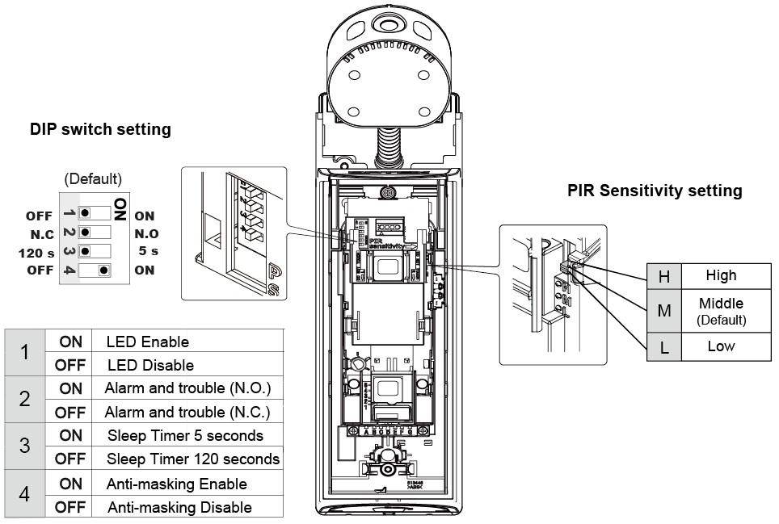

# VESTA-116

**AQS-3ZW**

## **Air Quality Sensor**&#x20;

The AQS-1/ AQS-3 is a Z-Wave™ indoor air quality sensor that aims to detect and monitor surrounding particulate matter (PM2.5), temperature, humidity, illuminance (lux) levels, and carbon dioxide (optional) within your premises. The level of the air quality is indicated by different LED colors.

The Air Quality Sensor is compatible only with Z-Wave Gateway/Control Panel. Z-Wave is a wireless communication protocol that uses a low-power RF radio. By taking advantage of the Z-Wave mesh network, commands can be routed to their destination via intermediary “listening” Z-Wave products. The AQS-ZW Series includes the following models:

| **Model Name** | **PM2.5** | **Temperature** | **Humidity** | **CO2** |
| -------------- | --------- | --------------- | ------------ | ------- |
| AQS-1ZW        | v         | v               | v            |         |
| AQS-3ZW        | v         | v               | v            | v       |

### Parts Identification

<figure><figcaption></figcaption></figure>

1. **RGB Light**
2. **LED Indicator (Green)**
3. **LED Indicator (Orange)**
4. **LED Indicator (Red)**
5. **Function Button**

&#x20;      -Press the button once to toggle RGB light On/Off.

&#x20;      -Press the button once to send RGB light, temperature, humidity, PM2.5, and CO2 concentration level signals.

&#x20;      -Press the button 3 times within 1 second to transmit a learn code.

&#x20;      -Press and hold the button for 2 seconds to enter RGB Light Color Change mode.

&#x20;      -Press and hold the button for 10 seconds to perform factory reset.

6. **DC Jack**

&#x20;     Connects to a 12V 1A DC Adapter

## Features

### Power Supply

The Air Quality Sensor is powered by connecting with a DC 12V output and 1A adaptor. Be sure to only use an adapter with the appropriate AC voltage rating to prevent component damage, or only use the AC power adapter included with the Air Quality Sensor.

If an AC power failure is detected, the Air Quality Sensor will send an AC failure report to the Control Panel.

### Temperature and Humidity Detection

* The Air Quality Sensor measures temperature and humidity every 5 seconds and reports data to the Control Panel every 30 minutes. If the temperature changes by +/- 2°C, or humidity changes by 10%, the Air Quality sensor will report to the Control Panel.
* The temperature detection range is about -10°C \~ 50°C ( 14°F \~ 122°F).  The humidity detection range is about 0% \~ 95% RH.

### PM2.5 Detection

* The Air Quality Sensor detects PM2.5 in the air every 30 seconds, and reports data to the Control Panel every 30 minutes. If the concentration changes by +/- 6 μg/m3, the Air Quality Sensor will report to the Control Panel.
* The Air Quality Sensor indicates the ambient air quality with three levels.
* When the air quality is "unhealthy", the Air Quality Sensor will send signal to the Control Panel and RGB light will flash red to remind the user.
* When the air quality changes from "unhealthy" to "moderate", the RGB light will stop flashing red, and the Air Quality Sensor will send a restore signal to the Control Panel.
* When the RGB light flashes red, pressing the Function Button will stop the flashing, and the RGB light will return to the original color.
* When the air quality remains "unhealthy", the RGB light will flash red again in 15 minutes.

<table data-header-hidden data-full-width="false"><thead><tr><th width="203"></th><th width="209"></th></tr></thead><tbody><tr><td><strong>Air Quality Index (AQI)</strong></td><td><strong>Air Concentration</strong></td></tr><tr><td>(0-50)</td><td>Good</td></tr><tr><td>(51-100)</td><td>Moderate</td></tr><tr><td>(101- above)</td><td>Unhealthy</td></tr></tbody></table>

### Carbon Dioxide Detection (AQS-3 only)

* The Air Quality Sensor measures CO2 concentration every 5 seconds, and reports data to the Control Panel every 30 minutes. If the CO2 concentration changes by +/- 100ppm for two consecutive times, the Air Quality sensor will report to the Control Panel.
* If the detected CO2 concentration is above 1000ppm, the AQS-3 will send a CO2 alarm signal to the Control Panel. If the CO2 concentration drops below 1000ppm, the AQS-3 will send a CO2 restore signal to the Control Panel.

<table data-header-hidden><thead><tr><th width="145"></th><th width="194"></th></tr></thead><tbody><tr><td><strong>LED Indicator</strong></td><td><strong>CO2</strong></td></tr><tr><td>Green</td><td>0-800 ppm</td></tr><tr><td>Orange</td><td>800-1000 ppm</td></tr><tr><td>Red</td><td>1000ppm - above</td></tr></tbody></table>

### RGB Light

* The Air Quality Sensor’s RGB light can be remotely adjusted from the Z-Wave Coordinator by sending commands. Users can adjust the color, saturation, and light percentage.
* Press the Function Button once to toggle the RGB light On/Off.
* Users can also select RGB light color locally. Press and hold the Function Button for 2 seconds to enter RGB Light Color Change mode. Then each button press will lead to next color selection. The cycle of 0-8 can be repeated sequentially. Please refer to below table.
* The Air Quality Sensor will automatically exit RGB Light Color Change mode after 6 seconds of inactivity. The RGB light will flash the currently set color to indicate the exit.

<figure><figcaption>
<strong>AQS LED Color Setting</strong>
</figcaption></figure>

### Adding Device (Inclusion)

This product can be included and operated in any Z-Wave network with other Z-Wave certified devices from other manufactures and/or other applications. All non-battery operated nodes within the network will act as repeaters regardless of vendor to increase reliability of the network.

* Plug in the AC Power adapter; connect to the DC Jack on the Air Quality Sensor to power up.
* Put the Z-Wave Gateway or Control Panel into **Inclusion** mode (please refer to the Z-Wave Gateway or Control Panel manual).
* Within 1 second, press the Function Button 3 times.
* Refer to the operation manual of the Z-Wave Gateway or Control Panel to complete the inclusion process.
* If the sensor has already been **added** (included) into another Z-Wave Gateway/Control Panel, or if the sensor is unable to be added into the current Z-Wave Gateway/Control Panel, please exclude it first (see _**Removing Device**_) before attempting to **include** it into the current Z-Wave Gateway/Control Panel.

### Removing Device (Exclusion)

The Air Quality Sensor must be removed from existing Z-Wave network before being included into another. There are two methods available to exclude a device.

#### Exclusion Mode

* Put the Z-Wave Gateway or Control Panel into **Exclusion mode** (please refer to the Z-Wave Gateway or Control Panel manual).
* Within 1 second, press the Function Button 3 times and the device will be removed from the Z-Wave network.

#### Factory Reset

_(Only use factory reset when network Control Panel/Gateway is missing or inoperable)._  Press and hold the Function Button for 10 seconds to perform factory reset.


Note:

Factory resetting the device will restore it to factory default settings (excluded from the Z-Wave network). The Z-Wave Gateway or Control Panel will still keep its Z-Wave settings. Please refer to the Gateway or Control Panel manual on how to remove the device’s Z-Wave settings.


## Installation

### Placing the Air Quality Sensor

The Air Quality Sensor should be placed on a flat surface with open area around it in the room you want to monitor. For best LED Light display quality, the Air Quality Sensor should be placed at the normal height level of your nose, e.g., on a bookshelf, desk, side table, or nightstand in the living room, study, or bedroom. The more open the location of placement is, the more accurate the air quality measurements will be.

### Z-Wave Information

**Generic Type:** Switch Multilevel

**Specific Type:** Color Tunable Multilevel

**Product Type ID:** 0x0004

**Product ID:** 0x0020

**Role Type:** Always On Slave (AOS)

**Security:** S2 Unauthenticated

### Command Class Support/Control

**Mandatory CC Support:**&#x20;

Z-Wave Plus Info CC, V2

Switch Binary CC (security 2)

Sensor Multilevel CC, V11 (security 2)

Switch Color CC, V1 (security 2)

Association CC, V2 (security 2)

Multi Channel Association CC, V3 (security 2)

Association Group Information CC (security 2)

Manufacturer Specific CC, V2 (security 2) Transport Service CC, V2

.Version CC, V3 (security 2)

.Device Reset Locally CC (security 2)

.Powerlevel CC (security 2)

.Security CC

Security 2 CC

.Supervision CC

.Firmware Update MD CC, V4 (security 2)

### Z-Wave’s Groups (Association Command Class Version 2)

The AQS can be set to send reports to associated Z-Wave devices. It supports 1 association group.

Group 1 for “LifeLine”: (maximum node: 5)

Switch Binary (COMMAND\_SWITCH\_BINARY, SWITCH\_BINARY\_REPORT)

Sensor Multilevel (COMMAND\_SWITCH\_MULTILEVEL, SWITCH\_MULTILEVEL\_REPORT)

Switch Color (COMMAND\_SWITCH\_COLOR, SWITCH\_COLOR\_REPORT)

Device Reset Locally

(COMMAND\_CLASS\_DEVICE\_RESET\_LOCALLY, DEVICE\_RESET\_LOCALLY\_NOTIFICATION)

* **Switch Binary Report:** It will transmit switch binary command FF when LED is on and 00 when LED is off.
* **Sensor Multilevel:** As the temperature, humidity, PM2.5, or CO2 levels detected changes; the AQS will transmit sensor multilevel command.
* **Switch Color:** If the LED color changes value, it will transmit sensor switch color command.
* **Factory Reset:** When the AQS has been reset to factory default state, it will send Device Reset Locally to all nodes in Group 1.

### Command Class Data Format

* Temperature/Humidity Report: \[COMMAND\_CLASS\_SENSOR\_MULTILEVEL] \[SENSOR\_MULTILEVEL\_REPORT]
* If temperature signal 01 42 09 D1 is transmitted, 09D1 can be viewed as 0x09D1 in Hexadecimal number. You can convert hexadecimal to decimal and divide by 100 to check the temperature data (in Celsius). 0x09D1=2513=25.13℃.
* If humidity signal 05 02 00 3B is transmitted, 003B can be viewed as 0x003B in Hexadecimal number. You can convert hexadecimal to decimal to check the humidity level (in percentage). 003B=0x003B=59%
* PM2.5 Report: \[COMMAND\_CLASS\_SENSOR\_MULTILEVEL] \[SENSOR\_MULTILEVEL\_REPORT]
* If PM2.5 signal 23 0A 00 02 is transmitted, 0002 can be viewed as 0x0002 in Hexadecimal number. You can convert hexadecimal to decimal to check the PM2.5 value.  0002=0x0002=2μg/m3
* CO2 Report: \[COMMAND\_CLASS\_SENSOR\_MULTILEVEL] \[SENSOR\_MULTILEVEL\_REPORT]
* If CO2 signal 11 02 06 99 is transmitted, 0699 can be viewed as 0x0699 in Hexadecimal number. You can convert hexadecimal to decimal to check the CO2 value. 0699=0x0699=1689ppm
* RGB Report: \[COMMAND\_CLASS\_SWITCH\_COLOR] \[SWITCH\_COLOR\_REPORT]
* If RGB signal 02FF is transmitted, 023D can be viewed as 0x023D in Hexadecimal number. You can convert hexadecimal to decimal to check the RGB color and color value. 02=red color; 03=green color; 04=blue color 3D =0x3D =61ppm
