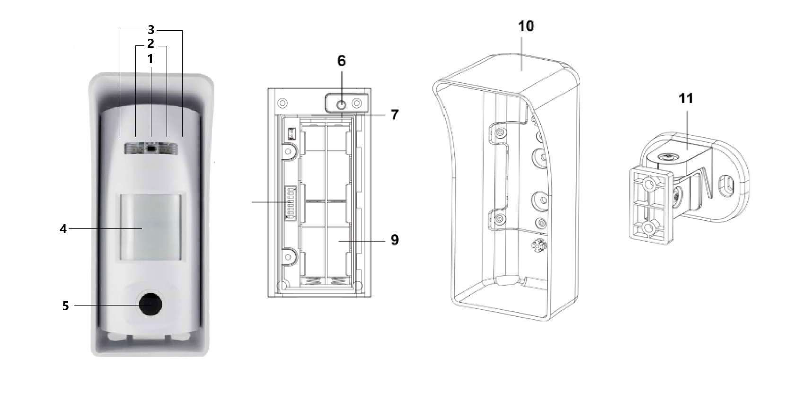

# VESTA-210

**VST-892EXC**

## **Outdoor Curtain PIR Motion Sensor Camera**

<figure><figcaption>
VESTA-210
</figcaption></figure>

VST-892EXC is an outdoor curtain passive infrared (PIR) motion sensor camera. It is capable of sending wireless signals and captured images (picture quality of up to 640 x 480 pixels) to the Control Panel upon movement detection.

Featuring night illumination capability, with UV resistant housing, and waterproof to IP65 standard, VST-892EXC is ideal for backyards, lawns, gates, outdoor corridors and hallways.

The Outdoor Curtain PIR Camera is designed to give a typical detection range of 12 meters when mounted at **1.4-2.5** meters above ground.

Three types of PIR lens (**A, B, C**) are provided for different applications. Lens **A** (Default) provides vertical curtain detection with pet immunity of animals up to 60 kilos. Lens **B** provides vertical curtain detection, which is ideal for perimeter application. Lens **C** features horizontal curtain detection with pet immunity of animals up to 60 kilos. By changing lens, you can select the detection pattern that best suits your desired application.

Besides, VST-892EXC is designed with the digital proximity detector. The anti-masking feature allows for detection of any attempts to blind the detector by placing objects in its field of view.

VST-892EXC is also compatible with Climax’s Repeater RP-29/Router RMB-29, which can further extend the RF communication range into hard-to-reach areas.

**The VST-892-EXC Series includes the following models**:

VST-892-EXC – Outdoor PIR motion sensor camera with flash LED

&#x20;VST-892-EXC-IL – Outdoor PIR motion sensor camera with Infrared LED

## _**Identifying the Parts**_

_**Front View**_ _**Inside View**_

<figure><figcaption></figcaption></figure>

1. **Flash LED/Infrared LED**
   * The Flash LED (for VST-892-EXC) or Infrared LED (for VST-892-EXC-IL) delivers sufficient light for image capture under low lighting condition.
2. **LED Indicator (RED)**

&#x20;      The LED indicator is used to indicate the system status

3. **Digital Proximity Detector**

* The digital proximity detector is used to detect any masking (blocking) attempt by an intruder.

4. **IR Sensor**

* The IR sensor is intended to detect moving objects.
* Three types of PIR lens (**A, B, C**) are provided for different applications.
* Lens **A** (Default) provides vertical curtain detection with pet immunity of animals up to 60 kilos.
* Lens **B** provides vertical curtain detection without pet immunity.
* Lens **C** features horizontal curtain detection with pet immunity of animals up to 60 kilos.
* Please refer to _**Changing Lens**_ section for instructions of changing PIR lens.

5. **PIR Camera Lens**
6. **Test & Learn Button**
   * Press the button once to enter test mode for 10 minutes.
   * Press the button once to send a learn code to the repeater/router.
7. **Internal Tamper**
8. **DIP Switch Block**
9. **Battery Compartment**
10. **Mounting Bracket**
11. **Rotating Holder**


Press and hold the button for 3 seconds to send a learn code, and then release the button when Red LED lights up.


### _**LED Indicator**_

When enabled, the LED Indicator will light up in the following conditions:

* When the Tamper Switch is triggered, the LED will flash for 2 seconds to indicate it is transmitting “**Tamper**” signal.
* When the PIR Camera is in fault conditions (tamper open or low battery condition persists), each time it transmits a detected movement, the LED will flash for 2 seconds.
* After the Test button is pressed once to enter Test Mode, the LED will flash for 60 seconds to indicate that the PIR motion sensor camera is warming up.
* In Test mode, the LED will flash for 2 seconds whenever a movement is detected.
* If the LED flashes to indicate signal transmission, it will flash twice rapidly upon receiving acknowledgement from panel.


Note:

The LED indicator can be enabled by setting the DIP Switch 2 to ON position. Please refer to **DIP Switch Position Table** for details.


### _**Image Capture**_

When the alarm system is armed, the PIR Camera will capture 1, 3 or 6 alarm images in 640 x 480 or 320 x 240 resolutions (programmable from Control Panel) upon movement detection. You can also manually request the PIR Camera to take a picture through the Control Panel. The captured images will be transferred to the Control Panel for visual alarm verification.


Note:

If your PIR Camera is installed at a location where the camera’s field of view is a complex environment with intense light or lots of colors, the images captured will be great in file size, possibly leading to truncation when the images are transmitted to the Control Panel.


### _**Warm Up Period**_

The PIR Camera will warm up for 60 seconds in the following conditions:

* When the PIR Camera is turned on by the Control Panel system upon entering arm mode (either with or without fault conditions).
* When the test button is pressed once to enter Test Mode.

The Red LED will flash slowly during warm-up period. During the warm-up period, the PIR Camera will not be activated.

### _**Test Mode**_

* The PIR Camera can be put into Test mode for 10 minutes by pressing the Test button once. In Test mode, the sleep timer and image capture functions are disabled. LED indicator is enabled to light up for two seconds whenever a movement is detected. The PIR Camera will automatically exit Test Mode after 10 minutes, and return to normal mode.
* To put the PIR Camera into constant Test mode, please adjust DIP switch 1 to ON position (Please refer to **DIP Switch Position Table**).

### _**Supervision Signal**_

* After installation, the PIR Camera will automatically transmit Supervisory signals periodically to the Control Panel at random intervals of 15 to 18 minutes.
* If the Control Panel has not received the signal from the PIR Camera for the preset period of time, the Control Panel will indicate on its display that the particular PIR Camera is experiencing an out-of-signal problem.

### _**Sleep Timer**_

* The PIR Camera features an automatic “sleep time” of approximately one minute for power conservation. After transmitting a detected movement, the PIR Camera will not retransmit for one minute. Any further movement detected within this one-minute sleep period will extend the sleep time by another minute. This way, continuous movement in front of PIR Camera will not unduly exhaust the battery.

### _**Tamper Protection**_

* The PIR Camera is protected by an internal tamper switch which is compressed when the PIR Camera is hooked onto the mounting bracket. When the PIR Camera is removed from the mounting bracket, the tamper switch will be activated and the PIR Camera will send a tamper open signal to the control panel to remind the user of this condition.

### _**DIP Switch Position Table**_

The function of each DIP Switch is listed in the table below. The DIP Switch is either ON or OFF. Top position indicates ON and bottom position indicates OFF.

<figure><figcaption>
Function os each DIP SWITCH
</figcaption></figure>

### _**Anti-masking**_

* The PIR Camera has a digital proximity detector that can detect any masking (blocking) attempt by an intruder.
* When a masking event is detected, and the masking condition lasts for 3 minutes, VST-892EXC will send a masking alarm signal to the Control Panel to notify user of the masking condition.
* After masking/blocking is removed for 3 minutes, VST-892EXC will send restore signal to the Control Panel.

### _**Battery**_

* The PIR Camera uses four AAL91 lithium batteries as its power source.
* The PIR Camera features low battery voltage detection. When low battery is detected, a low battery signal will be sent to the Control Panel along with regular signal transmissions for the Control Panel to display the status accordingly.

### **To Change Battery:**

**Step 1:** Navigate the Control Panel into Programming mode.

**Step 2:** Remove the PIR Camera from mounting position and loosen 2 back cover fixing screws.

**Step 3:** Push the back cover from left to right.

.jpeg>)

**Step 4:** Remove the old batteries and press the test button twice to fully discharge.

**Step 5:** Insert four new AAL91 lithium batteries.

**Step 6:** Press the test button once. A battery normal signal will be sent to the Control Panel.

**Step 7:** Screw back the back cover.

**Step 8:** Mount back the PIR Camera to mounting location.

**Step 9:** Navigate the Control Panel to exit Programming mode and return to operation mode. The procedure is complete.

## _**Getting Started – Learning the PIR Camera into the Control Panel**_

* Put the Control Panel into learning mode, refer to Control Panel manual for details.
* Press and hold the Test button for 3 seconds to send a learn code, and then release the button when Red LED lights up. The LED will be on for 20 seconds, indicating that the PIR Camera is in learning mode.
* If the Control Panel receives the signal from the PIR Camera, it will display the information accordingly. Within 20 seconds when the LED of the PIR Camera is on, select the PIR Camera on the Control Panel Webpage and click **“add”** to include it into the Panel. Refer to the Control Panel manual for details.
* When the PIR Camera receives acknowledgement from the Control Panel, the LED of the PIR Camera will flash 6 times and then turn off to indicate successful learning.
* After the PIR Camera is learnt-in, put the Control Panel into Walk Test mode. Hold the PIR Camera in the desired location, and press the Test button to confirm this location is within the signal range of the Control Panel.
* When you are satisfied that the PIR Camera works in the chosen location, you can proceed to installation.


Note:

After the Test button is pressed and held for 3 seconds, the LED of the PIR Camera will be on for 20 seconds. If the
&#x20;PIR Camera does not receive acknowledgement from the Control Panel within this 20-second period, the LED will
&#x20;turn off. The Test button needs to be pressed and held for 3 seconds again to resend a learning code.

If the PIR Camera already exists in a Control Panel system, you will need to first remove the PIR Camera from the
&#x20;Control Panel before you can learn it into a different Control Panel.

Walk Test should be conducted to confirm proper operation and coverage of the PIR Camera.

When learning the PIR Camera into a repeater/router, please press the Test button once (instead of pressing and
&#x20;holding it for 3 seconds) to send a learn code.&#x20;


### _**Edit PIR Camera Operation Area**_

Follow instruction below to change PIR Camera Area in the Control Panel

1. Use the panel Edit Device function to change PIR Camera area setting.
2. Press and hold the Test button for 3 seconds on the PIR Camera to send a signal to the panel, and then release the button when the LED lights up.

## _**Mounting & Installation Method**_

**Mounting with mounting bracket and rotating holder:**


Rotating Bracket code: VESTA-213&#x20;


.jpeg>)

**Step 1.** Mount the VST-892EXC with the hooks of the mounting bracket latched on the back cover of the VST-892EXC, and then push downwards until you hear a click sound.

.jpeg>)

**Step 2.** On the back of the mounting bracket, install a screw to make sure the device is well-secured.

<figure><figcaption></figcaption></figure>

**Step 3.** Fix the rotating holder to the wall with 2 provided screws. Fix the mounting bracket on the rotating holder with fixing screws.

<figure><figcaption></figcaption></figure>

**Step 4.** When the top screw of the rotating holder is loose, the VST-892EXC can be rotated horizontally. A calibration line is marked for 0 degree.

When the screw on the side of the rotating holder is loose, the VST-892EXC can be rotated vertically. 7 scales are marked for adjusting angles. 1 scale is for 5 degrees and the VST-892EXC can be moved to the maximum of 30 degrees vertically.

<figure><figcaption></figcaption></figure>

**Step 5.** After adjusting the proper angles for the IR Detection, secure the screws on the top and the side.

## _**Changing PIR Lens**_

* Three types of PIR lens (**A**, **B**, **C**) are provided with different detection patterns, which allows user to install on PIR Camera for different applications.
* Lens **A** (installed by Default) provides vertical curtain detection with pet immunity of animals up to 60 kilos.
* Lens **B** provides vertical curtain detection without pet immunity.
* Lens **C** features horizontal curtain detection with pet immunity of animals up to 60 kilos.
* If the default Lens **A** does not provide desired detection pattern, you can follow the steps below to change the PIR lens.&#x20;

**Step 1.** Loosen 2 back cover fixing screws and push the back cover from left to right as shown in Figure 1.

**Step 2.** 4 screws are secured. Remove 2 rubber caps on the 2 bottom screws and then loosen 4 screws as shown in Figure 2.

<figure><figcaption></figcaption></figure>

**Step 3.** Remove the old PIR lens, and install the new lens onto the PIR Camera.

**Step 4.** Secure 4 screws and put the 2 rubber caps on the 2 bottom screws.

**Step 5.** After changing IR lens, ensure to adjust **Dip Switch 3** settings for appropriate application.

Step 6. PIR lens A / B should be installed vertically; PIR lens C is installed horizontally. Different applications and installation methods are shown in the table and figures below.

<figure><figcaption></figcaption></figure>

## _**Installation Recommendations**_

**It is recommended to install the PIR Camera in the following locations:**

* It is recommended to mount the PIR Camera at 1.4 -2.5m above ground.
* When mounted at 1.4 -2.5m above ground, the outdoor PIR camera has typical detection range of 12 meters.
* When you mount the PIR camera higher, the blind spot will be larger; when you mount the PIR camera lower, the blind spot will be reduced.
* Tilting the PIR camera will impact the blind spot area under the camera and the pet immune area.

<figure><figcaption></figcaption></figure>

**Lens A: Vertical Curtain (pet immune)**

<figure><figcaption></figcaption></figure>

<figure><figcaption></figcaption></figure>

<figure><figcaption></figcaption></figure>

* Users can slightly tilt the PIR Camera to reduce blind spot.
* Lens B for vertical curtain detection does not have Pet immune function.

<figure><figcaption></figcaption></figure>

<figure><figcaption>
Vertical Curtain Detection Range
</figcaption></figure>

<figure><figcaption>
Tilt Angle
</figcaption></figure>

## **Limitations:**

* Do not install the PIR Camera completely exposed to direct sunlight.
* Avoid large obstacles in the detection area.
* Do not point directly at sources of heat, such as fires and boilers, or install above radiators.

<figure><figcaption></figcaption></figure>

* Never attempt to disassemble or modify the unit.
* Do not install the motion sensor camera where objects moved by wind such as trees and laundry, which may block the motion sensor camera’s field of view.
*

    <figure><figcaption></figcaption></figure>
* Clear all light reflecting surfaces from the detection area, as well as water puddles.

<figure><figcaption></figcaption></figure>


Adjust the Dip Switche 3 setting according to the IR lens direction for appropriate application. If Dip Switch 3 setting does not match with the IR lens direction, the PIR Camera’s performance will be hindered and may cause either false alarm or inability to detect movement.



The PIR Camera detects differences between the moving object and the background. If the object is idle (i.e. not moving), the PIR Camera is unable to detect it



The PIR Camera has a directional characteristic and is most effective at detecting intruder moving across field of detection. It is less sensitive for detecting motion directly towards the PIR Camera.



Unless required, we suggest keeping the PIR Camera mounting location at 1.4-2.5M for optimum performance. If you change the mounting height, please conduct detection test to make sure the PIR Camera can detect intruder normally at the chosen height.

