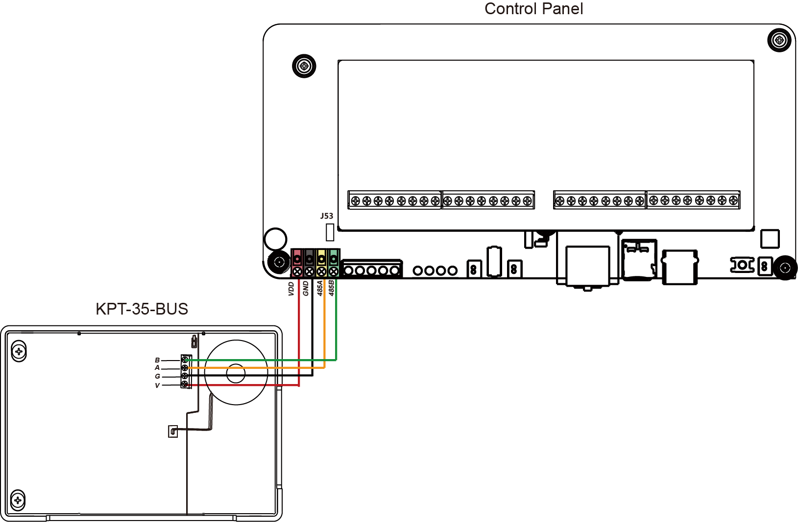
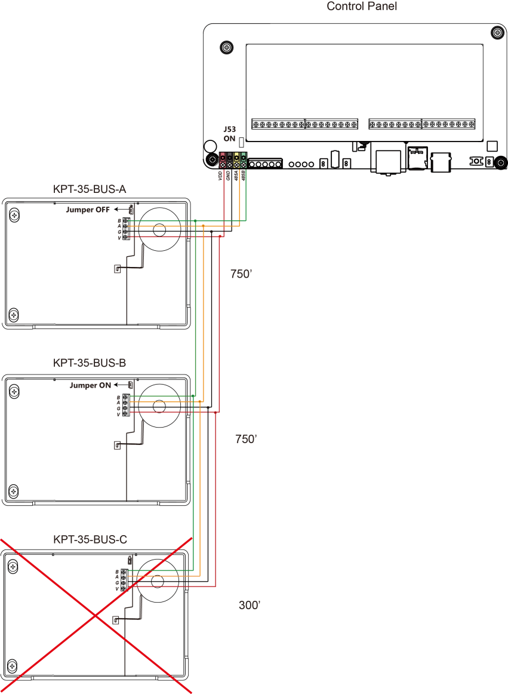

# VESTA 249

**Vesta-249**

**Door Contact (DC-15Z2)**

The Door Contact is used to detect the opening and closing of doors and windows. Typically the Door Contact is fixed to the

door frame and the actuating magnet is fixed to the door. When the door opens, the magnet is moved away from the Door

Contact and an internal magnetic switch will be activated causing the Door Contact to transmit an alarm.

A PCB tamper switch protects the enclosure from being opened or being removed from the mounting surface and also alert

you to signal communication problems and low battery situations.

λ _**Identifying the Parts**_

**1. RED LED indicator Test Button**

Test Button

λ Press once to transmit learn code for magnetic switch and PCB

tamper.

λ Press and hold for 3 seconds to transmit learn code for extension

terminals.

λ Press once to enter Test mode for 3 minutes.

The LED Indicator turns on when:

λ Test button is pressed.

λ Tamper is opened.

λ Battery exhausted.

λ Activated under Test mode, low battery or Tamper open condition.

**2. Mounting Holes**

These holes are used to fixed and screw the Door Contact directly onto

the Door Frame or Wall.

**3. PCB Tamper Switch**

The PCB Tamper Switch protects the device from being opened or

being removed from the mounting surface.

**4. Battery Insulator**

**5. Fixing Screw**

It is used to secure the top and bottom case of the Door Contact.

λ _**Accessories Included**_

a) 1 Magnet

b) 2 White Caps

c) 2 Screws

d) 2 Wall Plugs

e) 1 double-sided adhesive tape for Magnet

f) 2 screws for Magnet

λ _**Test Mode**_

λ Each time the Test Button is pressed, the Door Contact will transmit a test signal to the Control Panel for radio

range test and enter the test mode for 3 minutes. When the test signal is transmitted, the Red LED will light

on.

λ Under Test Mode, the LED will light up whenever the Door Contact is activated.

λ Each additional press on the Test Button will rest Test Mode to 3 minutes.

λ _**Supervision Function**_

The Door Contact conducts self-test periodically by transmitting a Supervisory signal once every 30\~50 mins.

If this signal is not received, the Control Panel will indicate on its screen that the particular Door Contact is

experiencing an **out-of-signal** problem.

2

λ _**Battery**_

The Door Contact uses CR2 3V Lithium battery as its power source. When low battery voltage is detected, a low

battery signal will be send to the Control Panel along with regular signal transmissions for the Control Panel to

display the status accordingly.

When the battery is exhausted, the Door Contact will stop all function, the LED will flash every 4 seconds.

Before shipment, the battery is pre-installed by the factory with an Insulator inserted. Please remove the battery

insulator to activate the Door Contact.

λ _**Door Contact Functions**_

The Door Contact has two separate functions that works independently and are learnt into separate zones in

Control Panel.

**Internal Magnetic Switch / PCB Tamper**

λ The Internal Magnetic Switch monitors door opening and closing. The PCB tamper protects the door contact

from cover opening and removal from mounting location

λ The Internal Magnetic Switch and built-in PCB Tamper Switch are learnt into panel by pressing the Learn/Test

button once.

**Extension Terminals**

λ The Extension Terminal 1 is used to connect to either a N.C. (Normal Close) device or a Roller Shutter

λ The Extension Terminal 2 is used to connect to an external N.C. Tamper Switch, it transmits tamper signal when

activated

λ The Extension Terminals are learnt into panel by pressing and holding the Learn/Test Button for 3 seconds

If you want to disable one of the functions, remove its corresponding zone from the Control Panel.

λ _**Getting Started**_

λ Pull out the battery Insulator.

λ Put the Control Panel into learning mode.

λ Learn in the Internal Magnetic Switch/PCB Tamper and Extension Terminals into separate zones on Control

Panel.

\- Press the Test Button once to transmit learn code for magnetic switch and PCB Tamper.

\- Press and hold for 3 seconds to transmit a separate learn code for extension terminals.

λ If the signal is received by the Control Panel, the panel will display the information accordingly, please refer to

the Control Panel manual to complete the learning process.

λ After the Door Contact is learnt-in, put the Control Panel into “**Walk Test**” mode, hold the Door Contact in the

desired location, and press the Test button to confirm this location is within signal range of the Control Panel.

λ When you are satisfied that the Door Contact works in the chosen location, you can proceed with installation.

λ _**Mounting Methods and Installation**_

It is recommended that the Door Contact should be placed on the door frame and the

magnet on the door. If the door contact is placed on the door, and the door is

opened too fast, the transmitted distance may be shorted.

The magnet should not be more than 15mm from the Door Contact when the door is

closed.

_\<NOTE>_

Φ If the Door Contact cannot be mounted on the door frame, you can connect

additional switches to the “**Extension Terminal**” and mount the Door Contact

remotely (for details, please refer to “**Using the Extension Terminal**” section).

Step 1: Find a suitable place that is close to your door / window to locate the Door

Contact.

Step 2: The Door Contact has 2 rib-marks on one side (refer to figure), where the

internal magnet switch is located. The door contact should be installed either

upright or inverted, to ensure that the rib-marked side faces the magnet.

Step 3: To mount the Door Contact:

(i) Using the 2 mounting holes of the Door Contact as a template, mark off the

hole positions on the most appropriate place.

3

(ii) Insert the wall plugs if fixing into plaster or brick

(iii) Screw the Door Contact into the wall plugs.

Step 4: Fit the magnet on the door using the small double sided adhesive tape or the screws provided. The magnet

must be aligned with the marked side of the door contact as shown in figure.

_< NOTE >_

Φ Ensure the PCB tamper switch spring is positioned so that it makes contact with the mounting surface

through the tamper switch aperture.

Step 5: Test the Door Contact by opening and closing the door or window when the Control Panel is in “Walk Test”

mode.

Step 6: Fit the white caps to the two mounting holes of the Door Contact..

Step 7: Installation is now completed.

λ _**Internal Jumper and Terminal**_

**1. Extension Terminal 1**

Connect to either a N.C. (Normal Close) device or a Roller Shutter, see JP3 setting for detail

**2. Extension Terminal 2**

Connect to a N.C. (Normal Close) external Tamper Switch.

**3. Reserved (JP2)**

**4. Terminal 1 NC Input / Roller Shutter Switch (JP3)**

The Jumper switch determines whether Terminal 1 is set to N.C. input or Roller Shutter.

If the jumper is ON (the jumper link is inserted connecting the two pins), Terminal 1 is

set to Roller Shutter connection

If the jumper is OFF ( if the jumper link is removed or “**parked**” on one pin), Terminal 1 is

set to N.C. connection. _(**Factory Default**)_

**5. Roller Shutter Setting** － **5 Pulse /Disable(JP4)**

**Only used when Terminal 1 is set to Roller Shutter**

This Jumper is to select how many pulses it takes to activate Terminal 1 when it is set to Roller Shutter

If the jumper is ON, when the Terminal 2 counts **5** Pulses **in 10 seconds**, the Door Contact will send

alarm signal.

If the jumper is OFF, the Terminal 2 will not be triggered by 5 Pulses in 10 seconds. _(**Factory Default**)_

**6. Roller Shutter Setting** － **6 Pulse /Disable(JP5)**

**Only used when Terminal 1 is set to Roller Shutter**

This Jumper is to select how many pulses it takes to activate Terminal 1 when it is set to Roller Shutter

If the jumper is ON, when the Terminal 2 counts **6** Pulses **in 10 seconds**, the Door Contact will send

alarm signal.

If the jumper is OFF, the Terminal 2 will not be triggered by 6 Pulses in 10 seconds. _(**Factory Default**)_

**7. Roller Shutter Setting** － **8 Pulse /Disable(JP6)**

**Only used when Terminal 1 is set to Roller Shutter**

This Jumper is to select how many pulses it takes to activate Terminal 1 when it is set to Roller Shutter

If the jumper is ON, when the Terminal 2 counts **8** Pulses **in 10 seconds**, the Door Contact will send

alarm signal.

If the jumper is OFF, the Terminal 2 will not be triggered by 8 Pulses in 10 seconds. _(**Factory Default**)_

_\<NOTE>_

Φ Only one of the JP5, JP6 and JP8 can be set as ON at .

Φ If more than one of the JP5, JP6 and JP8 are set as ON or none is set as ON, the Terminal 2 will

be triggered after **5** Pulse are counted **in 10 seconds**.

Φ The pulse count will reset if Terminal 1 is not activated within 10 seconds .

**8. Test Button**

λ _**Extension Terminal Connection**_

**Extension Terminal 1**

The Extension Terminal 1 can be programmed by Jumper Switch JP3 setting to either work with a N.C. device or a

Roller Shutter.

**N.C. (Normal Close)**

When set to N.C., Terminal 1 forms a closed loop with the device connected to it. When the device is triggered, the

loop will be opened; the Door Contact will also be triggered.

1\. Open the Door Contact by loosening the fixing screw

2\. The upper end of the front case has a thinner plastic knockout. Break through the knockout to create a hole for the

wiring connection to the extension terminal.

3\. Connect the device to the extension terminal

The Extension terminal may be useful for the following situation.

λ If the Door Contact cannot be mounted on the door frame, you can connect an additional extension switch to the

extension terminal to mount the Door Contact remotely.

λ Any dry contact device with N.C. (Normal Close) loop can be connected to the Extension Terminal making the

Door Contact serve as an Universal Transmitter.

λ Multiple dry contact device can be wired together with Door Contact, as show in diagram.

 

**Roller Shutter**

When set as Roller Shutter, Terminal 1 can be triggered by the rotations of the axle.

λ Whether the pull string is pulled down or retracted, it will cause axle

rotation. Option are available for alarm trigger with 5, 6 or 8 axle rotations.

Φ 5 axle rotations are about 9.5 cm.

Φ 6 axle rotations are about 10.5 cm.

Φ 8 axle rotations are about 13 cm.

λ When the Pulse does not achieve the number of triggered times in 10 sec, the count will reset.

λ The times of Pulse, which causes the terminal 2 alarm trigger, can be programmed by Jumper 5, 6 or 8. Only

one of the three can be selected ON. If more than one of the three are set as ON or none is set as ON, the

Terminal 2 will be triggered after **6** Pulse are counted **in 10 seconds**.

**Extension Terminal 2**

λ The Termianl 2 should be connected to a N.C. device. The Door Contact will transmit a Tamper Open signal when

the terminal is activated.

λ _**Battery Change**_

I. Dismount the Door Contact, by first removing the white caps then the mounting screws.

| II. III. IV. | 
Open the Door Contact by loosening the bottom fixing screw.

Remove the old batteries and press the Tamper Switch twice to fully discharge.

Replace the new CR2 3V Lithium battery in the battery compartment, taking care to connect the polarity

correctly.

Replace and tighten the cover.

Screw back the Door Contact to the surface with mounting screws, and then re-insert the white caps.
 |
| ------------ | ------------------------------------------------------------------------------------------------------------------------------------------------------------------------------------------------------------------------------------------------------------------------------------------------------------------------------------------------------------------------------------------------------------------------------------ |
| V. VI.       |                                                                                                                                                                                                                                                                                                                                                                                                                                      |

Pull Cord
