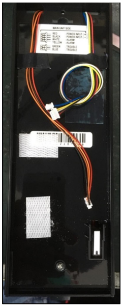

# VESTA-271

## QUICK START



## MANUAL GUIDE

**TX for OPTEX outdoor PIR Instructions**

**The transmitter is installed in the motion detector, allowing them to send wireless RF signals to the Control Panel. 4**

**motion detector models are included, QXI-RDT-X5, BXS-RAM, VXS-RAM, and WXI-RAM. The introduction of the transmitter and the installation of the transmitter are illustrated below.**

.png>)

**For the Remote Control settings of Sleep Time, Alarm Notification with LED,**

**Anti-Masking, and PIR Sensitivity (Low/Medium/High), users are able to toggle on/off**

**the functions through setting on the local webpage of the Control Panel. After the**

**setting is done, users have to press the function button of the device to enable the**

**function.**

## **Identifying the Parts**

1. **LED indicator (Red)**
2. **Learn/Test Button**
3. **Battery (CR123)**

## **LED Indicator**

**In Normal operation mode, the LED Indicator remains off except:**

**When the motion detector is powered on, the Red LED will flash about 12 seconds. When the transmitter is well connected, the Red LED turns off.**

**When the motion detector is in low battery condition, each time it transmits a detected movement, the LED will flash.**

**When the Tamper Switch is triggered, the LED will flash to indicate it is transmitting “Tamper” signal. When the Tamper condition persists, each time it transmits a detected movement, the LED will flash. When the battery is exhausted, the LED will flash every 4 seconds.**

## **Learning**

**Follow the steps below to install the transmitter.**

**Install the battery to power on. When the detector is powered on, the Red LED will flash about 12 seconds. When the transmitter is well connected, the Red LED turns off.**

**Put the Control Panel into learning mode, refer to Control Panel manual for details. Press the Learn button.**

**Refer to Control Panel manual to complete the learn-in process.**

## **Walk Test**

**After the detector is learnt-in, put the Control Panel into “Walk Test” mode, hold the detector in the desired location, and press the Test button to confirm this location is within signal range of the Control Panel, refer to Control Panel manual to complete Walk Test.**

**When you are satisfied that the detector works in the chosen location, you can proceed to mounting.**

## **Battery**

**The detector uses one CR123 Lithium battery as its power source.**

**When low battery is detected, a low battery signal will be sent to the Control Panel along with regular signal transmissions for the Control Panel to display the status accordingly.**

**When the battery is exhausted, the detector will stop all function, the LED will flash every 4 seconds.**

**When changing battery, after removing the old battery, press the Learn button twice to fully discharge before inserting new battery.**

## **Supervision**

**The detector will transmit a supervisory signal every 90-110 minutes.**

## **Installation of the Transmitter**

**The section illustrates how to install the transmitter in the motion detector QXI-RDT-X5, BXS-RAM, VXS-RAM, and WXI-RAM.**

### **QXI-RDT-X5**

**Step 1. Apply the foam tape on the transmitter.**

<figure><figcaption></figcaption></figure>

**Step 2. Remove the back cover. Align its border with the lower side of the cover case and the middle of the hole as the pictures shown below.**

<figure><figcaption></figcaption></figure>

<figure><figcaption></figcaption></figure>

**Step 3. Connect the wires and fix the wires as the pictures shown below.**

<figure><figcaption></figcaption></figure>

**Step 4. Use the wires to make a loose knot, and thread the wires’ end into the circles.**

.png>)

**Step 5. Fix the wires onto the transmitter board.**

.png>)

**Step 6. Fix the other pair of wires onto the area below the battery case. (Refer to the pictures below)**

.png>)

**Step 7. The installation is complete.**

.png>)

### **BXS-RAM**

**Step 1. Apply the foam tape on the transmitter.**

<figure><figcaption></figcaption></figure>

**Step 2: Use the wires to make a loose knot, and thread the wires’ end into the circles.**

<figure><figcaption></figcaption></figure>

**Step 3. Thread the other pair of wires through the knot, and fix the wires onto BXS-RAM.**

<figure><figcaption></figcaption></figure>

**Step 4. Turn the BXS-RAM around. Use the wires to make a loose knot and thread the wires’ end into the circles. Align a foam tape with the edge marked in the picture below and apply it in the middle to fill in the gap. Align the transmitter in the middle of the back cover as the picture shown below and attach the transmitter to the foam tape closely.**


Note:

**A foam tape is included in the package to fill in the gap between the BXS-RAM and the transmitter board.**


<figure><figcaption></figcaption></figure>

<figure><figcaption></figcaption></figure>

**Step 5. The installation is complete.**

<figure><figcaption></figcaption></figure>

### **VXS-RAM**

**Step 1. Apply the foam tape on the transmitter.**

<figure><figcaption></figcaption></figure>

**Step 2. First, turn the front of the board to the farthest right.**

<figure><figcaption></figcaption></figure>

**Step 3. Turn to the back of the board. Use the wires to make a loose knot, and thread the wires’ end into the circles.**

<figure><figcaption></figcaption></figure>

**Step 4. Turn the front of the board to the** farthest left. Then, insert the cables.

<figure><figcaption></figcaption></figure>

&#x20;**Step 5. Pull the cables downward and** paste the cables onto the device.

<figure><figcaption></figcaption></figure>

**Step 6. It should look like the image when wire pasting is completed.**

<figure><figcaption></figcaption></figure>

**Step 7. Install the transmitter board.**

<figure><figcaption></figcaption></figure>

**Step 8. After installing the transmitter, connect the cables. It should look like the picture below when the installation is completed.**

<figure><figcaption></figcaption></figure>

**Note: The front of the device should look like this when the transmitter is installed. Full rotation of the front will not be interfered by the wire connection.**

<figure><figcaption></figcaption></figure>

### **WXI-RAM**

**Step 1. Apply the foam tape on the transmitter.**

<figure><figcaption></figcaption></figure>

**Step 2. Pull two set of cables to the lower left side. (Refer to the image below).**

<figure><figcaption></figcaption></figure>

**Step 3. Fix the two set of wires onto WXI-RAM. (Refer to the image below)**

<figure><figcaption></figcaption></figure>

**Step 4. Bend the wires that are not connected to the small board, and fix it onto the device.**

<figure><figcaption></figcaption></figure>

**Step 5. Then, take the wires connected to the small board, and fix them onto the device. (For the fixing position, refer to the image below)**

<figure><figcaption></figcaption></figure>

**Step 6. Fix the rest of the wires onto the device.**

<figure><figcaption></figcaption></figure>

**Step 7. To install the transmitter, the lower side of the transmitter should be align the installation line and use the middle of the hole or the middle of the screw to align the transmitter in the middle. Please refer to the pictures below.**

<figure><figcaption></figcaption></figure>

**Step 8. The installation is complete.**
