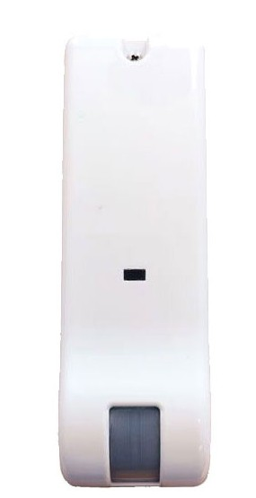

# VESTA-352

## Outdoor curtain digital detector with dual technology &#x20;

<figure><figcaption></figcaption></figure>

The detector has been designed to provide external perimeter protection, creating a vertical barrier with multiple beams, which detects the presence of an intruder before he breaks into the internal environments, with a maximum range of 9 m.

Robust IP54 enclosure.

LED

1. Yellow colour, Pir alarm.
2. Blue colour, Microwave alarm
3. Red colour, Rele alarm

CONFIGURATION

<figure><figcaption></figcaption></figure>

<table><thead><tr><th width="126" align="center">DIP SWITCH</th><th width="64"></th><th></th></tr></thead><tbody><tr><td align="center">SWITCH POSITION</td><td> </td><td>FUNCTION</td></tr><tr><td align="center">1</td><td>OFF</td><td>Minimum infrared sensitivity</td></tr><tr><td align="center">2</td><td>OFF</td><td> </td></tr><tr><td align="center">1</td><td>ON</td><td>Medium infrared sensitivity </td></tr><tr><td align="center">2</td><td>OFF</td><td> </td></tr><tr><td align="center">1</td><td>OFF</td><td>Medium/high infrared sensitivity</td></tr><tr><td align="center">2</td><td>ON</td><td> </td></tr><tr><td align="center">1</td><td>ON</td><td>High infrared sensitivity</td></tr><tr><td align="center">2</td><td>ON</td><td> </td></tr><tr><td align="center">3</td><td>OFF</td><td>Normal microwave sensitivity</td></tr><tr><td align="center"> </td><td>ON</td><td> High microwave sensitivity</td></tr><tr><td align="center">4</td><td>OFF</td><td>Anti-blinding OFF</td></tr><tr><td align="center"> </td><td>ON</td><td>Anti-blinding ON</td></tr><tr><td align="center">5</td><td>OFF</td><td>Battery saver off</td></tr><tr><td align="center"> </td><td>ON</td><td>Battery saver active </td></tr><tr><td align="center">6</td><td>OFF</td><td>Low anti-blinding sensitivity </td></tr><tr><td align="center"> </td><td>ON</td><td>High anti-blinding sensitivity </td></tr><tr><td align="center">7</td><td>OFF</td><td>LED OFF</td></tr><tr><td align="center"> </td><td>ON</td><td>LED ON</td></tr></tbody></table>

INSTALLATION

For correct installation, the sensor must be mounted outside at a maximum height of 2.5m from the ground, perpendicular to the ground plane.

1. Choose the position of the
   &#x20;detector
2. Fix the bottom of the detector to the wall, drilling the holes provided, checking that it is perfectly perpendicular to the ground
3. Set the Dip Switches according to the table


Note:

The Dip Switch setting must be done before powering up.



Note:

If necessary, it is possible to reduce the sensitivity of the microwave using the relevant trimmer.


4. Close the sensor by hooking the lower part and screwing the upper screw.
5. During the first two minutes, the sensor self-calibrates the anti-blinding if
   &#x20;this is active

<figure><figcaption></figcaption></figure>


Note:

Once the verification and calibration operations are completed, deactivate the LED signal (Dip 7 OFF) to avoid reducing battery life.
\
All the settings must be made with the device disconnected from the power supply.


INSTALLATION TIPS

Avoid fixing the detector in places completely exposed to atmospheric agents (wind, rain, snow, etc.)

Avoid direct sunlight or reflected light on shiny surfaces

Do not install the detector near plants, bushes or air jets from air conditioners.
