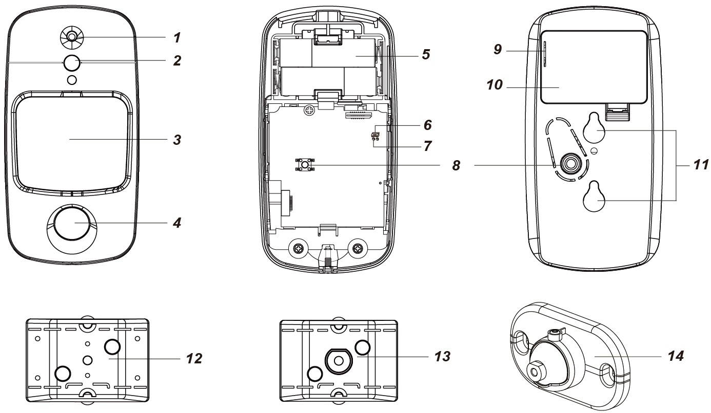
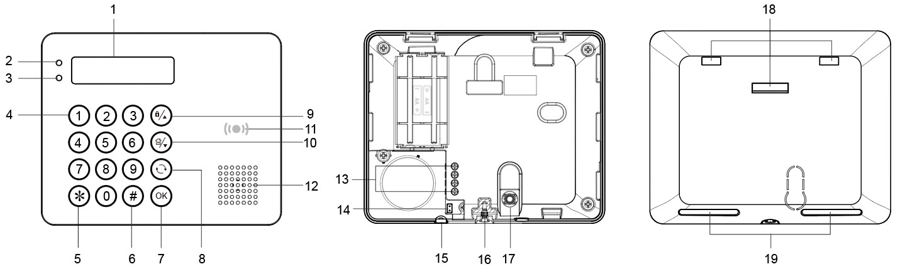
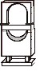

# VESTA 355

**Wired PIR Motion Sensor Camera (VST-892-BUS)**

**Introduction**

VST-892-BUS is a passive infrared (PIR) motion sensor camera. It is capable of sending wired signals and captured images (picture quality of up to 640 x 480 pixels) over BUS to the Control Panel upon movement detection.

The PIR Camera is designed with a typical detection range of 12 meters when mounted at a height of 2.3-2.5 meters above the ground. When Pet Immunity function is enabled, the motion sensor camera will not detect pets of up to 25kg when mounted at the height of 2.3-2.5 meters above the ground.

In addition, VST-892-BUS is designed with the digital proximity detector. The anti-masking feature allows for detection of any attempts to blind the detector by placing objects in its field of view.

Remote configuration is supported for the PIR camera. Besides adjusting the Jumper Switches, users can also enable/disable pet immunity function and adjust the sensitivity of the PIR camera from the Control Panel webpage or Home Portal Server.

The PIR Camera consists of a two-part design made up of a cover and a base. The cover contains all the electronics and optics and the base provides a means of fixing. The base has knockouts to allow mounting on a flat surface directly, or a mounting bracket is provided for corner mounting and surface mounting.

**The VST-892-BUS Series includes the following models**:

VST-892-BUS – Wired PIR motion sensor camera with flash LED VST-892-IL-BUS – Wired PIR motion sensor camera with Infrared LED

**Parts Identification**

**1. Flash LED/Infrared LED**

The Flash LED (For VST-892-BUS) or Infrared LED (For VST-892-IL-BUS) delivers sufficient light for image capture under low lighting condition.

**2. Blue LED/Function Button**

**Blue LED:**

(Please refer to _**LED Indicator**_ description below for details)

**Function Button Usage:**

*
  * Press the button once to enter test mode for 3 minutes.

1. **Digital Proximity Detector**

The digital proximity detector is used to detect any masking (blocking) attempt by an intruder

1. **IR Sensor**
2. **PIR Camera Lens**
3. **BUS Terminal**

Hardwire the four terminals (VCC, GND, A, B) to the BUS Terminal on the Control Panel. Please refer to _**PIR Camera Wiring**_ section for details.

1

1. **Terminal Resistor Jumper Switch**

When the PIR Camera is connected as the furthest BUS device on a BUS line, please set the PIR Camera's terminal resistor jumper and the first BUS device’s (usually the Hybrid Panel’s) Jumper Switch to ON to serve as terminating resistors. The connected BUS line’s communication ability will be enhanced.

 .png>)

**Jumper On**

The jumper link is inserted, connecting the two pins.

**Jumper Off**

The jumper link is removed or “**parked**” on one pin.

*
  * If the jumper is OFF, the communication ability is in normal level.
  * If the jumper is ON, the communication ability is enhanced.

1. **Tamper Switch**
2. **Pet Immunity Enable/Disable Jumper Switch (JP3)**

.png>)

**Jumper On**

.jpeg>)

The jumper link is inserted, connecting the two pins.

**Jumper Off**

The jumper link is removed or “**parked**” on one pin.

When set to ON, Pet Immunity is disabled (Factory default).

When set to OFF, Pet Immunity is enabled.

**10. Sensitivity Increaser Jumper Switch (JP4)**

When set to ON, the PIR’s detection sensitivity is high.

When set to OFF, the PIR’s detection sensitivity is in normal level (Factory default).

1. **Bottom Fixing Screw**
2. **Breakaway Area for Tamper Switch**
3. **Breakaway Area Options for Wiring**
4. **Mounting Bracket**

**Features**

.png>)

* _**LED Indicator**_
  * The Blue LED will flash for 1 second when the PIR Camera enters Test Mode. During Test mode, the Blue LED will flash once every time a movement is detected.
  * The LED will not flash if the PIR Camera is normal and is not under test mode.
* _**Image Capture**_

.png>)

When the alarm system is armed, the PIR Camera will capture 1, 3 or 6 alarm images with resolution of 640 x 480 or 320 x 240 (programmable from the Control Panel) upon movement detection. You can also manually request the PIR Camera to take a picture through the Control Panel. The captured images will be transferred to the Control Panel for users to view.

.png>)

_\<NOTE>_

*
  * If your PIR Camera is installed at a location where the camera’s field of view is a complex environment with intense light or lots of colors, the images captured will be great in file size, possibly leading to truncation when the images are transmitted to the Control Panel.
* _**Warm Up Period**_

.png>)

When the Control Panel system enters armed mode, or when the PIR Camera is put into Test Mode, the PIR Camera will warm up for 30 seconds.

* _**Power Supply**_

When VST-892-BUS is hardwired to a Hybrid Panel, 13.5V power supply can be provided by the Hybrid Panel.

.png>)

* _**Anti-Masking**_
  * The PIR Camera has a digital proximity detector that can detect any masking (blocking) attempts by an intruder.
  * When a masking event is detected, and the masking condition lasts for 3 minutes, VST-892-BUS will send a masking alarm signal to the Control Panel to notify user of the masking condition.
  * After masking/blocking is removed for 3 minutes, VST-892-BUS will send a restore signal to the Control Panel.
* _**Tamper Protection**_

.png>)

The PIR Camera is protected by a tamper switch which is depressed when the PIR Camera is properly installed. When the PIR Camera is removed from the mounting surface or its cover is opened, the tamper switch will be activated and the PIR Camera will send a tamper open signal to the system control panel to remind the user of the condition.

2

* .png>)_**Supervision**_

The PIR Camera will conduct a self-test periodically by transmitting a supervisory signal once every 20-30 seconds.

.png>)

* _**Test Mode**_
  *
    * Test Mode is for you to check the PIR camera’s detection range (not shooting coverage).
    * Press the Function button once to enter Test Mode for 3 minutes. The Blue LED will flash for 1 second.
    * The PIR camera will warm up for 30 seconds. Please do not trigger the Camera during this warm-up period.
    * After the warm-up period, you can trigger the PIR camera to check the IR detection range. If the PIR camera is triggered, the Blue LED will flash once.
* _**Caution**_
  * Wiring of the PIR camera should only be performed by certified technicians with proper knowledge and training in electric equipment.
  * Before installation or any maintenance work, make sure the power supply from the Control Panel has been disconnected.
* _**PIR camera Wiring**_
  *
    * Before connection, make sure the Panel power supply has been disconnected, and the panel battery switch has been slid to OFF position.
    * To assist with cable connections, the terminal blocks on each BUS system module are color-coded.

.png>) .png>)

| **Red**    | VDD  |
| ---------- | ---- |
| **Black**  | GND  |
| **Yellow** | 485A |
| **Green**  | 485B |

* Multiple BUS devices can be connected in series to the Hybrid Panel. For optimal communication of the connected BUS line devices, ensure the terminal resistor jumper switches of the first (usually the Hybrid Panel) and the furthest BUS devices on a BUS line are set to ON to serve as terminating resistors. Be sure to only enable the aforementioned 2 jumper switches, and do not set the jumper switches to ON for any other BUS devices in between.

.png>)

_\<NOTE>_

*
  * The pluggable design of BUS terminal blocks improves upon installation efficiency. Before wiring, you can remove the terminal blocks from the PCB board for ease of use, and plug in again after wiring.
  * After unplugging the terminal, when re-installing the terminal back to the board, make sure to install the terminal in the same direction to avoid potential hazards.
* Incorrect connections will result in failure or improper operation. Inspect wiring and ensure proper connections before applying power.
* There are eight Breakaway Area Options on the back cover and the battery cover for the wires to exit by detaching any one of them.

3

* _**Learning**_

Please follow the steps below to learn the device into the Hybrid Panel.

Step 1. Connect the device to the Panel. Then, power the Panel on.

Step 2. On the Panel’s webpage, click “**Learning**” to enter learn page.

Step 3. Click “**Start**” to enter learning mode.

Step 4. Click “**Add**” to include the device into the Panel.

Step 5. If the device is successfully learnt into the Panel, it will be displayed in the “Learned Device” section.

* _**Identification**_

The “Identify” function is used to localize a specific BUS device in the BUS wired system. This function is helpful in distinguishing which device is which especially in a large installation where numerous BUS devices are included.

To locate the PIR Camera in the BUS system:

**Step 1.** On Hybrid Panel’s webpage, click “Identify” under the device list after the IR Camera’s device column entry.

**Step 2.** If VST-892-BUS receives the signal from the Hybrid Panel, the webpage will display a success message and VST-892-BUS’s LED indicator will flash 10 times to indicate where it is to the user.

_\<NOTE>_

*
  *
    * If a timeout message is displayed on the webpage, it means VST-892-BUS did not receive the signal from the Panel.

Please check whether VST-892-BUS is connected properly to the Panel within appropriate wiring distance.

* _**Walk Test**_
  * To make sure the PIR Camera is able to communicate with the Panel after it is learned-in, place the Control Panel in Walk Test mode and press the function button on VST-892-BUS to transmit a test signal to the Panel.
  * When the Panel receives the test signal, it will beep once and display the PIR Camera’s information accordingly on the top of the device list.

_\<NOTE>_

*
  * If there is no response from the Panel after the press of function button, it means the Panel did not receive the test signal from the device.

Please check whether VST-892-BUS is connected properly to the Panel within appropriate wiring distance.

* _**Pet Immunity Function**_

The PIR sensor supports pet immunity feature and will not detect pets up to 25 kg to minimize false alarm situations. The Pet Immunity function can be enabled/disabled by setting the Jumper Switch (JP3) position. When the Jumper Switch (JP3) is set to ON, Pet Immunity is disabled (factory default). When the Jumper Switch (JP3) is set to OFF, Pet Immunity is enabled. The pet immunity function can also be adjusted by remote setting as described below.

* _**Sensitivity Increaser Function**_

You can use the sensitivity increaser function to increase the PIR’s detection sensitivity. To increase detection sensitivity, set the Jumper Switch (JP4) to ON. To maintain normal detection sensitivity, set the Jumper Switch (JP4) to OFF (Factory default). The sensitivity increaser function can also be adjusted by remote setting as described below.

* _**Remote Setting**_
  * The PIR camera supports remote setting of pet Immunity and sensitivity.
  * When the PIR camera is powered on, its pet immunity function and sensitivity are determined by the JP3 and JP4 settings. Users can either adjust jumper settings or remotely change the pet immunity and sensitivity settings from the Control Panel. Remote setting will overwrite the jumper settings.

**Control Panel Webpage**:

*
  *
    1. On the Panel’s local webpage, go to the Edit Device page and input the PIR Camera configuration in the Sensor Setting section. Click OK to confirm.

Please refer to the table below for configuration details. For example, if you want to enable Pet Immunity and set Sensitivity level to high, you can input 02.

| **IR Configuration** | **Pet Immunity** | **Sensitivity** |
| -------------------- | ---------------- | --------------- |
| 00                   | No               | High            |
| 01                   | No               | Normal          |
| 02                   | Yes              | High            |
| 03                   | Yes              | Normal          |

**Home Portal Server**:

1. On Home Portal Server, go to the Device Setting page, click the VST-892 device row and select “IR Configuration.”

4

1. Select the Pet Immunity function (Enable/Disable) and Sensitivity (High/Normal) from the drop-down menu, and click “Submit” to confirm the setting.

**Installation**

* _**Installation Guideline**_
  * The PIR Camera is designed to be mounted on either a flat surface or in a corner.
  * The base has knockouts, where the plastic is thinner, for mounting purpose. Two knockouts on the base are for surface fixing, and a mounting bracket can be used for corner fixing.
  * The detection range is up to 12 meters if the PIR Camera is mounted at a height of 2.3-2.5 meters above the ground.
  * When pet immunity function is enabled, it will not detect pets of up to 25kg when mounted at the height of 2.3-2.5 meters above the ground. If required, you can adjust the height of the PIR Camera according to the size of your pet for optimal pet immune performance. Higher installation location will provide a larger pet-immune space, but also increase the blind spot under the PIR Camera.
  * When VST-892-BUS is mounted with the rotating bracket, it will not have the regular detection area or the typical pet immunity range.

**It is recommended installing the PIR Camera in the following locations:**

*
  * At a position where the animals cannot come to the detection area by climbing on furniture or other objects.
  * Don’t mount the device at stairways where animals can climb on.
  * At a position where an intruder would normally move across the PIR’s field of view.
  * At a height between 2.3 and 2.5 meters above the ground for best performance.
  * In a corner to give the widest view.
  * At a position where its field of view will not be obstructed by, e.g., curtains, ornaments, etc.
* **Limitations**

|  | Do not install outdoors.                             |  | Avoid large obstacles in the detection area.               |
| - | ---------------------------------------------------- | - | ---------------------------------------------------------- |
|   |                                                      |   |                                                            |
|  | Do not expose the PIR Camera completely to direct    |  | Avoid vapor or high humidity that can cause                |
|   | sunlight.                                            |   | condensation.                                              |
|   |                                                      |   |                                                            |
|  | Avoid moving objects, e.g., curtains, wall hangings, |  | Avoid reflected light from bright surfaces, e.g., mirrors, |
|   | etc., in the detection area.                         |   | windows, etc.                                              |
|   |                                                      |   |                                                            |

5

* Avoid installing the PIR Camera in areas where machines such as air conditioners or heaters may cause rapid change in temperature in the detection area.
* Avoid reflecting surfaces in the detection area. Reflected infrared signatures may lead to false alarm.

6

6\. Re-place the cover onto the base and tighten the bottom fixing screw.

* **Surface Mounting with the mounting bracket:**
  1. Use the two central screw holes on the bracket as a template and drill holes into the surface to be mounted.
  2. Insert the wall plugs if the PIR Camera is to be fixed onto plaster or bricks.
  3. Screw the mounting bracket onto the wall plugs with the two pointing sticks on top and facing you.
  4. Hook the PIR Camera onto the hooks of the mounting bracket.
* **Corner mounting with the mounting bracket:**
  1. Use the 4 side screw holes on the bracket as template and drill holes on the corner surface.
  2. Insert the wall plugs if the PIR Camera is to be fixed onto plaster or bricks.
  3. Screw the mounting bracket onto the wall plugs with the two pointing sticks on top and facing you.
     1. Hook the PIR Camera onto the hooks of the mounting bracket.

7

* **Surface mounting with rotating bracket (optional item, sold separately):**

The rotating bracket can be mounted on the wall with the screws provided.

1. Screw the rotating bracket onto the wall.
2. Hook the PIR Camera onto the rotating bracket accordingly.
3. Rotate the bracket for the proper range of detection and tighten the fixing screw.

8
