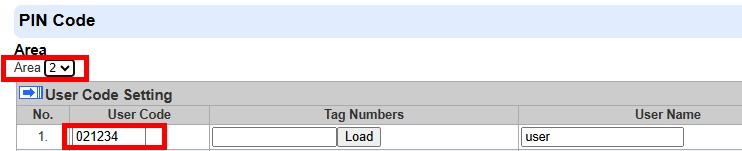

# VESTA 361

**Wired Outdoor Bell Box (BX-32-BUS)**

BX-32-BUS is a hardwired Bell Box used for system alarm indication outside a building. When an alarm signal is received from Control Panel, the Bell Box will activate its siren and strobe light to attract attention.

The Bell Box can also work with the Control Panel to emit entry and exit delay sounds, and also alert you to tamper violation.

.png>)

**Parts Identification**

1. **Wall Mounting Holes x 3**
2. **Tamper Switch**

The Tamper switch will be activated when the Bell box is removed from mounted surface, or when its cover is opened.

1. **Learn Button**
2. **LED 3 & 2 & 1 (From Left to Right)**
3. **Terminal Resistor Jumper Switch (J3)**

When the Bell Box is connected as the furthest BUS device on a BUS line, please set the Bell Box's terminal resistor jumper and the first BUS device’s (usually the Hybrid Panel’s) Jumper Switch to ON to serve as terminating resistors. The connected BUS line’s communication ability will be enhanced.

.jpeg>) .png>)

**Jumper On**

.jpeg>)

The jumper link is inserted, connecting the two pins.

**Jumper Off**

The jumper link is removed or “**parked**” on one pin.

*
  * If the jumper is OFF, the communication ability is in normal level.
  * If the jumper is ON, the communication ability is enhanced.

1. **Bus connection Terminal**
2. **Wiring Hole (for BUS Terminal)**
3. **Power Terminal (DC 12V Input / GND) (Optional)**

Connect to the power supply.

1. **Wiring Hole (for Power Terminal)**

**Power Supply**

* When BX-32-BUS is hardwired to a Hybrid Panel, 13.5V power supply can be provided by the Hybrid Panel.
* BX-32-BUS can also be powered by connecting to two-wired 12V AC-DC Adaptor via the DC 12V terminal. It is recommended to use the adaptor when connected to loads that require heavier power draw.

1

**Supervision**

The Bell box will transmit a supervisory signal every 20-30 seconds in normal operation mode. If this signal is not received, the Control Panel will indicate that the particular Bell box is experiencing an out-of-order problem.

**Function Overview**

.png>)

* **Alarm Memory**

If an alarm was triggered in your absence and the system was not disarmed before alarm length expiry, the Bell box will sound a short alarm when the system is disarmed to warn the user that an alarm had been triggered when he is away. This suggests that the intruder could still be within the premises.

* **Alarm Length**

When an alarm is activated by the Control Panel, the Control Panel will notify the Bell box to start alarming according to the panel’s alarm length setting. When the Panel’s alarm length expires, it will notify the Bell box to stop the alarm.

If the Bell box does not receive the Control Panel’s signal to stop the alarm, it will sound alarm for a maximum of 15 minutes, then stop the alarm.

For example:

*
  * If the Panel’s alarm length is set to more than 15 minutes, after an alarm is activated, instead of waiting the Panel’s alarm length to expire, the Bell box will stop alarming after 15 minutes.
  * If the Panel is under disarmed mode and the Bell box tamper switch is triggered, the Bell box will not activate the alarm since the Panel is under disarmed mode, and will activate the alarm for 15 minutes due to tamper triggering.
* **Siren Tamper**

The Bell box is protected against any attempts to open the lid or to detach the Bell box from its mounting surface.

If the Bell box detects a tamper condition, it will activate the siren & strobe light for the programmed alarm length. A tamper signal will be sent to the Control Panel along with regular signal transmissions for the Control Panel to display the status accordingly. If the tamper condition continues, the Bell box will sound a series of five beeps either every time the system is armed or when the tamper is enabled, to indicate a fault.

* **Audio & Visual Status Indication**

While arming / disarming the system, the Bell box uses different methods to distinguish various statuses for the user, as listed in the table below.

.png>) .png>) .png>)

|                  | **Siren Audio** |                                   | **Strobe light indication**  |
| ---------------- | --------------- | --------------------------------- | ---------------------------- |
|                  |                 |                                   |                              |
| Arm/Home         | 1 beep          | 3                                 | LED groups flash once        |
| Disarm           | 2 beeps         | Sequentially flashes for 1 cycle  |                              |
| Arm (Tamper)     | 5 beeps         | 3                                 | LED groups flash for 5 times |
| Disarm (Tamper)  | 5 beeps         | Sequentially flashes for 5 cycles |                              |
| Entry/Exit delay | Count-down      |                                   |                              |
| Sound            | beeps           |                                   |                              |

.jpeg>)  (1).jpeg>) .png>)

**Caution**

* Wiring of the Outdoor Bell Box should only be performed by certified technicians with proper knowledge and training in electric equipment.
* Before installation or any maintenance work, make sure the power supply has been disconnected.

**Bell Box Wiring**

2

* Before connecting the Bell box to the system bus, please switch the power off.
* To assist with cable connections, the terminal blocks on each BUS system module are color-coded.

.jpeg>)

| **Red**    | VDD  |
| ---------- | ---- |
| **Black**  | GND  |
| **Yellow** | 485A |
| **Green**  | 485B |

* Multiple BUS devices can be connected in series to the Hybrid Panel.For optimal communication of the the connected BUS line devices, ensure the terminal resistor jumper switches of the first (usually the Hybrid Panel) and the furthest BUS devices on a BUS line are set to ON to serve as terminating resistors. Be sure to only enable the aforementioned 2 jumper switches, and do not set the jumper

switches to ON for any other BUS devices in between.

.png>)

_\<NOTE>_

*
  * The pluggable design of BUS terminal blocks improves upon installation efficiency. Before wiring, you can remove the terminal blocks from the PCB board for ease of use, and plug in again after wiring.
  * After unplugging the terminal, when re-installing the terminal back to the board, make sure to install the terminal in the same direction to avoid potential hazards.
* Incorrect connections will result in failure or improper operation. Inspect wiring and ensure proper connections before applying power.

.jpeg>)

**Learning**

Please follow the steps below to learn the Bell box into the Hybrid Panel.

Step 1: Connect the Bell box to the Panel. Then, power the Panel on.

Step 2: On the Panel’s webpage, click “**Learning**” to enter learn page.

Step 3: Click “**Start**” to enter learning mode.

Step 4: Click “**Add**” to include the Bell box into the Panel.

Step 5: If the Bell box is successfully learnt into the Panel, it will be displayed in the “Learned Device” section.

3

**Identification**

The “Identify” function is used to localize a specific BUS device in the BUS wired system. This function is helpful in distinguishing which device is which especially in a large installation where numerous BUS devices are included.

To locate the Bell Box in the BUS system:

**Step 1.** On Hybrid Panel’s webpage, click “Identify” under the device list after the Bell Box’s device column entry.

**Step 2.** If the Bell Box receives the signal from the Hybrid Panel, the webpage will display a success message and the Bell Box’s 3 LED groups will flash 10 times to indicate where it is to the user.

.png>)

_\<NOTE>_

* If a timeout message is displayed on the webpage, it means the Bell Box did not receive the signal from the Panel.

Please check whether the Bell Box is connected properly to the Panel within appropriate wiring distance.

**Walk Test**

* To make sure the Bell Box is able to communicate with the Panel after it is learned-in, place the Control Panel in **Walk Test** mode and press the learn button on the Bell Box to transmit a test signal to the Control Panel.
* When the Panel receives the test signal, it will beep once and display the Bell Box’s information accordingly on the top of the device list.

.png>)

_\<NOTE>_

* If there is no response from the Panel after the press of learn button, it means the Panel did not receive the test signal from the device.

Please check whether Bell Box is connected properly to the Panel within appropriate wiring distance.

**Installation**

Step 1. Find the location where the Bell box is to be mounted.

Step 2. Unscrew the bottom screw with a Phillips screwdriver and remove the top cover.

Step 3. Hold the Bell box at the position where it is to be mounted.

Step 4. Identify the 3 mounting holes, mount and fix the Bell box on the wall using the large screws and wall plugs provided. Secure the screws with a Phillips screwdriver. Make sure the Tamper Switch is fully depressed against the wall

.png>)

_\<NOTE>_

* The tamper switch protrudes from the back of the siren when the Bell box is not mounted in place. When the siren is pulled off from the wall, the alarm will be activated. Ensure it is fully depressed when the siren is mounted. If there is a gap, pack with a suitable spacing material.

Step 5. Re-place the top cover and tighten the bottom screw with a Phillips screwdriver.

Step 6. Check if the installation is successful by testing from the Control Panel with arming and disarming function.

Successful arming/disarming will be indicated by the table provided above in **Audio & Visual Status Indication** section.

.png>)

_\<NOTE>_

* If 5 short beeps are noticed while arming/disarming, it means the tamper is not fully depressed. Check to ensure that tamper is properly set and test from Control Panel again.

Step 7. The installation is now complete.

4
