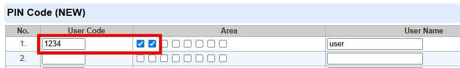
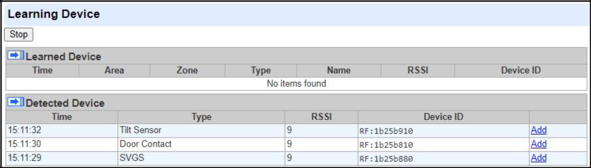

# VESTA-381

**Door Contact / Shock Sensor / Tilt Sensor (DCSV-32)**

DCSV-32 is a Door Contact / Shock Sensor / Tilt Sensor capable of sending wireless signals to the Control Panel upon detecting door/window opening, shock, or when vertical axis deviation exceeds the alarm-triggering threshold. The device also features an extension terminal for connecting to a third-party device.

When learning into the Control Panel, DCSV-32 will be recognized as 3 devices: Door Contact (internal magnetic switch and/or extension terminal), Shock Sensor, and Tilt sensor. The 3 devices operate independently. The user can select the desired sensors for use and add them to the Panel.

**Parts Identification**

1. **LED Indicator / Test Button**

\- Press the button once to send a learn code or enter test mode for 3 minutes.

1. **Cover Fixing Screw**
2. **Extension Terminal**

Besides the built-in magnet switch, an additional 2-pin dry contact terminal is provided for an extension magnet switch or any device with N.C. (Normally Closed) or N.O. (Normally Open) functionality.

**4. Reed Switch Jumper Switch (JP1)**

 (1).png>)

**Jumper On** **Jumper Off**

The jumper link is inserted, connecting the two pins. The jumper link is removed or “parked” on one pin.

*
  * Jumper ON: Internal Reed Switch is **disabled**.
  * Jumper OFF: Internal Reed Switch is **enabled** (Factory Default).

1. **Input Jumper Switch (JP2)**

 (1) (1) (1).png>)

| **Jumper On**                                        | **Jumper Off**                                        |
| ---------------------------------------------------- | ----------------------------------------------------- |
| The jumper link is inserted, connecting the two pins | if the jumper link is removed or “parked” on one pin. |

* Jumper ON: Normally Closed (N.C.) is set.
* Jumper OFF: Normally Open (N.O.) is set **(Factory Default)**.

1. **Battery Compartment**
2. **Tamper Switch**
   * Provides tamper protection against unauthorized device opening and/or removal from mounting surface.
3. **Mounting Holes**
4. **Battery Insulator**
5. **Magnet**
6. **Magnet Screw holes**
7. **Magnet Spacer**

**Features**

* _**LED Indicator**_
  * In Normal Operation Mode, the LED will not light up when the device is activated.
  * When the device battery voltage is low, every time the device is activated, the LED will flash quickly.
  * When the tamper switch is triggered, the LED will flash quickly. When the tamper condition continues, the LED will flash quickly whenever the device is triggered.
  * When under Test mode, the LED will flash quickly every time the device is triggered.
  * When the battery is exhausted, the device will stop all functions, the LED will flash every 4 seconds.
* _**Battery**_
  * DCSV-32 uses one CR123 3V Lithium battery as its power source. The battery is installed in the battery compartment with a battery insulator inserted. To activate the battery, simply pull out the battery insulator.
  * DCSV-32 can detect low battery condition. When the battery voltage is low, a low battery signal will be sent to the Control Panel to notify the condition. The LED will light up when the Door Contact / Shock Sensor / Tilt Sensor is activated under low battery status. When the battery is exhausted, DCSV-32 will stop all function, the LED will flash every 4 seconds.
  * When changing a battery, after removing the old battery, press the Tamper Switch twice to fully discharge it before inserting a new battery.
* _**Tamper Protection**_
  * DCSV-32 is protected by a tamper switch which is depressed against the mounting surface when the device is mounted in place. Whenever DCSV-32 is removed from the mounting surface or its cover is opened, the tamper switch will be activated, causing the device to send a tamper open signal to remind the user of the condition.
  * The tamper open signal will be transmitted with the device’s regular signal transmission to the Control Panel. The tamper fault status will be displayed in the zone of Door Contact on the Control Panel.
* _**Supervision**_
  * When in normal operation, the Door Contact / Shock Sensor / Tilt Sensor will send a supervision signal to the Control Panel separately at random intervals of 90-120 minutes.
  * If the Control Panel has not received the supervision signal from the detector for a preset period of time, the Control Panel will indicate that the particular Door Contact / Shock Sensor / Tilt Sensor are experiencing an out-of-signal problem.
* _**Test Mode**_
  * Under Normal Mode, press the Test Button to transmit a test signal to the Control Panel. The detector will enter the Test Mode for 3 minutes.
  * Under Test Mode, the LED will flash quickly whenever the Door Contact / Shock Sensor / Tilt Sensor is triggered.
  * Each additional press of the Test Button will reset the Test Mode time to 3 minutes.
* _**Operation**_

**Door Opening Detection**

* **Door Opening** is detected by the detector’s built-in reed switch and the magnet.
* The detector is usually fixed to the monitored door/window frame with the magnet fixed to the door/window. When the door or window opens/closes, the magnet moves away / approaches, and the reed switch changes the state of the contacts, causing the detector to transmit a door open / closing signal to the Panel.
* Besides the built-in magnet switch, an additional 2-pin dry contact terminal is provided for an extensionmagnet switch or any device with N.C. (Normally Closed) or N.O. (Normally Open) functionality.
* The extension terminal and the internal magnetic switch can function together to trigger the Door Contact when either of them is activated, you can also choose to disable the internal magnetic switch through JP1 Jumper setting. If both extension terminal and internal magnetic switch are in use and any of them is triggered (opened), the Door Contact will only send Door Contact a close (restore) signal when both of them are closed.

**Shock Detection**

* The device is triggered by shock detection that exceeds the detection threshold.
* **Materials of Mounting Surface:** The device supports shock detection on various materials including glass, wood, metal, and concrete. After installation, you can select the material of the mounting surface on the Control Panel. The default is set to **Wood**.
* **Sensitivity:** The shock sensor sensitivity is programmable from the Control Panel. Three sensitivity levels are selectable: **Low**, **Medium (Default)**, and **High**.
* Please refer to the following section _**Set the Material & Sensitivity Level for Shock Sensor**_ for further details.

**Tilt Detection**

* The tilt sensor detects vertical axis deviation of a device. If the device tilts beyond the programmed alarm threshold, it will be triggered.
* **Tilt angle for alarm triggering:** The tilt sensor’s active trigger threshold is programmable from the

Control Panel. Available options include: **disable**, **≥5° (default)**, **≥10°**, **≥15°**, **≥20°**, and **≥25°**.

* The tilt sensor’s restore time is programmable from the Control Panel. Available options include: **disable**, **2 secs**, **4 secs**, **6 secs**, **8 secs**, **10 secs (default)**, **12 secs**, **14 secs**, **16 secs**, **18 secs**, **20 secs**, **22 secs**, **24 secs**, **26 secs**, **28 secs**, **30 secs**.
* Please refer to the following section _**Tilt Sensor Configuration**_ for details.
* _**Extension Terminal**_

DCSV-32 has an extension terminal to provide enhanced flexibility. According to the setting of JP2, the extension terminal forms a closed (Normally Closed (N.C.)) or open (Normally Open (N.O.)) loop with the device connected to it. When the device connected to the extension terminal is triggered, the Door Contact will be triggered.

_**Caution**_

* Wiring of the detector should only be performed by certified technicians with proper knowledge and training in electric equipment.
* Before installation or any maintenance work, make sure the power supply has been disconnected.

| To connect the device to the extension terminal: | _**Top View of DCSV-32**_                                         |   |   |
| ------------------------------------------------ | ----------------------------------------------------------------- | - | - |
| 1.                                               | Open the Door Contact’s cover with a screwdriver by loosening the |   |   |
|                                                  | cover fixing screw at the bottom of the device.                   |   |   |
| 2.                                               | The upper end of the front case has a thinner plastic knockout.   |   |   |
|                                                  | Break through the knockout to create a hole for the wiring        |   |   |
|                                                  | connection to the extension terminal.                             |   |   |
| 3.                                               | Connect the device to the extension terminal.                     |   |   |

 

The extension terminal may be useful for the following situations:

* If the Door Contact cannot be mounted on the door frame, you can

connect an additional extension magnet switch to the extension terminal to mount the Door Contact remotely.

* Any dry-contact devices with an N.C. (Normal Closed) or N.O. (Normally Open) loop can be connected to the extension terminal, enabling the Door Contact to serve as a Universal Transmitter.
* Multiple dry-contact devices can be wired together with the Door Contact, as shown in the picture below.

* The extension terminal and the internal magnetic switch can function together to trigger the Door Contact when either of them is activated. You can also choose to disable the internal magnetic switch through JP1 Jumper setting. If both extension terminal and internal magnetic switch are in use and any of them is triggered (opened), the Door Contact will only send Door Contact a close (restore) signal when both of them are closed.
* _**Learning**_

Please follow the steps below to learn the device into the Panel.

**Step 1.** Remove the battery insulator on the DCSV-32 to power on the device.

**Step 2.** On the Panel’s webpage, click “**Learning**” to enter learn page.

**Step 3.** Click “**Start**” to enter learning mode.

**Step 4.** Press the Test Button on the DCSV-32.

* When learnt into the Control Panel, DCSV-32 will be recognized as 3 devices: Door Contact (internal magnetic switch and/or extension terminal), Shock Sensor (SVGS), and Tilt sensor. The 3 devices operate independently. The user can select the desired sensors for use and add them to the Panel.

**Step 5.** Click “**Add**” to include the devices into the Panel.

**Step 6.** If the devices are successfully learnt into the Panel, they will be displayed in the “**Learned Device**” section.

* _**Set the Material & Sensitivity Level for Shock Sensor:**_

After the device is learnt into the Control Panel, the user can edit the device configuration. The default setting of Shock sensor is wood / medium.

**For HPGW/HSGW**

**Step 1.** After DCSV-32 is learned into the Control Panel, press the Test Button on DCSV-32 once.

**Step 2.** Go to the Control Panel webpage to edit the device.

**Step 3.** Select the material and sensitivity level from sensor setting. Click **OK** to confirm.

**Step 4.** Press the Test Button on DCSV-32 to receive Material & Sensitivity Level data from the Control Panel. The LED will first turn off, and then become brighter and then turn dark, indicating that programming command from the Control Panel has been successfully received.

**For BOGP-3**

**Step 1.** After DCSV-32 is learned into the Control Panel, press the Test Button on DCSV-32 once.

**Step 2.** Go to the Control Panel webpage. Select “**Device Management**,” and then click on “**Settings**” in the **SVGS** row.

**Step 3.** Input the Sensitivity configuration in the **Device Edit** section. Please refer to the table below for configuration details. For example, if you want to set the material and sensitivity level as concrete and low, please input 0800.

|   | **Sensitivity**   |   |   | **Material** |   |        | **Sensitivity** |   |   |
| - | ----------------- | - | - | ------------ | - | ------ | --------------- | - | - |
|   |                   |   |   |              |   |        |                 |   |   |
|   | **Configuration** |   |   |              |   |        |                 |   |   |
|   |                   |   |   |              |   |        |                 |   |   |
|   |                   |   |   |              |   |        |                 |   |   |
|   | 0800              |   |   | Concrete     |   | Low    |                 |   |   |
|   |                   |   |   |              |   |        |                 |   |   |
|   | 0801              |   |   | Concrete     |   | Medium |                 |   |   |
|   |                   |   |   |              |   |        |                 |   |   |
|   | 0802              |   |   | Concrete     |   | High   |                 |   |   |
|   |                   |   |   |              |   |        |                 |   |   |
|   | 0A00              |   |   | Metal        |   | Low    |                 |   |   |
|   |                   |   |   |              |   |        |                 |   |   |
|   | 0A01              |   |   | Metal        |   | Medium |                 |   |   |
|   |                   |   |   |              |   |        |                 |   |   |
|   | 0A02              |   |   | Metal        |   | High   |                 |   |   |
|   |                   |   |   |              |   |        |                 |   |   |
|   | 0C00              |   |   | Glass        |   | Low    |                 |   |   |
|   |                   |   |   |              |   |        |                 |   |   |
|   | 0C01              |   |   | Glass        |   | Medium |                 |   |   |
|   |                   |   |   |              |   |        |                 |   |   |

5

| 0C02 | Glass | High   |
| ---- | ----- | ------ |
|      |       |        |
| 0E00 | Wood  | Low    |
|      |       |        |
| 0E01 | Wood  | Medium |
|      |       |        |
| 0E02 | Wood  | High   |
|      |       |        |

**Step 4.** Click “**Submit**” to confirm. Press the Test Button on DCSV-32 to receive Material & Sensitivity Level data from the Control Panel. The LED will first turn off, and then become brighter and then turn dark, indicating that programming command from the Control Panel has been successfully received.

* _**Tilt Sensor Configuration**_

Once the device is learnt into the Control Panel, the user can edit the device configuration. The default setting of Tilt Sensor is Tilt ≥ 5° for Alarm Trigger Threshold, and 10 secs for Restore Time.”

**For HPGW/HSGW**

**Step 1.** Go to the Tilt Sensor device edit page.

**Step 2.** Input the Tilt Sensor configuration in the Sensor Setting section. Click **OK** to confirm.

Please refer to the table below for configuration details. For example, to set the alarm trigger threshold to ≥5° and restore time to 2 seconds, please input 1100.

|   | Parameter 1           |   |                  | Parameter 2         |   |              | Parameter 3 |   |              | Parameter 4 |   |   |
| - | --------------------- | - | ---------------- | ------------------- | - | ------------ | ----------- | - | ------------ | ----------- | - | - |
|   |                       |   |                  |                     |   |              |             |   |              |             |   |   |
|   |                       |   |                  |                     |   |              |             |   |              |             |   |   |
|   | **Alarm Trigger**     |   |                  |                     |   |              |             |   |              |             |   |   |
|   |                       |   | **Restore Time** |                     |   | **Reserved** |             |   | **Reserved** |             |   |   |
|   | **Threshold**         |   |                  |                     |   |              |             |   |              |             |   |   |
|   |                       |   |                  |                     |   |              |             |   |              |             |   |   |
| 0 | = disable             |   | 0                | = disable           | 0 |              | 0           |   |              |             |   |   |
| 1 | = Tilt ≥ 5° (default) |   | 1                | = 2 secs            | 0 |              | 0           |   |              |             |   |   |
| 2 | = Tilt ≥ 10°          |   | 2                | = 4 secs            | 0 |              | 0           |   |              |             |   |   |
| 3 | = Tilt ≥ 15°          |   | 3                | = 6 secs            | 0 |              | 0           |   |              |             |   |   |
| 4 | = Tilt ≥ 20°          |   | 4                | = 8 secs            | 0 |              | 0           |   |              |             |   |   |
| 5 | = Tilt ≥ 25°          |   | 5                | = 10 secs (default) | 0 |              | 0           |   |              |             |   |   |
|   |                       |   | 6                | = 12 secs           | 0 |              | 0           |   |              |             |   |   |
|   |                       |   | 7                | = 14 secs           | 0 |              | 0           |   |              |             |   |   |
|   |                       |   | 8                | = 16 secs           | 0 |              | 0           |   |              |             |   |   |
|   |                       |   | 9                | = 18 secs           | 0 |              | 0           |   |              |             |   |   |
|   |                       |   | A = 20 secs      | 0                   |   | 0            |             |   |              |             |   |   |
|   |                       |   | B = 22 secs      | 0                   |   | 0            |             |   |              |             |   |   |
|   |                       |   | C = 24 secs      | 0                   |   | 0            |             |   |              |             |   |   |
|   |                       |   | D = 26 secs      | 0                   |   | 0            |             |   |              |             |   |   |
|   |                       |   | E = 28 secs      | 0                   |   | 0            |             |   |              |             |   |   |
|   |                       |   | F = 30 secs      | 0                   |   | 0            |             |   |              |             |   |   |

**Step 3.** Press the Test Button of DCSV-32 to receive Tilt Sensor configuration from the Control Panel. The LED will first turn off, and then become brighter and turn dark, indicating that programming command from the Control Panel has been successfully received.

**For BOGP-3**

**Step 1.** After DCSV-32 is learned into the Control Panel, press the Test Button on DCSV-32 once.

**Step 2.** Go to the Control Panel webpage. Select “**Device Management**,” and then click on “**Settings**” in

the **Tilt Sensor** row.

6

**Step 3.** Input the Sensitivity configuration in the **Device Edit** section. For configuration details, please refer to the table mentioned in **Step 2** of the **HPGW/HSGW** Section in the Tilt Sensor Configuration. For example, to set the alarm trigger threshold to ≥5° and restore time to 2 seconds, please input 1100.

**Step 4.** Click “**Submit**” to confirm. Press the Test Button of DCSV-32 to receive Tilt Sensor configuration from the Control Panel. The LED will first turn off, and then become brighter and turn dark, indicating that programming command from the Control Panel has been successfully received.

* _**Walk Test**_
  * After the device is learned-in, place the Control Panel into (Walk Test) mode, hold the device in the desired location, and press the Test Button to transmit a test signal to Control Panel. If the Control Panel is within device signal range, the panel will display Door Contact / Shock Sensor / Tilt sensor information accordingly.
  * Proceed with mounting and installation once you are satisfied that the device functions properly in the desired location.

**Installation**

* _**Mounting the Door Contact / Shock Sensor / Tilt Sensor**_

**Mounting as a Door Contact:**

* The Door Contact should be installed with the rib-marked side facing the magnet.
* The distance between Door Contact and the magnet should be no more than 15 mm when the door is closed.
* Mount the device as high as possible.

**Mounting as a Shock Sensor:**

Refer to the table below for information about installation location and the thickness of different materials:

|                           | Glass Window | Wood/Metal Door | Concrete Wall |   |
| ------------------------- | ------------ | --------------- | ------------- | - |
|                           |              |                 |               |   |
| **Thickness**             | >5mm         | <40mm           | -             |   |
|                           |              |                 |               |   |
| **Installation Location** | Window Frame | Door            | Wall          |   |
|                           |              |                 |               |   |
|                           | 7            |                 |               |   |

|                        | **Low Sensitivity**  | 0.5M | 0.5M | 0.25M |   |
| ---------------------- | -------------------- | ---- | ---- | ----- | - |
| **Shock Detection**    |                      |      |      |       |   |
| **Medium Sensitivity** | 1M                   | 1M   | 0.5M |       |   |
| **Radius**             |                      |      |      |       |   |
|                        |                      |      |      |       |   |
|                        | **High Sensitivity** | 1.5M | 2M   | 1M    |   |
|                        |                      |      |      |       |   |

**Mounting as a Tilt Sensor:**

* The tilt sensor detects vertical deviation relative to the initial position exceeding the programmed activation threshold (≥5°, ≥10°, ≥15°, ≥20°, ≥25°).
* The tilt sensor can be installed on windows or skylights, and the device should be mounted either vertically or horizontally with respect to the ground (within ±5°).
* _**Mounting Procedure**_
  1. Use the 2 mounting holes on the back cover as a template and drill holes into the surface to be mounted.
  2. Insert the provided wall plugs when the device is to be mounted on window frames / concrete wall.
  3. Screw the detector onto the wall plugs. (Drilling is recommended when mounting on steel, or you can also use the provided sticker in the package).
  4. Fit the magnet on the door using a small piece of double-sided adhesive tape or the provided screws.
  5. To mount the magnet, use the 2 magnet screw holes as a template for hole positioning and drilling.
     * _NOTE >_
       * The magnet must align with the rib-mark side of the Door Contact. If required, apply the magnet spacer to the back of the magnet to better align the magnet to the rib marks.
  6. Screw the magnet and insert the two white caps into the magnet screw holes for aesthetic integrity.
  7. Installation is now complete.

