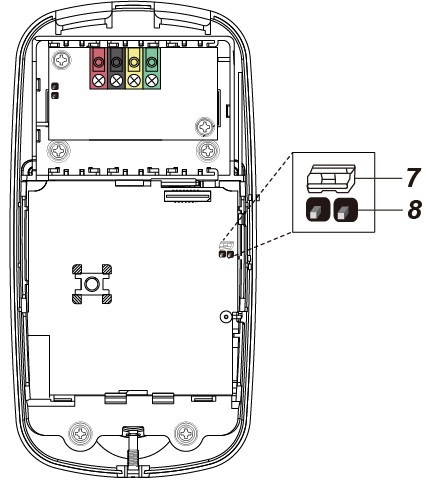

# VESTA-383

**KPT-35N**

## **REMOTE KEYPAD with NFC Reader**&#x20;

KPT-35N is a Remote Keypad with NFC reader. It is designed to have quick access control of the System Control Panel via PIN Code or NFC label. The Keypad can send wireless signals to and receive wireless signals from the Control Panel. The LCD screen will display any information the system control panel sends back.

The Remote Keypad can either be mounted on a flat surface or wall with screws, or placed on the desktop with the enclosed bracket. It also has a tamper protection switch which will be activated upon any unauthorized attempt to open the back cover.

## **Parts Identification**

<figure><figcaption></figcaption></figure>

1. **Backlit LCD Display**
2. **Green LED**
   * The Green LED is off in stand-by mode.
   * The Green LED will light up when any key is pressed.
3. **Yellow LED**
   * The Yellow LED will flash once every 3 seconds when any fault situation is detected, and turn to OFF when all fault conditions are restored. The LED’s behavior is controlled by the Control Panel.
4. **Backlit Numeric Keys**
5. **Backlit Star (**＊**) Key**
6. **Backlit Pound (**＃**) Key**
7. **Backlit OK Key**
   * For confirming the keyed-in data or confirming the selection.
8. **Backlit Restore (****) Key**
   * This key is is used for deleting a digit, canceling the selection, aborting the current screen, and returning to the previous screen etc.
9. **Backlit Arm/"UP ARROW" Key**
   * Use this key to move the cursor and scroll the display upwards - The key is also used for entering “Away Armed” mode.
10. **Backlit Arm/"DOWN ARROW"Key**
    * Use this key to move the cursor and scroll the display downwards.
    * The key is also used for entering “Home Armed” mode.
11. **Backlit NFC Sensor Zone**
12. **Buzzer**
13. **Battery Compartment**
14. **Tamper Switch**
15. **Bracket Holes x 3**
16. **Mounting Holes x 4**
17. **Bottom Fixing Screw x 1**

## Features

### &#x20;Battery and Low Battery Detection

* Three CR123 lithium batteries are used to power the keypad. Prior to inserting batteries, ensure correct battery placement to protect your device.
* KPT-35N can detect the battery status. When batteries are low in power, a low battery signal will be sent along with regular signal transmissions to the Control Panel to alert users to battery replacement.


Note:

Only use specified batteries with the device. When replacing batteries, always replace the whole set, do not mix different types of batteries or new and used ones to avoid damaging the device.


### Power Saving Feature

* When idle, the keypad is in **stand-by** mode and consumes no power. It will wake up when any key is pressed.
* After entering User Menu, if neither of the **Arm** key/**Home Arm** key is pressed, the keypad will return to **stand-by** mode within 5 seconds. If either or both of the **Arm** key/**Home Arm** key is/are pressed, the keypad will return to stand-by mode within **20** seconds.
* After “Enter PIN Code” is displayed on the LCD screen, if no key is pressed, the keypad will return to **stand-by** mode within 5 seconds.
* After the mode change request is submitted, if no signal is received from the Control Panel, the keypad will return to **stand-by** mode within 15 seconds.
* Upon completion of a command input, the keypad will return to **stand-by** mode.

### Tamper Protection

* The keypad is protected against any unauthorized attempts to open the back cover with a tamper switch. When the back cover is opened, the tamper switch will be triggered and the keypad will transmit a tamper open signal to the system control panel.
* After replacing the back cover, the keypad will transmit a tamper restore signal to the Control Panel.
* When the keypad is properly mounted with back cover screwed onto the wall, removing the keypad forcefully will break off the back cover from the hollowed section around the screw location and activate tamper switch.

### Supervision Signal

* After installation, the keypad will automatically transmit Supervision Signals to the Control Panel at an interval of 30-50 minutes.
* If the Control Panel has not received the signal from the keypad for a preset period of time, the Control Panel will consider the keypad out of order and react according to panel setting.

### Joining the System Network

* To add the keypad to the system network, first put the Control Panel in learning mode.
* **Press the OK key once. When “Enter PIN Code” is displayed on the LCD screen, press and hold the OK key for 10 seconds.**
* “KPT will reset in 2 seconds” will be displayed on the LCD screen along with a long beep.
* “Scanning Network” will be displayed on the LCD screen while the keypad is sending learning code to the Control Panel.
* When the keypad is added to the Control Panel, “Learning Success” will be displayed on the LCD screen along with 2 beeps.


Note

* If the Control Panel promptly responds to the keypad, the “Scanning Network” process will be skipped, and “Learning Success” will be directly displayed on the LCD screen.
* If the keypad does not receive any signal from the Control Panel within 20 seconds, the LCD screen will be turned off, and the keypad will return to stand-by mode.


### Label Addition/Deletion Procedures

The Keypad is capable of transmitting NFC signals to the Control Panel, and you can assign a PIN Code and user name to each NFC label on the Panel webpage. The NFC labels can then be used to control alarm system mode through the Keypad. The number of NFC labels and PIN Codes are managed on the Control Panel webpage. _**For H Series Control Panel & Hybrid Panel**_

_**A. Add Label:**_

When adding a new label, the keypad must be in normal operation mode.

Step 1. Go to the PIN Code page on the Control Panel webpage, input a 4-digit or 6-digit user pin code and user name for the label, and assign the user pin code to an Area.

<figure><figcaption></figcaption></figure>

Step 2. After the keypad is successfully learnt into the panel, press the OK key and then apply a new label to the Keypad Tag sensor zone. The white backlight will turn on with 4 beeps to indicate this label is new (not added to the system yet).

Step 3. Click the Load button on the PIN Code page as below. The corresponding label number will be loaded. Click Submit to save the user code setting.

<figure><figcaption></figcaption></figure>

Step 4. The label has been added. You can use the label to arm/home arm/disarm the system.


Note:

* Consecutively sensing 5 unadded labels or unadded label(s) for 5 times will generate an error record and cause the Keypad to be locked up for 5 minutes. To prevent lockup from happening, an added label must be sensed once to clear the error record.
* If the Keypad is locked up, it will be automatically unlocked after the 5-minute lockup period expires.


&#x20;_**B. Clear Label:**_

Step 1. Go to the PIN Code page on the Control Panel webpage.&#x20;

Step 2. Manually delete the label number and click “Submit”.

<figure><figcaption></figcaption></figure>

Step 3. The label has been cleared.

_**For BOGP-3**_

_**A. Add Label:**_

Step 1. Change the system mode to disarmed mode; press the OK key once and “Enter PIN Code” will be displayed on the LCD screen.

Step 2. Apply an unadded label to the Keypad Tag sensor zone. The white backlight will turn on with 4 beeps to indicate this label is not being added to the system before.

Step 3. On BOGP-3’s webpage, go to User page and click “Last UID” at the bottom of User Setting.

<figure><figcaption></figcaption></figure>

Step 4. The label number will then be shown after “Last UID” above “User Setting”.

Step 5. Copy the label number and paste it to the Tag column. Input a 4-digit or 6-digit user pin code and user name for the label and click “Submit” to save the label’s info. The label has been added.

&#x20;_**C. Clear Label:**_

Step 1. Go to the User page of BOGP-3’s webpage.

Step 2. Manually delete the label number from the Tag column and click “Submit”.

&#x20;Step 3. The label has been cleared.

### Area Status Check

* The keypad allows the user to check the status mode of each area. When the Control Panel is under stand-by mode, press the OK key and the current status of each area will be displayed on the LCD screen for 3 seconds.
* There are three different statuses: A = Away Armed / H = Home Armed / D = System Disarmed.
* A question mark “?” will be displayed if the area status cannot be identified.
* Example:

<figure><figcaption></figcaption></figure>

### System Mode Change

Users can use the keypad to change the system mode with a PIN code or an NFC label.

1. **To change the system mode with a PIN Code:**

After entering the PIN code, press the **Arm/Home Arm/OK** key to enter **Away Armed/Home Armed/System Disarmed** mode.

2. **To change the system mode with a label:** Press the **Arm/Home Arm/OK** key, and then swipe the label. If the label info is correct, “Success” will be displayed on the LCD screen, indicating that the system has entered **Away Armed/Home Armed/System Disarmed** mode.

* When the system mode is changed to disarmed mode, the LCD will show “Area No. Alarm Memory” and Yellow LED will flash once every 3 seconds with 5 beeps if there is/are alarm(s) triggered before. Users can manually enter User Menu to view the alarm memory (please refer to User Menu section below for details).
* **Quick Arm Function:** Users can enter Setting Menu to activate the Quick Arm Function (Choose **Setting > Quick Arm > Enable**, and then press OK), which will allow users to change the mode by pressing the Arm key or the Home Arm key without entering the PIN code. To disarm the system, users still need to enter the PIN code.
* After entering User Menu with the system disarmed, users can also select **Away Arm** or **Home Arm**, and press OK to change the system mode.

### User Menu

* The keypad will communicate with the system to retrieve information before entering User Menu. The following options will be displayed on the LCD screen for selection. Use  and  keys to select, and then press the **OK** key to confirm your selection.
* To enter User Menu, press and hold “＊” for 2 seconds in idle mode of the keypad when the system of the area where KPT-35N is located is already in **Disarmed mode**.
* The keypad will exit User Menu automatically after 20 seconds of inactivity.

<figure><figcaption></figcaption></figure>

* **Away Arm:** Select “Away Arm” and press the OK key to change the system mode to “Away Armed”.
* **Home Arm:** Select “Home Arm” and press the OK key to change the system mode to “Home Armed”.
* **Alarm Memory:** This option will become available after an alarm is triggered. Entering the keypad’s User Menu will be directed to the Alarm Memory option automatically. Press **OK** to confirm the selection, and then use "UP ARROW" and "DOWN ARROW" keys to view the alarm memory.
* **Fault Display:** This option will become available when fault event exists in the system. To view fault events, select “Fault Display” and press OK to confirm the selection. Use "UP ARROW" and "DOWN ARROW" keys to view the fault events and press "DOUBLE ARROW" key to return to menu.


Note:

* The Yellow LED will flash once every 3 seconds when any fault situation is detected, and turn to OFF when all fault situations are cleared.
* If you try to arm the system when fault event exists, the arming will be prohibited and the LCD screen will jump to Fault Display. If you want to forcibly arm the system, perform the arm action again within 30 seconds. The system will ignore the fault event and enter your selected arm mode.


* **Log**: Select “Log” and press OK to view the system log. Use "UP ARROW" and "DOWN ARROW" keys to view the events and press "DOUBLE ARROW" key to return to User Menu.
* **Setting:** After enter Unser Menu, input the default M. code “**1111**” to enter the setting menu. Use "UP ARROW" and "DOWN ARROW" keys to select setting options and press "DOUBLE ARROW" key to return to User Menu.

<figure><figcaption></figcaption></figure>

* **Language:** Select “Language” and press OK to enter language menu. Use "UP ARROW" and "DOWN ARROW" keys to select the language for display, and press "DOUBLE ARROW" key to return to User Menu.

<figure><figcaption></figcaption></figure>

* **Change M. Code:** The default M. code is 1111. Users can change it manually, and only when the correct M. Code is entered can the user enter the setting menu.

### Mode Change Result

* **Away Armed:** When the system changes to “Away Armed” mode, “Area No. Away Armed” will be displayed on the LCD screen along with a long beep indicating successful operation.
* **Home Armed:** When the system changes to “Home Armed” mode, “Area No. Home Armed” will be displayed on the LCD screen along with 3 beeps indicating successful operation.
* **System Disarmed:** When the system changes to “System Disarmed” mode, “Area No. System Disarmed” will be displayed on the LCD screen along with 2 beeps indicating successful operation.
* **Exit/Entry Delay:** When the Entry/Exit delay timer is enabled in the Control Panel, and the Entry/Exit Beep function is enabled on the keypad, the keypad will count down with the system when Entry/Exit delay timer begins. "Counting Down Area No.” will be displayed on the LCD screen for 10 seconds. The green LED will also light up for 10 seconds along with 1 beep every second. After 10 seconds, the LCD screen and the green LED will turn off, but the warning beeps will continue with the system count down.
* **Operation Error:** “Operation Error” will be displayed on the LCD screen along with 2 beeps indicating unsuccessful operation; for instance, when you submit the mode change request from **Away Arm** to **Home Arm** mode.
* **Fault Display**: When the system arms with fault, “Fault Display” will be displayed on the LCD screen along with 3 beeps indicating arming fault.
* **Incorrect PIN Code:** When incorrect password is submitted, “Incorrect PIN Code” will be displayed on the LCD screen along with 4 beeps indicating wrong password entered.


Note:

* After the mode change request is submitted, if no signal is received from the Control Panel, the keypad will return to stand-by mode within 15 seconds.
* If there are 5 incorrect PIN Code attempts within 10 minutes, the keypad will be automatically locked up for 5 minutes. During this period, any operation will be invalid. When the lockup time expires, the keypad will emit 1 long beep.


### Dual Key Alarm Functions

* The dual-key function is disabled by default. To enable it, enter the setting menu of the keypad to set alarm triggers (Choose **Setting > Panic Alarm/Fire Alarm/Medical Alarm > Enable**, and then press OK).
* Panic Alarm: Press “1 + 3” to trigger a Panic Alarm.
* Fire Alarm: Press “4 + 6” to trigger a Fire Alarm.
* Medical Alarm: Press “7 + 9” to trigger a Medical Alarm.
* When an alarm is triggered, “Alarm! Alarm!” will be displayed on the LCD screen, and the green LED will light up for 10 seconds.

### _**Beep Control:**_

This function is for you to set the keypad warning beep functions.

* **Entry/Exit Beep:** The function is disabled by default. To enable it, please choose **Setting > Beep Control > Entry/Exit Beep > Enable** in User Menu, and press OK to confirm the setting. The duration of Entry/Exit Beep lasts for 4 minutes at most.
* **Alarm Beep:** The function is disabled by default. To enable it, please choose **Setting > Beep Control > Alarm Beep > Enable** in User Menu, and press OK to confirm the setting. The duration of Alarm Beep lasts for 15 minutes at most.

### Fault Conditions

_When the keypad is under **NORMAL OPERATION MODE,**_

* If the Control Panel is in Away Armed mode, you CANNOT activate Home Armed mode by the keypad. If you do so, the keypad will emit 2 beeps indicating the Control Panel is in Away Armed mode.
* When any fault situation is detected, the Yellow LED will flash once every 3 seconds. The Yellow LED behavior is decided by the Control Panel.
* If there are 5 incorrect PIN Code attempts within 10 minutes, the keypad will be automatically locked up for 5 minutes. During this period, any operation will be invalid. When the lockup period expires, the keypad will emit 1 long beep.

### Change of Batteries

1. Go to the Control Panel programming menu to bypass the KPT tamper alarm.
2. Dismount the keypad.
3. Take out the two used batteries and press the tamper switch for more than 3 seconds to fully discharge before inserting new batteries. Do not mix new and used batteries.
4. Take out the used batteries and press the tamper switch to discharge before putting in new batteries.
5. Screw back the keypad to the mounting surface with the mounting screws.
6. Put the Control Panel back to normal operation mode.

### Reset the Keypad to Factory Default

The keypad can be reset to clear all learnt-in data and return all settings to the default values by the steps below:

1. Please follow _**Change of Batteries**_ steps for factory default.
2. Within 10 seconds after inserting the batteries, enter “0000”. When the last digit of “0000” turns into “ \* ” on the LCD screen, press “#” to reset the keypad to the default values.
3. “Reset Default” will be displayed on the LCD screen along with 3 beeps indicating successful operation.
4. All learnt-in data will be cleared.
5. Entry/ Exit Beeps will be disabled.
6. Alarm Beep will be disabled.
7. Dual Key alarm function will be disabled.


Note:

* Factory default setting can only be performed within 10 seconds after inserting the batteries. If the keypad does not wake up within 10 seconds after inserting the batteries, remove the batteries and try again.
* Whenever the keypad is removed from the Control Panel, it should be put to factory default as well to clear its Control Panel memory.


### Mounting the Keypad

To mount the keypad:

1. Remove the front cover by loosening the cover fixing screw with a screwdriver.
2. Use the 4 mounting holes on the back cover as a template to mark and drill mounting holes.
3. Drill 4 holes and insert the wall plugs. Ensure the wall plugs are flush with the mounting surface.
4. Screw the back cover onto the wall plugs.
5. Re-place the front cover onto the back cover. Tighten the cover fixing screw.
6. The installation is now complete.
