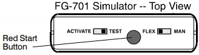
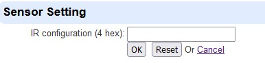

# VESTA-397

**IRAGS-35-BUS**

## **Wired PIR Plus Glass Break Detector**&#x20;

### Introduction

IRAGS-35-BUS integrates two sensors, the PIR motion sensor & glass break detector, into a single device, featuring the detections of movements within an assigned area and signals the Control Panel to activate the alarm if an intruder crosses its’ path of detection as well as breakage of glass windows.

The PIR is designed to give a typical detection range of 12 meters when mounted at a height of 2.5 meters above the ground and supports pet immunity function to avoid false alarm. The high-frequency sound emitted by glass breakage can be detected by the glass break detector.

### Parts Identification

<figure><figcaption></figcaption></figure>

### 1 Test Button / LED Indicator

* The Test Button is used for testing the radio performance and for learning purpose.
* The LED indicator is used to indicate the status of system.

### 2 Microphone&#x20;

### 3 IR Sensor&#x20;

### 4 Tamper Switch&#x20;

### 5 Hook Holes&#x20;

### 6 Pet Immunity Enable / Disable Jumper Switch (JP3)

<figure><figcaption></figcaption></figure>

**Jumper On.** The jumper link is inserted, connecting the two pins

&#x20;**Jumper Off.** The jumper link is removed or “**parked**” on one pin.

* When set as ON, Pet Immunity is disabled (Factory default).
* When set as OFF, Pet Immunity is enabled.

### 7 Sensitivity Increaser Jumper Switch (JP4)

* When set as ON, the PIR’s detection sensitivity is high.
* When set as OFF, the PIR’s detection sensitivity is in normal level. (Factory default)

### 8 BUS Strip Connection Socket&#x20;

### 9 BUS Strip&#x20;

### 10 Hooks&#x20;

### 11 Terminal Resistor Jumper Switch (J3)

On each BUS network, enable the terminal resistor jumpers at both endpoint (the two farthest nodes) to prevent signal reflection and ensure stable communication. If the Detector is one of the endpoints, set this jumper switch to ON.

* If the jumper is OFF (the jumper link is removed or “parked” on one pin), the communication ability is in normal level.
* If the jumper is ON, the the communication ability will be enhanced.

### **12 BUS Terminal**&#x20;

### **13 BUS Wiring Holes**&#x20;

### **14 Breakaway Area for Tamper Switch**

## Features

### LED Indicator

* <mark style="color:red;">**Red LED**</mark>**&#x20;(for PIR)**

In normal operation mode, the LED Indicator will light up in the following situations:

* When the cover is opened and the tamper switch is triggered
* When movement is detected if the tamper condition continues
* When movement is detected under Test mode
* When Remote Setting from the Control Panel is successfully applied The LED will not flash if the PIR tamper is normal and not under test mode.

In normal operation mode, the LED Indicator will flash 5 times when the detector receives remote settings from the Control Panel.

* <mark style="color:orange;">**Orange LED**</mark>**&#x20;(for Glass Break Detector)**
  * The Orange LED will light up when the Test Button is pressed.
  * The Orange LED will slowly turn on and then turn off when Remote Setting from the Control Panel is successfully applied.
  * The Orange LED will light up when glass break is detected under test mode.

(The Orange LED does not light up when glass break is detected during normal operation.)

* <mark style="color:green;">**Green LED**</mark>**&#x20;(for Glass Break Detector)**
  * The Green LED will flash rapidly when glass striking is detected under test mode.
  * The Green LED will flash per second in test mode.

### Power Supply&#x20;

* When IRAGS-35-BUS is hardwired to a Hybrid Panel, 13.5V power supply can be provided by the Hybrid Panel.

### Caution

* Wiring of the PIR motion sensor should only be performed by certified technician with proper knowledge and training in electric equipment.
* Before installation or any maintenance work, make sure the power supply has been disconnected.

### Tamper Protection

IRAGS-35-BUS is protected by a tamper switch which is depressed when the detector is properly installed. When IRAGS-35-BUS is removed from the mounting surface, or when its cover is opened, the tamper switch will be activated and the detector will send a tamper-open signal to the control panel to remind the user of the condition. If any movement is detected when the tamper switch is open, the LED for PIR will light up.

### Supervision

After installation, IRAGS-35-BUS will automatically transmit supervisory signals to the Control Panel at random intervals of 75 seconds.

### Test Mode

* By pressing the Test Button, the wired PIR and Glass Break Detector can be put into test mode for **3 minutes** to test the PIR’s signal transmission as well as to check the glass break detection range. In test mode, the Green LED will flash every second.
* In test mode, if a movement is detected, the Red LED indicator for PIR will light up.
* In test mode, if glass break is detected, the Green LED will flash rapidly and the Orange LED will light up.
* Pressing the Test Button again in test mode will extend the test mode duration to another **3 minutes**. Test Mode will time out after 3 minutes.

### Testing the Glass Break Detector

The glass break detector should be tested to ensure it is able to detect glass breakage successfully.

.jpeg>)

**Testing Tool**

Use FlexGuard FG-701 Glassbreak Simulator to create glass break sound.

1. Set the switches on FG-701 to “FLEX” and “TEST” mode. Press the red start button.

<figure><figcaption></figcaption></figure>

2. Put FG-701 at the desired testing location on the glass point the speaker at IRAGS-35-BUS. Close the window covering if it is present.
3. Strike the glass with a cushioned tool to create a glass striking sound. When FG-701 detects the glass striking sound, it will emit a glass break sound.&#x20;

**Testing the Glass Break Detector**

Put the detector at the desired installation location. Make sure the sensitivity level is adjusted based on the detection range. For optimal detection, IRAGS-35-BUS should face windows to monitor glass breakage.

1. Press the Test Button once, and the device will enter test mode for 5 minutes. The Green LED will flash slowly.
2. Press the red start button on FG-701. Within 8 seconds after the button press, strike the glass with a cushioned tool to create a glass strike sound. FG-701 will produce a burst of glass break audio.
3. IRAGS-35-BUS will be activated if both the glass striking and glass break sounds are properly received. The Green LED will flash quickly and the Orange LED will light up. A glass-break signal will be sent to the Control Panel.


Note:

After the red start button on the FG-701 is pressed, if there is no strike action performed within the 8 seconds, the simulator will automatically “click” off. You will need to press the red start button again to restart testing.


### Glass Thickness

Float Glass: 3 mm to 6.4 mm (1/8 to 1/4”)

Tempered Glass: 2.4 mm to 6.4 mm (3/32 to 1/4”)

Wired Glass: 3.2 mm to 6.4 mm (1/8 to 1/4”)

Laminated Glass: 3.2 mm to 6.4 mm (1/8 to 1/4”)

### Double Detection Function

* The PIR motion sensor features double detection function that enhances detection accuracy.
* When the function is enabled, the PIR motion sensor will trigger alarm only if two consecutive movements are detected within a specified time frame (5 seconds, 10 seconds, 15 seconds, programmable form the Control Panel).
* If the double detection function is disabled, the PIR sensor will instantly trigger an alarm upon detecting any movement.
* To adjust the double detection time or to disable this function completely, refer to the Remote Configuration section.

### Sleep Timer

* The PIR motion sensor features an automatic“sleep time”of a specified period after transmitting an alarm event.
* During the sleep time, the PIR motion sensor will not retransmit an alarm. Only after sleep time expires will the PIR motion sensor resume sending alarm, triggered by one movement or two movements when Double Detection is enabled.
* Sleep timer can be remotely adjusted to 10 seconds, 20 seconds, 30 seconds, 60 seconds, 90 seconds, 120 seconds, 180 seconds, or disabled completely. Please refer to the Remote Configuration section for details.

### PIR Pet Immunity Function

IRAGS-35-BUS supports pet immunity feature and will not detect pets of up to 25 kg to minimize false alarm situation.

The Pet Immunity function can be enabled or disabled by setting the position of Pet Immunity Jumper Switch (JP3). When the Jumper Switch (JP3) is set to ON, Pet Immunity is disabled (factory default). When the Jumper Switch (JP3) is set to OFF, Pet Immunity is enabled. The pet immunity function can also be adjusted by remote setting as described in the _**Remote Setting**_ section below.

### Sensitivity Setting

* **For PIR motion sensor**

You can use the sensitivity increaser jumper switch (JP4) to increase the PIR’s detection sensitivity.

To increase detection sensitivity, set JP4 to ON. To maintain normal detection sensitivity, set JP4 to OFF (Default). The sensitivity for PIR can also be adjusted by remote setting as described in the _**Remote Setting**_ section below.

* **For Glass Break Detector**

The sensitivity for Glass Break Detector can only be adjusted on Control Panel’s webpage. Please refer to the _**Remote Setting**_ section below.

Adjusting the sensitivity will change the detection range. The detector will send alarm signals to the Control Panel according to different sensitivity levels set in the Control Panel. The sensitivity levels include maximum, medium, low and minimum. The sensitivity is set to Maximum (high) by default.

| **Sensitivity** | **Detection Range** |
| --------------- | ------------------- |
| Maximum (High)  | 8m                  |
| Medium (Med.)   | 5m                  |
| Low (Low)       | 3m                  |
| Minimum (Lower) | 1.5m                |

### Flex & Audio Detection

* The Glass Break Detector features the detection of low-frequency sound for glass impact (flex) as well as high-frequency sound for glass breakage (audio).
* Normally the Glass Break Detector will trigger an alarm when it detects glass impact followed by glass breakage.
* If you disable the flex detection for glass impact, the Glass Break Detector will trigger an alarm once it detects a high-frequency sound.


Note:

Disabling the flex detection for glass impact will increase the possibility of false alarms due to environmental sounds.


* &#x20;If both Flex and Audio Detection are disabled, the Glass Break Detector is essentially turned off.

### Remote Setting

* **For PIR motion sensor**

When the PIR is powered on, its pet immunity function and sensitivity are determined by adjusting the JP3 and JP4 settings or remotely change the pet immunity and sensitivity settings from the Control Panel. Remote settings will overwrite the jumper settings. **Control Panel Webpage**

1. On the Panel’s local webpage, go to the Device Edit page by clicking “Edit” of the IR entry.
2. Input the PIR motion sensor configuration (4 hex) in the Sensor Setting section. Click OK to confirm.

<figure><figcaption></figcaption></figure>

3. Please refer to the table below for configuration details. For example, if you want to configure the following setting, _Pet Immunity **enabled**, **High** Sensitivity, Double Detection Time **5 seconds**, Sleep Timer **10 seconds**_, please input _**0311 (hex)**_.

 (1).png>)

<figure><figcaption></figcaption></figure>

<figure><figcaption></figcaption></figure>

* **For Glass Break Detector**

Functions for the Glass Break Detector can only be set on the Control Panel’s webpage. Functions configurable are audio (high-frequency detection for glass breakage sound), flex (low-frequency detection for glass impact sound) and sensitivity.

**Control Panel Webpage**

1. Click “Edit” of the Glass entry on the Control Panel’s webpage.
2. Press the Test Button once and then the Sensor Setting section will be shown.

<figure><figcaption></figcaption></figure>

3. Fill in the configuration value according to the table below and click OK to confirm.

The Orange LED will slowly turn brighter and then turn dark, indicating the programming command from the Control Panel is successfully set for the Glass Break Detector.

| **ACGS Configuration** | **Audio (Glass Breakage)**         | **Flex (Glass Impact)** | **Sensitivity** |
| ---------------------- | ---------------------------------- | ----------------------- | --------------- |
| 01xx                   | Disable (ACGS Detector turned off) |                         |                 |
| 0000                   | Enable                             | Enable                  | Lower           |
| 0001                   | Enable                             | Enable                  | Low             |
| 0002                   | Enable                             | Enable                  | Medium          |
| 0003 (Default)         | Enable                             | Enable                  | High            |
| 0008                   | Enable                             | Disable                 | Lower           |
| 0009                   | Enable                             | Disable                 | Low             |
| 000A                   | Enable                             | Disable                 | Medium          |
| 000B                   | Enable                             | Disable                 | High            |


Note:

&#x20;Disabling the flex detection for glass impact will increase the possibility of false alarms due to environmental sounds.


### Wiring of IRAGS-35-BUS

* Before connecting the PIR motion sensor to the system bus, please switch the power off.
* To assist with cable connections, the terminal blocks on each BUS system module are color-coded.

<figure><figcaption></figcaption></figure>

* For optimal communication on the BUS network, enable the Terminal Resistor Jumpers only at both endpoints (the two farthest nodes) to prevent signal reflection and improve communication stability. Do NOT enable jumpers on any intermediate BUS devices --- only the two endpoints should have them enabled.


Note:

* The pluggable design of BUS terminal blocks improves upon installation efficiency. Before wiring, you can remove the terminal blocks from the PCB board for ease of use, and plug in again after wiring.
* After unplugging the terminal, when re-installing the terminal back to the board, make sure to install the terminal in the same direction to avoid potential hazards.


* After the wires are connected and the terminal blocks are plugged to the base, re-place the device back to the base and push it downwards so that the BUS strips on the base will be well connected to the connection socket on the device for the BUS Terminal to function.
* Incorrect connections will result in failure or improper operation. Inspect wiring and ensure proper connections before applying power.

.jpeg>)

### Getting Started

Please follow the steps below to learn the device into the Hybrid Panel. **Step 1** Connect the device to the Panel. Then, power the Panel on.

**Step 2** On the Panel’s webpage, click “**Learning**” to enter learn page.

**Step 3** Click “**Start**” to enter learning mode.

**Step 4** Click “**Add**” to include the device into the Panel.

 IRAGS-35-BUS will be recognized as two separate devices (i.e., PIR & Glass Break Detector), occupying two zones after being learned into the Control Panel.

<figure><figcaption></figcaption></figure>

Step 5. If the device is successfully learnt into the Panel, it will be displayed in the “Learned Device” section.

### Identification

The “**Identify**” function is used to localize a specific BUS device in the BUS wired system. This function is helpful in distinguishing which device is which especially in a large installation where numerous BUS devices are included.

To locate the wired PIR & Glass Break Detector in the BUS system:

**Step 1** On Hybrid Panel’s webpage, click “Identify” under the device list after the IR’s or Glass’ device column entry.

**Step 2** If the wired PIR & Glass Break Detector receives the signal from the Hybrid Panel, the webpage will display a success message and the Detector’s LED indicator will flash 10 times to indicate where it is to the user.


Note:

If a timeout message is displayed on the webpage, it means the wired PIR & Glass Break Detector did not receive the signal from the Panel.

Please check whether IRAGS-35-BUS is connected properly to the Panel within appropriate wiring distance.


### Walk Test

* To make sure the wired PIR & Glass Break Detector is able to communicate with the Panel after it is learned-in, place the Control Panel in Walk Test mode and press the Test button on IRAGS-35-BUS to transmit a test signal to the Panel.
* When the Panel receives the test signal, it will beep once and display the wired PIR & Glass Break Detector’s information accordingly on the top of the device list.


Note:

If there is no response from the Panel after the press of test button, it means the Panel did not receive the test signal from the device.

Please check whether IRAGS-35-BUS is connected properly to the Panel within appropriate wiring distance


### Factory Reset

The PIR & Glass Break Detector can be factory reset to the default pet Immunity and sensitivity based on JP3 and JP4 settings. Follow the steps below to proceed.

**Step 1** Power off the Detector by disconnecting the power supply from the Control Panel.

**Step 2** Press and hold the Test Button of the Detector, and then power on the Panel. Continue to hold the Test Button until the LED flashes 5 times. Factory Reset is complete.

## Installation

### Installation Guideline

* When the detector is mounted at a height of 2.3-2.5 meters above the ground, the PIR’s detection range is up to 12 meters.
* For optimal detection of glass break, the detector should face the window to monitor the glass breakage.
* When Pet-Immunity function is enabled, the PIR will not detect pets up to 25 kg when mounted at the height of 2.3-2.5 meters above the ground. If required, you can adjust the height of the PIR according to the size of your pet for optimal pet immunity performance. Higher installation location will provide larger pet-immune space, but will increase the blind spot under the PIR.
* After the installation site is selected, press the Test Button to enter Test Mode. Walk around the protected area noting when the LED lights up and check that the detection coverage is adequate.
* When detection coverage is found to be satisfying, follow the steps described in _**Mounting Method**_ section below to mount the detector.

<figure><figcaption></figcaption></figure>

### Mounting Method

* The detector is designed to be mounted either on a flat surface or in a corner.
* The base has knockouts where the plastic is thinner and can be broken for mounting purpose (FIG. 1).
* Five hook holes on the device are for hooking the device to the base (FIG. 2) during installation.

<figure><figcaption></figcaption></figure>

**Surface Mounting:**

1. Loosen the bottom fixing screw and detach the device and the base by sliding the device upwards and pulling the device and the base apart.

<figure><figcaption></figcaption></figure>

2. Break through the two surface fixing knockouts from the inside of the base; use the holes as a template and drill holes into the surface to be mounted.
3. (Optional) Insert the wall plugs if the device is to be fixed onto plaster or bricks.

<figure><figcaption></figcaption></figure>

4. Hook the device onto the base and press the device against the base.

<figure><figcaption></figcaption></figure>

5. Push downwards the device and fasten the bottom fixingscrew to firmly secure the device to the base.

\

<figure><figcaption></figcaption></figure>

**Corner Mounting:**

1\) Loosen the bottom fixing screw and detach the device and the base by sliding the device upwards and pulling the device and the base apart.

<figure><figcaption></figcaption></figure>

2. Break through the two surface fixing knockouts from the inside of the base; use the holes as a template and drill holes into the surface to be mounted.
3. (Optional) Insert the wall plugs if the device is to be fixed onto plaster or bricks.

<figure><figcaption></figcaption></figure>

&#x20;&#x20;

4. Push downwards the device and fasten the bottom fixing screw to firmly secure the device to the base.

<figure><figcaption></figcaption></figure>

5. Hook the device onto the base and press the device against the base.

<figure><figcaption></figcaption></figure>

6. Push downwards the device and fasten the bottom fixing screw to firmly secure the device to the base.

### Installation Recommendations

**It is recommended to install the wired PIR & Glass Break Detector in the following locations:**

* Face the window and mount at a height of 2.3-2.5 meters for best performance.
* Avoid locations or stairways where animals cannot come to the detection area by climbing on furniture or other objects.
* At a position such that an intruder would normally move across the PIR’s field of view from side to side.&#x20;
* In a corner to give the widest view.
* At a position where its field of view will not be obstructed by e.g., curtains, ornaments etc.
* Away from sound source such as speakers, air conditioners or motors.
* As far from the windows or doors as possible to avoid external sound interference.

&#x20;**Limitations**

<figure><figcaption></figcaption></figure>
