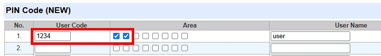
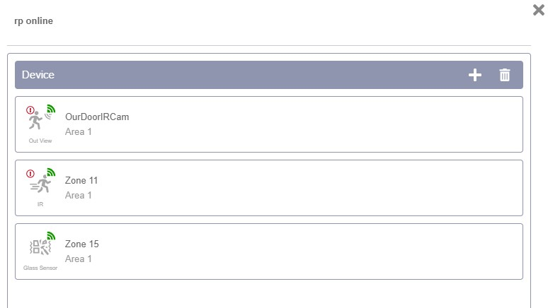
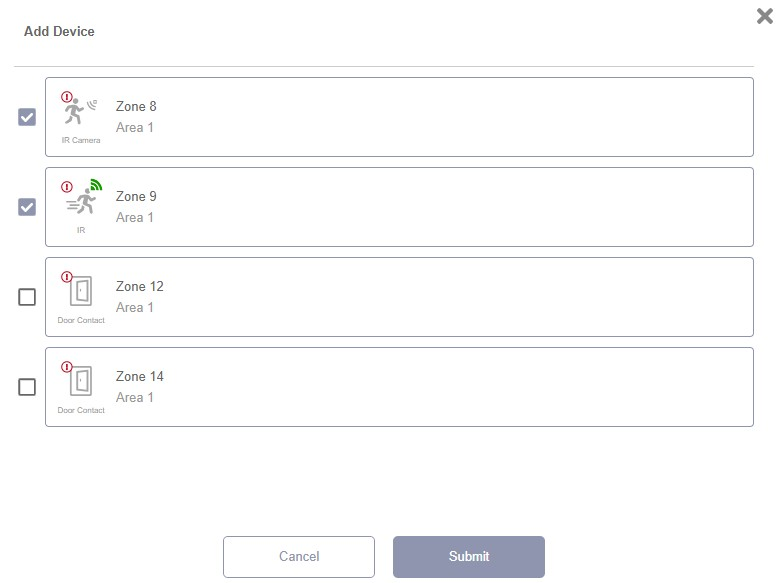

# VESTA-418

**RP-32**

## **Repeater**&#x20;

The Repeater is designed to increase the effectiveness and versatility of the alarm system. It is a device that makes your system more powerful by increasing the maximum possible distance between the Main Unit (Control Panel) and the Devices.

## Identifying the Parts

<figure><figcaption></figcaption></figure>

1. **Power LED (Green)**                      &#x20;

&#x20;     **On** – Powered by a Power Adapter or Rechargeable Battery&#x20;

&#x20;     **Flash** (1 flash every second) –  Rechargeable Battery low on power

2. **Mode LED (Yellow)**

&#x20;     **Slow Flash** (1 flash every 2 seconds) – When in Learning Device Mode operated from Local Webpage

&#x20;     **Flash** (1 flash every second) – In Walk Test Mode

&#x20;     **On** – In Learning Panel Mode

**3. Transmission: Receive LED (Blue)**&#x20;

&#x20;    The Blue LED lights up when the Repeater receives a signal transmission

**4. Transmission: Transmit LED (Red)**

&#x20;    The Red LED lights up when the Repeater transmits a signal.

5\. Test Button&#x20;

6\. Battery Switch&#x20;

7\. Tamper Switch

8\. Mounting Holes

&#x20;**9. DC power jack**

**10. Mounting Bracket**

## Power Supply

**Power Adapter Application:**

A DC 12V 1A output Power Adapter is used to power the Repeater.

The DC power jack and plug provide twist-lock feature that can prevent accidental disconnection. To connect the Power Adapter:

Step 1 Align the arc parts of the plug with the arc parts on top/bottom of the DC jack slot, and fit the plug into the slot.

.jpeg>)

Step 2 Push the plug into place, and make a quarter turn clockwise to lock the plug.

<figure><figcaption></figcaption></figure>

<figure><figcaption></figcaption></figure>


Note:

Locked plug cannot be disconnected without twisting counterclockwise to unlock.


Step 3 Plug the Power Adapter to a wall power outlet.

Step 4 The Repeater will sound a Long beep and the Green LED will light up.

### **Rechargeable Battery:**

In addition to the adapter, there is a rechargeable battery inside the Repeater, which serves as a back-up power in case of a power failure.

When the Power Adapter is plugged into the DC power jack, slide the Battery Switch to the ON position so the Power Adapter supplies power to the Repeater and at the same time recharges the battery. It takes approximately 32 hours to fully charge the battery.

When the Power Adapter is unplugged, the Repeater will be powered by the rechargeable battery.

### **AC Failure / AC Restore / Low Battery Detection:**

The Repeater will send an AC Failure signal to the Control Panel when the Power Adapter is unplugged for 30-60 seconds. When the Power Adapter is plugged in again for 30-60 seconds, the Repeater will send an AC Restore signal to the Control Panel.

The Repeater can detect the battery voltage. When the battery voltage is low, the Repeater will send a Low Battery signal to the Control Panel, the Green LED will flash to indicate low battery status. When the power adaptor is plugged in again, low battery status will be removed

## Learn Repeater into the Control Panel

Step 1 Put the Control Panel into Learning Mode (please refer to the Control Panel manual).

Step 2 Press the test button of the Repeater for 3 seconds, then release the button after one long beep at the 3rd second. The Repeater’s yellow LED will turn on.

Step 3 If the Repeater receives an acknowledge signal from the Control Panel within 60 seconds, Learning is successful. The Blue LED will light up for 1 second, accompanied by 1 long beep as the Repeater leaves learning mode.

If the Repeater fails to receive an acknowledge signal from the Control Panel within 60 seconds, learning has failed. Please repeat step 1-2 again.


Note:

After the test button is pressed for 3 seconds, the Repeater enters learning mode with its yellow remain on for up to 60 seconds. The Repeater will leave learning mode upon successful learning, or reaches the 60 second timeout limit. Pressing the button for 3 seconds again will also leave learning mode immediately with 2 short beeps.


## Repeater Setting (Local Webpage)

After the repeater is learned into the Control Panel, proceed to program repeater setting on the Panel’s webpage.

Go to the **Repeater Setting** on Panel’s webpage.

<figure><figcaption></figcaption></figure>

<figure><figcaption></figcaption></figure>

## Learning Device into the Repeater

Make sure the devices are already learned into the Control Panel before learning them into the Repeater.

Step 1 On the Repeater setting page, click “**Enter Learn Mode**.” The repeater will emit 1 long beep and enter device learning mode. The Repeater’s Yellow LED will start to flash slowly (1 flash every 2 seconds).

Step 2 Refer to the device manuals for instructions on how to send a learn code to the Repeater. **For PIR Camera, please press the test button once to send a learn code to the Repeater.**

If the Repeater receives a learn code from a new device, it will emit 1 long beep and the Blue LED will light up for 1 second to indicate successful learning.

If the Repeater receives a learn code from a device already learnt into the Repeater, it will emit 2 beeps and the Blue LED will light up for 1 second.

* **A maximum of 60 devices can be learnt into the Repeater, and up to 8 PIR cameras are supported. If the user attempts to learn in a 61****st****&#x20;device, the Repeater will emit 4 beeps.**
* **SFV voice extenders are Not supported by the Repeater.**

Step 3 Click “**Exit Learn Mode**.” The repeater will emit 1 long beep and exit device learning mode. The yellow LED will turn off.

Alternatively, the repeater will automatically exit device learning mode after 5 minutes.

### Conducting Walk Test

Learnt-in devices can check for its signal range with the Repeater if the Repeater enters Walk Test Mode.

Step 1: On the Repeater setting page, click “**Enter Walk Test Mode**.” The Repeater will enter Walk Test mode, as indicated by 1 long beep. The Yellow LED will start to flash once every second.

Step 2: When the Repeater receives a signal from the learnt-in device, it will emit a long beep and the Blue LED will light up for 1 second. The signal will then be retransmitted as the Red LED lights up for 1 second.

Step 3: Click “**Exit Walk Test Mode**.” The repeater will exit Walk Test mode, as indicated by 1 long beep. The yellow LED stops flashing.

Alternatively, the repeater will automatically exit Walk Test mode after 5 minutes.

### Query Child Node

After the devices are learned into the Repeater, click “**Query Child Node.**” The learned in devices will be displayed one by one in the Child Node list.


Note:

If a child node device is not yet learned into the Control Panel, “Unknown Type” and “Device Not Existed” will be displayed. Make sure to learn the device into the Control Panel for the Panel to recognize it.


<figure><figcaption></figcaption></figure>

### Delete Device from the Repeater

* **Delete All**: Click “**Delete All Child Nodes**”**.** All previously learned-in devices will be removed.
* **Delete One At A Time**: Click the **Delete** button at the end of the device entry you wish to delete from the Device List. The device will then be deleted.

## RP Connection Map (Home Portal Server: Installer Web/App)

Please log in to Home Portal Server with the **Installer account**. Go to **Main Page** > **Device List**. If the Panel has learned in RP-32 Repeater(s), the **RP Connection Map icon**  (1) (1).jpeg>) will be

displayed besides the Device List header.

<figure><figcaption></figcaption></figure>

Clicking on the icon .png>) will pop up the RP Connection Map.

<figure><figcaption></figcaption></figure>

The **Panel**, the **Repeater/RF Devices**, and **the RF Device(s) that is/are connected to Repeater** will be displayed from the left column to the right column on the map.

If no devices are connected to any Repeater, only two columns (Panel, Repeater/Devices) will be shown on the map.

* Zoom in and Zoom out: Use the Zoom in  and Zoom out  buttons on the lower right,
  \
  or scroll with the mouse wheel to zoom in and out on the Map
* Refresh: Click  to get the latest Repeater connection status.
* Edit: Click  to enter Edit Mode, and then click an individual Repeater icon  to
  \
  access the settings page for that repeater.

* **Edit Mode:** In Edit Mode, only Repeater icons are highlighted. Click on a Repeater
  \
  icon to access its settings page.

<figure><figcaption></figcaption></figure>

* **Repeater Setting Page**: The Repeater Setting page lists the devices that are connected to the repeater. You can add / delete devices by clicking  / 

**Add Device**:

After clicking , the Add Device list will pop up, displaying devices that are not connected to any Repeater and are available to be added to the current Repeater. Select the device(s) by checking the box(es), then click Submit to add the selected device(s) to the Repeater.

<figure><figcaption></figcaption></figure>

**Remove Device**:

After clicking , the Delete Device list will pop up, displaying devices that are connected to the current Repeater. Select the device(s) by checking the box(es), then click Delete to remove the selected device(s) from the Repeater.

<figure><figcaption></figcaption></figure>

After exiting Edit mode, the third column of devices connected to the Repeater(s) will be updated immediately.

## Supervisory Signal

* After being learnt into the Control Panel, the Repeater will automatically transmit Supervisory Signals every 15 to 18 minutes.
* If the Control Panel has not received the signal from the Repeater for a preset period of time, the Control Panel will indicate it on its display to show that the Repeater is experiencing an out-of-signal problem.

## Tamper Protection

The Tamper Switch is in normal operating position (Tamper Closed) when the Repeater is hooked onto the Wall Mounting Bracket. Tamper violation happens when the Repeater is removed from the hook where Tamper Switch is released (Tamper Opened).

## Operation

* If the Repeater receives a signal from the Control Panel (e.g. a command), the signal is retransmitted to the corresponding device(s) from the Repeater. The transmission LEDs will light up accordingly.
* If the Repeater receives signal from a device (e.g. an alarm signal), the signal is retransmitted to the Control Panel from the Repeater. The transmission LEDs will light up accordingly.

## Deployment Guidelines

* All Devices and Repeaters must be learnt into the Control Panel for the panel to recognize them. Each device must be learnt into the Repeater that receives and relays its signal.
* If a device is within an acceptable range for Control Panel to receive its signal, it is strongly recommended to learn the device into the Control Panel directly instead of into the Repeater.
* When employing multiple repeaters, please learn each device into the closest repeater in its operation area. Avoid learning a device into multiple repeaters.
* Only link one layer of repeater(s). **Do Not** cascade repeaters to create a transmission relay.
* Maintain a distance between repeaters and the Control Panel to prevent cross signaling.

### **Repeater Usage**


* **Maximum recommended number of repeaters per panel:** **3 repeaters**.\
  Exceeding this number may cause **RF signal saturation**, which can negatively impact system performance.\
  However, **if due to significant distance it is absolutely necessary to add more than 3 repeaters directly to the panel**, and this need has been properly assessed, **additional repeaters may be added like example bellow with 4 repeters**. The **recommended maximum remains 3**.
* **Daisy-chaining repeaters:** It is not recommended to connect more than **2 repeaters in a chain**.\
  **Whenever possible, repeaters should be connected directly to the panel**.\
  If this is not feasible, a **maximum of 2 daisy-chained repeaters** is allowed.


### Single Repeater

In the example below when one repeater is used:

* Repeater A should be learned into the Control Panel.
* Device 2 should be learned into Repeater A for Repeater A to receive and relay its signals. Device 2 should also be learned into the Control Panel.
* For Device1 that is within acceptable range for Control Panel to receive its signal, it is strongly recommended to learn Device1 into the Panel directly instead of into the Repeater

&#x20;Example

<figure><figcaption></figcaption></figure>

### Multiple Repeaters

In Example1 when multiple repeaters are used:

* All Repeaters (A/B/C/D) and Devices (1/2/3/4) should be learned into the Control Panel.
* Devices (1/2/3/4) need to be learned into the respective repeaters in their operation areas.

Device 1 into Repeater A,

Device 2 into Repeater B,

Device 3 into Repeater C, Device 4 into Repeater D.

In Example 2, where the Device 5 is located between the RF coverage areas of two Repeaters, please choose **one Repeater only** to learn the Device 5 to prevent signal traffic. **Do Not** learn a device into more than one repeater.

* Repeater E and F should be learned into the Control Panel.
* Device 5 has to be learned into One Repeater Only (**either Repeater E only or Repeater F only**). Do NOT learn Device 5 into both repeaters.
* Device 5 should also be learned into the Control Panel.

<figure><figcaption></figcaption></figure>

## How to mount the Repeater

The Repeater can be placed on the table, mounted on the wall or wherever desired. Follow the steps below to mount the Repeater:

Step 1 Using the holes of the Mounting Bracket as a template, drill holes into the mounting surface.

Step 2 Insert the wall plugs if fixing into plaster or brick. Screw the Mounting Bracket to the wall.

<figure><figcaption></figcaption></figure>

Step 3 Hook the Repeater onto the Wall Mounting Bracket (with the Mounting Holes of the Repeater).

<figure><figcaption></figcaption></figure>

Step 4 Hold the Repeater and gently push it downwards as shown below.

<figure><figcaption></figcaption></figure>
