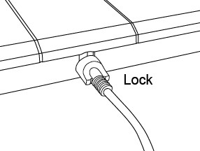

# VESTA-422

&#x20;VST-897-IL-BUS

## Wired PIR Motion Sensor Camera

### Introduction

VST-897-BUS is a passive infrared (PIR) motion sensor camera. It is capable of sending wired signals and captured images (picture quality of up to 1280 x 720 pixels) over BUS to the Control Panel upon movement detection.

VST-897-BUS is designed with two masking sensors. The anti-masking feature allows for detection of any attempts to blind the device by placing objects in its field of view or by covering or painting the device.

The PIR Camera is designed with a detection range of 9 meters when mounted at a height of 2.3-2.5 meters above the ground. When Pet Immunity function is enabled and the device is mounted with the optional Mounting Bracket B, the motion sensor camera will not detect pets of up to 25kg when mounted at the same height.

Remote configuration is supported for the PIR camera. Besides adjusting the Jumper Switches, users can also enable/disable pet immunity function and adjust the sensitivity of the PIR camera from the Control Panel webpage or Home Portal Server.

**The VST-897-BUS Series includes the following models**:

VST-897-BUS – Wired PIR motion sensor camera with flash LED

VST-897-IL-BUS – Wired PIR motion sensor camera with Infrared LED

## Parts Identification

<figure><figcaption></figcaption></figure>

#### 1 Flash LED / Infrared LED

The Flash LED (For VST-897-BUS) or Infrared LED (For VST-897-IL-BUS) delivers sufficient light for image capture under low lighting condition.

#### 2 Blue LED / Function Button

&#x20;    **Blue LED** (Please refer to _**LED Indicator**_ description below for details)&#x20;

&#x20;    **Function Button Usage:** - Press the button once to enter test mode for 3 minutes.

#### 3 IR Sensor&#x20;

#### 4 PIR Camera Lens&#x20;

#### 5 BUS Terminal&#x20;

#### 6 Terminal Resistor Jumper Switch

On each BUS network, enable the terminal resistor jumpers at both endpoints (the two farthest nodes) to prevent signal reflection and ensure stable communication. If the Wired PIR Motion Sensor Camera is one of the endpoints, set this jumper switch to ON.

**Jumper On.** Enables the terminal resistor.

**Jumper Off.** Disables the terminal resistor

\- If the jumper is OFF, the communication ability is in normal level.&#x20;

\- If the jumper is ON, the communication ability is enhanced.

#### 7 Pet Immunity Enable/Disable Jumper Switch (JP3)

<figure><figcaption></figcaption></figure>

**Jumper On** The jumper link is inserted, connecting the two pins.

**Jumper Off** The jumper link is removed or  “**parked**” on one pin.

When set to ON, Pet Immunity is disabled (Factory default).

When set to OFF, Pet Immunity is enabled.

#### 8 Sensitivity Increaser Jumper Switch (JP4)

When set to ON, the PIR’s detection sensitivity is high.

When set to OFF, the PIR’s detection sensitivity is in normal level (Factory default).

#### **9 Tamper Switch**&#x20;

#### **10 Breakaway Areas for Wiring**&#x20;

#### **11 Breakaway Area for Tamper Switch**&#x20;

#### **12 Hook Holes**&#x20;

#### **13 Mounting Bracket A**

#### **14 Mounting Bracket B** (Optional item, sold separately)

## Features

### LED Indicator

* The Blue LED will be on for 3 seconds when the PIR Camera enters Test Mode. During Test mode, the Blue LED will light up for 3 seconds every time a movement is detected.
* The Blue LED will also light up for 3 seconds every time a movement is detected when a fault exist.
* The Blue LED will flash rapidly during image transmission and capturing images.
* The LED will not flash if the PIR Camera is normal and is not under test mode.

### Image Capture

* When the alarm system is armed, the PIR Camera will capture 1or 3 alarm images in 1280 x 720, or 1/3/6 alarm images in 640 x 360 or 320 x 184 resolutions (programmable from Control Panel) upon movement detection. You can also manually request the PIR Camera to take a picture through the Control Panel. The captured images will be transferred to the Control Panel for visual alarm verification.


Note:

If your PIR Camera is installed at a location where the camera’s field of view is a complex environment with intense light or lots of colors, the images captured will be great in file size, possibly leading to truncation when the images are transmitted to the Control Panel


* The Blue LED will flash rapidly during image transmission and capturing images.

### _**Power Supply**_

When VST-897-BUS is hardwired to a Hybrid Panel, 13.5V power supply can be provided by the Hybrid Panel.

### Masking Detection

* The PIR Camera has masking sensors to detect any attempts by an intruder to block or obstruct its view.
* When a masking event is detected, and the masking condition lasts for 3 minutes, VST-897-BUS will send a masking alarm signal to the Control Panel to notify user of the masking condition.
* After masking/blocking is removed for 3 minutes, VST-897-BUS will send a restore signal to the Control Panel.

### Tamper Protection

The PIR Camera is protected by a tamper switch which is depressed when the PIR Camera is properly installed. When the PIR Camera is removed from the mounting surface or its cover is opened, the tamper switch will be activated and the PIR Camera will send a tamper open signal to the Panel to remind the user of the condition.

### _**Supervision**_

The PIR Camera will conduct a self-test periodically by transmitting a supervisory signal once every 75 seconds.

### Test Mode

* Test Mode is for you to check the PIR camera’s detection range (not shooting coverage).
* Press the Function button once to enter Test Mode for 3 minutes. The Blue LED will light up for 3 second.  In Test Mode, you can trigger the PIR camera to check the IR detection range. If the PIR camera is triggered, the Blue LED will light up for 3 seconds.

### Caution

* Wiring of the PIR camera should only be performed by certified technicians with proper knowledge and training in electric equipment.
* Before installation or any maintenance work, make sure the power supply from the Control Panel has been disconnected.

### PIR camera Wiring

* Before connecting the PIR camera to the system bus, please switch the Hybrid Panel’s power off.
* To assist with cable connections, the terminal blocks on each BUS system module are color-coded.

<figure><figcaption></figcaption></figure>

* For optimal communication on the BUS network, enable the Terminal Resistor Jumpers only at both endpoints (the two farthest nodes) to prevent signal reflection and improve communication stability. Do NOT enable jumpers on any intermediate BUS devices --- only the two endpoints should have them enabled.


Note:

* The pluggable design of BUS terminal blocks improves installation efficiency. Before wiring, you can remove the terminal blocks from the PCB board for ease of use, and plug in again after wiring.
* After unplugging the terminal, when re-installing the terminal back to the board, make sure to install the terminal in the same direction to avoid potential hazards.


* There are Breakaway Area Options for Wiring. You can detach any of them from the base to wire and thread the cables through.
* After the wires are connected and the terminal blocks are plugged to the base, re-place the device back to the base and push it downwards so that the BUS strips on the base will be well connected to the connection socket on the device for the BUS Terminal to function.
* Incorrect connections will result in failure or improper operation. Inspect wiring and ensure proper connections before applying power.

<figure><figcaption></figcaption></figure>

### _**Learning**_

Please follow the steps below to learn the device into the Hybrid Panel.

<table data-header-hidden><thead><tr><th width="119"></th><th></th></tr></thead><tbody><tr><td>Step 1</td><td>Connect the device to the Panel. Then, power the Panel on.</td></tr><tr><td>Step 2</td><td>On the Panel’s webpage, click “<strong>Learning</strong>” to enter learn page.</td></tr><tr><td>Step 3</td><td>Click “<strong>Start</strong>” to enter learning mode.</td></tr><tr><td>Step 4</td><td>Click “<strong>Add</strong>” to include the device into the Panel.</td></tr><tr><td>Step 5</td><td>If the device is successfully learnt into the Panel, it will be displayed in the “Learned Device” section.</td></tr></tbody></table>

### Identification

The “**Identify**” function is used to localize a specific BUS device in the BUS wired system. This function is helpful in distinguishing which device is which especially in a large installation where numerous BUS devices are included.

To locate the PIR Camera in the BUS system:

**Step 1** On Hybrid Panel’s webpage, click “Identify” after the IR Camera’s device entry.

<figure><figcaption></figcaption></figure>

**Step 2** If VST-897-BUS receives the signal from the Hybrid Panel, the webpage will display a success message and VST-897-BUS’s LED indicator will flash 10 times to indicate where it is to the user.


Note:

If a timeout message is displayed on the webpage, it means VST-897-BUS did not receive the signal from the Panel.

Please ensure VST-897-BUS is properly connected to the Panel within appropriate wiring distance.


### Walk Test

* To make sure the PIR Camera is able to communicate with the Panel after it is learned-in, place the Control Panel in Walk Test mode and press the function button on VST-897-BUS to transmit a test signal to the Panel.
* When the Panel receives the test signal, it will beep once and display the PIR Camera’s information accordingly on the top of the device list.


Note:

If there is no response from the Panel after the press of function button, it means the Panel did not receive the test signal from the device.

Ensure VST-897-BUS is properly connected to the Panel within appropriate wiring distance.


### Pet Immunity Function

The PIR sensor supports pet immunity feature and will not detect pets up to 25 kg to minimize false alarm situations.

The Pet Immunity function can be enabled/disabled by setting the Jumper Switch (JP3) position. When the Jumper Switch (JP3) is set to ON, Pet Immunity is disabled (factory default). When JP3 is set to OFF, Pet Immunity is enabled. The pet immunity function can also be adjusted remotely as described in _**Remote Setting**_ section. _**Pet Immunity function is available only when the device is mounted with the optional Mounting Bracket B.**_

### Sensitivity Increaser Function

You can use the sensitivity increaser jumper to increase the PIR’s detection sensitivity. To increase detection sensitivity, set the Jumper Switch (JP4) to ON. To maintain normal detection sensitivity, set JP4 to OFF (Factory default). The sensitivity increaser function can also be adjusted remotely as described in _**Remote Setting**_ section.

### Remote Setting

* The PIR camera supports remote setting of pet Immunity and sensitivity.
* When the PIR camera is powered on, its pet immunity function and sensitivity are determined by the JP3 and JP4 settings. Users can either adjust jumper settings or remotely change the pet immunity and sensitivity settings from the Control Panel. Remote setting will overwrite the jumper settings.

**Control Panel Webpage**

1\) On the Panel local webpage, go to the Edit Device page and input the PIR Camera configuration in the Sensor Setting section. Click OK to confirm.

Please refer to the table below for configuration details. For example, if you want to enable Pet Immunity and set Sensitivity level to high, you can input 02.

| **IR Configuration** | **Pet Immunity** | **Sensitivity** |
| :------------------: | :--------------: | :-------------: |
|          00          |        No        |       High      |
|          01          |        No        |      Normal     |
|          02          |        Yes       |       High      |
|          03          |        Yes       |      Normal     |

**Home Portal Server**

1. On Home Portal Server, go to the Device setting page, click the VST-897 device row and select “IR Configuration.”
2. Select the desired setting for Pet Immunity (Enable/Disable) and Sensitivity (High/Normal) from the drop-down lists, and click “Submit” to confirm and apply the setting. The Blue LED will flash twice rapidly.

## Installation

### Installation Guideline

* The PIR Camera is designed to be mounted on either a flat surface or in a corner using the Mounting Bracket.
* When the PIR Camera is mounted using the optional Mounting Bracket B and the pet immunity function is enabled, it will not detect pets of up to 25 kg when mounted at the height of 2.3-2.5 meters above the ground. If required, you can adjust the height of the PIR Camera according to the size of your pet for optimal pet immune performance. Higher installation location will provide a larger pet-immune space, but also increase the blind spot under the PIR Camera.

**It is recommended installing the PIR Camera in the following locations:**

* Avoid positions or stairways where the animals can come to the detection area by climbing on furniture or other objects.
* At a position where an intruder would normally move across the PIR’s field of view.  At a height between 2.3 and 2.5 meters above the ground for best performance.
* In a corner to give the widest view.
* At a position where its field of view will not be obstructed by, e.g., curtains, ornaments, etc.
* **Limitations**

<figure><figcaption></figcaption></figure>

* When mounted with Mounting Bracket A at a height of 2.3 to 2.5 meters, the PIR Camera has a 9-meter detection range without the pet immunity function.

<figure><figcaption></figcaption></figure>

* When mounted with the optional Mounting Bracket B at the same height, the detection range extends to up to 12 meters.

<figure><figcaption></figcaption></figure>

### _**Mounting the PIR Camera**_

* The PIR Camera is designed to be mounted either on a flat surface or in a corner using the Mounting Bracket A or B.
* Mounting Bracket A includes three surface screw holes for fixing the device onto a flat surface and four corner screw holes for fixing it onto a corner.


Note:

_To prevent false masking event triggers, ensure there is **at least 20 centimeters of clearance** above the device to the ceiling and below the device to any object._


* **Surface/Corner mounting with Mounting Bracket A**

Mounting Bracket A has an A-shaped profile when viewed from the side and should be installed upside down.

Once installed, the PIR Camera will be tilted at a ten-degree angle. The bracket features **three** screw holes for surface mounting.

1. Use the three surface screw holes as a template and drill mounting holes. For corner mounting, use the four corner screw holes as a template.
2. Insert the provided wall plugs.
3. Screw the mounting bracket onto the wall plugs.

<figure><figcaption></figcaption></figure>

4. Undo the bottom fixing screw and detach the device cover from its base.
5. Route the BUS wire through a Breakaway Area for Wiring and close the Battery Compartment Cover.
6. Hook the PIR Camera’s base onto Mounting Bracket A and push it downwards.


Note:

Ensure the PIR Camera is securely hooked onto the mounting bracket so that the tamper switch is fully compressed.


7. Secure the base to Mounting Bracket A with the stabilizing screw.

<figure><figcaption></figcaption></figure>

8. Attach the upper part of the device cover to the base, then snap the lower part into place.

<figure><figcaption></figcaption></figure>

9. Tighten the bottom fixing screw.

* **Surface/Corner mounting with the optional Mounting Bracket B** Mounting Bracket B has **two** surface screw holes.
  1. Use the two surface screw holes as a template and drill mounting holes.

For corner mounting, use the four corner screw holes as a template.

1. Insert the provided wall plugs.
2. Screw the mounting bracket onto the wall plugs.

<figure><figcaption></figcaption></figure>

4. Undo the bottom fixing screw and detach the device cover from its base.
5. Route the BUS wire through a Breakaway Area for Wiring and close the Battery Compartment Cover.
6. Hook the PIR Camera’s base onto Mounting Bracket B and push it downwards.


Note:

Ensure the PIR Camera is securely hooked onto the mounting bracket so that the tamper switch is fully compressed.


7. Secure the base to Mounting Bracket B with the stabilizing screw.

<figure><figcaption></figcaption></figure>

8. Attach the upper part of the device cover to the base, then snap the lower part into place.

<figure><figcaption></figcaption></figure>

9. Tighten the bottom fixing screw.
