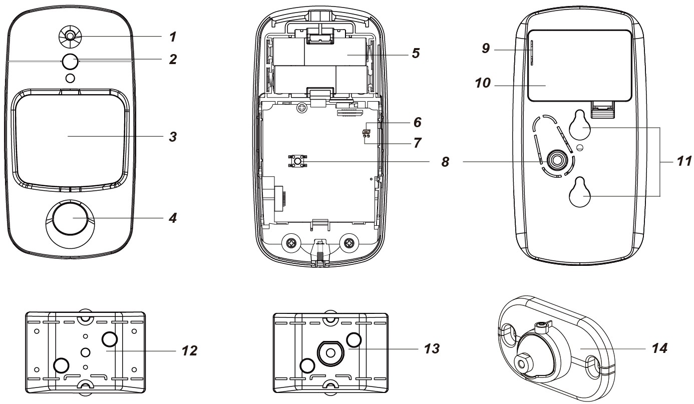

# VESTA-423

VST-897-IL-SF1-2W

## PIR Motion Sensor Camera

### Introduction

VST-897 is a passive infrared (PIR) motion sensor camera. It is capable of sending wireless signals and captured images (picture quality of up to 1280 x 720 pixels) to the Control Panel upon movement detection.

The PIR Camera is designed to give a typical detection range of 12 meters when mounted at 2.3-2.5 meters above ground. When Pet Immunity function is enabled, the motion sensor camera will not detect pets up to 25 kg when mounted at 2.3-2.5 meters above ground.

VST-897 is designed with two masking sensors. The anti-masking feature allows for detection of any attempts to blind the device by placing objects in its field of view or by covering or painting the device.

Remote configuration is supported for the PIR camera. Besides adjusting the Jumper Switches, users can also enable/disable pet immunity function and adjust the sensitivity of the PIR camera from the Control Panel webpage or Home Portal Server.

The PIR Camera consists of a two-part design made up of a cover and a base. The cover contains all the electronics and optics and the base provides a means of fixing. The base has knockouts to allow mounting on a flat surface, or a mounting bracket is provided for corner mounting and surface mounting.

**The VST-897 Series includes the following models**:

<table data-header-hidden><thead><tr><th></th><th align="center" valign="middle"></th><th align="center"></th><th align="center"></th></tr></thead><tbody><tr><td><strong>Model</strong></td><td align="center" valign="middle"><strong>Flash LED</strong></td><td align="center"><strong>Infrared LED</strong></td><td align="center"><strong>Anti-masking</strong></td></tr><tr><td><em><strong>VST-897</strong></em></td><td align="center" valign="middle">●</td><td align="center"></td><td align="center">●</td></tr><tr><td><em><strong>VST-897-IL</strong></em></td><td align="center" valign="middle"></td><td align="center">●</td><td align="center">●</td></tr><tr><td><em><strong>VST-897L</strong></em></td><td align="center" valign="middle">●</td><td align="center"></td><td align="center"></td></tr><tr><td><em><strong>VST-897L-IL</strong></em></td><td align="center" valign="middle"></td><td align="center">●</td><td align="center"></td></tr></tbody></table>

## Parts Identification

<figure><figcaption></figcaption></figure>

1. **Flash LED / Infrared LED**

The Flash LED or Infrared LED delivers sufficient light for image capture under low lighting condition.

2. **Red LED / Function Button**

&#x20;      **Red LED:** (Please refer to _**LED Indicator**_ below for details)

&#x20;**Function Button Usage:**

* Press and hold the button for 3 seconds to send a learn code, release when Red LED light on.
* Press the button once to enter test mode for 3 minutes.
* Press the button once to send a learn code to the repeater/router.

3. **IR Sensor**
4. **PIR Camera Lens**
5. **Battery Compartment**
6. **Pet Immunity Enable/Disable Jumper Switch (JP3)**

<figure><figcaption></figcaption></figure>

**Jumper On** The jumper link is inserted, connecting the two pins.

**Jumper Off** The jumper link is removed or “**parked**” on one pin.

When set as ON, Pet Immunity is disabled (Factory default).

When set as OFF, Pet Immunity is enabled.

7. **Sensitivity Increaser Jumper Switch (JP4)**

&#x20;      When set as ON, the PIR’s detection sensitivity is high.

&#x20;      When set as OFF, the PIR’s detection sensitivity is in normal level (Factory default).

8. **Tamper Switch**
9. **Battery Insulator**
10. **Battery Compartment Cover**
11. **Hook Holes**
12. **Mounting Bracket A**
13. **Mounting Bracket B (for Rotating Holder)**
14. **Rotating Holder (Optional, sold separately)**

## Features

### LED Indicator

In Normal operation mode, the Red LED will not light except in the following situations:

* When the PIR Camera is in low battery condition, every time it transmits a detected movement, the Red LED will flash for 2 seconds.
* When the cover is opened and the tamper switch is violated, the Red LED will flash for 2 seconds, to indicate it is transmitting “Tamper” signal.
* When the Tamper condition persists, every time it transmits a detected movement, the Red LED will flash for 2 seconds.
* When PIR Camera enters Test Mode, the Red LED will flash for 1 second. During Test mode, the Red LED will also flash for 2 seconds every time a movement is detected.
* When the PIR Camera is in 30 seconds warm up period, the Red LED will slow flash.
* When the PIR Camera is transmitting captured images under fault conditions (low battery, tamper switch activated), the Red LED will continuous flash.

The LED will not flash if the PIR Camera tamper and batteries are normal and is not under test mode,

If the LED flashes to indicate signal transmission, it will flash twice rapidly upon receiving acknowledgement from the Panel.

### Image Capture

When the alarm system is armed, the PIR Camera will capture 1, 3 or 6 alarm images in resolution of 1280 x 720 pixels, or alarm images in resolution of 640 x 360 or 320 x 184 pixels (programmable from Control Panel) upon movement detection. You can also manually request the PIR Camera to take a picture through the Control Panel. The captured images will be transferred to the Control Panel for users to view.


Note:

&#x20;If your PIR Camera is installed at a location where the camera’s field of view is a complex environment with intense light or lots of colors, the images captured will be great in file size, possibly leading to truncation when the images are transmitted to the Control Panel.


### Warm Up Period

When the PIR Camera is powered on, the PIR Camera will warm up for 30 seconds. During the 30-second warm-up period, the PIR Camera will not be activated.

### Sleep Timer

The PIR Camera has a “**sleep time**” of approximately 1 minute to conserve power. After transmitting for a detected movement, the PIR Camera will not retransmit for 1 minute.

Continuous movement in front of the PIR Camera will therefore not exhaust the batteries.

### Battery

The PIR Camera uses three 3V, CR123 Lithium batteries in series connection as its power source.

The PIR Camera features Low Battery Detection function. When the battery voltage is low, the PIR Camera will transmit Low Battery signal to the Control Panel. If movement is detected under Low Battery condition, the Red LED will flash for 2 seconds.

When changing the batteries, press the Tamper Switch or the Function Button twice after removing the old batteries to fully drain the residual power before inserting new ones.

### Tamper Protection

The PIR Camera is protected by a tamper switch which is compressed when the PIR Camera is properly installed. When the PIR Camera is removed from mounted surface or its cover opened, the tamper switch will be activated and the PIR Camera will send a tamper open signal to the system control panel to remind the user of the condition. If movement is detected when the tamper switch is open, the Red LED will flash for 2 seconds.

### Supervision

The PIR Camera will conduct a self-test periodically by transmitting a supervisory signal once every 15 to 18 minutes.

### Test Mode

* Test mode allows you to check the PIR Camera’s detection range (not shooting coverage).
* Press the Function button once to enter Test mode for 3 minutes; the Red LED will flash for 1 second.
* During Test mode, sleep timer is disabled. You can trigger the PIR Camera to check the IR detection range. Each time the PIR camera is triggered, the Red LED will flash for 2 seconds.

### Learning

* Power on the PIR Camera by removing the battery insulator.
* Put the Control Panel into learning mode; refer to Control Panel manual for details.
* Press and hold the function button for 3 seconds, release the button when the Red LED light on. (To learned into battery-operated panel, after pressing and holding the function button for 3 seconds, please press the function button again for one second.)
* The Red LED will light on for 25 seconds in learning mode, add PIR Camera into the Control Panel during this period (refer to your Control Panel to finish learn in process). If the PIR is successfully added into the Control Panel, the Red LED will flash 6 times to indicate. If PIR is not added within 25 seconds, please repeat learning process.


Note:

* If the PIR Camera already exists in a Control Panel system, you will need to first remove the PIR Camera from the Control Panel before you can learn it into a different Control Panel.
* When learning the PIR Camera into a repeater/router, please press the function button once (instead of pressing and holding it for 3 seconds) to send a learn code


### Walk Test

* After the PIR Camera is learnt-in, put the Control Panel into “**Walk Test**” mode, hold the PIR Camera in the desired location, and press the Function Button to confirm this location is within signal range of the Control Panel, refer to Control Panel manual to complete Walk Test.
* When you are satisfied that the PIR Camera works in the chosen location, you can proceed to mounting.

### Edit PIR Camera Operation Area

1. Use the “Edit Device” function on the Panel’s webpage to change the area setting.
2. For the device communicating directly with the Panel, the setting is completed after clicking OK.

For the device using a repeater, press the Function Button to transmit a learn code after changing the area setting.

### Pet Immunity Function

The PIR Camera supports pet immunity feature and will not detect pets up to 25 kg to minimize false alarm situation.

The Pet Immunity function can be enabled/disabled by setting the Jumper Switch (JP3) position. When the Jumper Switch (JP3) is set to ON, Pet Immunity is disabled (factory default). When JP3 is set to OFF, Pet Immunity is enabled. The pet immunity function can also be adjusted remotely as describe in _**Remote Setting**_ section below.

### Sensitivity Increaser Function

You can use the sensitivity increaser jumper to increase the PIR’s detection sensitivity. To increase detection sensitivity, set the Jumper Switch (JP4) to ON. To maintain normal detection sensitivity, set JP4 to OFF (Factory default). The sensitivity increaser function can also be adjusted remotely as describe in _**Remote Setting**_ section.

### Remote Setting

* The PIR camera supports remote setting of pet Immunity and sensitivity.
* When the PIR camera is powered on, its pet immunity function and sensitivity are determined by the JP3 and

JP4 settings. Users can either adjust jumper settings or remotely change the pet immunity and sensitivity settings from the Control Panel. Remote setting will overwrite jumper settings.

**Control Panel Webpage**:

1. On the Panel’s local webpage, go to the Device Edit page by clicking “Edit” of the IR entry.
2. Press the Test Button once and then the Sensor Setting section will be shown. Enter the value for the desired settings and click OK to confirm. Please refer to the table below for configuration details. For example, if you want to enable Pet Immunity, set Sensitivity level to “normal”, you can input 03.

| **IR Configuration** | **Pet Immunity** | **Sensitivity** |
| -------------------- | ---------------- | --------------- |
| 00                   | No               | High            |
| 01                   | No               | Normal          |
| 02                   | Yes              | High            |
| 03                   | Yes              | Normal          |

3. Press the function button once on the PIR Camera to send a signal to the Control Panel, new settings will be applied immediately. If the button is not pressed, new settings will be applied upon next signal transmission, e.g., transmission of the supervision signal or IR trigger signal.

**Home Portal Server:**

1. On Home Portal Server, go to the Device setting page, click the VST-897 device row and select “Remote Configuration.”
2. Select the desired setting for Pet Immunity (Enable/Disable), Sensitivity (High/Normal), and Sleep Mode (Normal/Optimized) from the drop-down lists, click “Submit” to confirm setting.
3. Press the function button once on the PIR Camera to send a signal to the Control Panel, new settings will be applied immediately. If the button is not pressed, new settings will be applied upon next signal transmission, e.g., transmission of the supervision signal or IR trigger signal.

### Masking Detection

* The PIR Camera is equipped with masking sensors for detecting any masking (blocking) attempts by an intruder every minute.
* When a masking event is detected, and the masking condition lasts for 3 minutes, the PIR Camera will send a masking alarm signal to the Control Panel to notify user of the masking condition.
* After masking/blocking is removed for 3 minutes, the PIR Camera will send a restore signal to the Panel.

## Installation

### Installation Guideline

* The PIR Camera is designed to be mounted either on a flat surface or in a corner.
* The base has knockouts, where the plastic is thinner, for surface mounting purpose. A mounting bracket can be used for corner fixing as well as surface fixing.
* To prevent false masking event triggers, ensure there is **at least 20 centimeters of clearance** above the device to the ceiling and below the device to any object.
* The detection range is up to 12 meters when mounted at a height of 2.3-2.5 meters above the ground.
* When Pet-Immunity function is enabled, it will not detect pets up to 25 kg when mounted at a height of 2.3-2.5 meters above the ground. If required, you can adjust the height of the PIR Camera according to the size of your pet for optimal pet immune performance. Higher installation location will provide larger pet-immune space, but also increases the blind spot under the PIR Camera.
* When the PIR Camera is mounted with rotating bracket, it will not have the regular detection area (as in the diagram below), or the typical pet immune range.

**It is recommended to install the PIR Camera in the following locations:**

* Avoid positions where pets can enter the detection area by climbing furniture, stairs or other objects.
* At a position such that an intruder would normally move across the PIR’s field of view.  At a height between 2.3 and 2.5 meters above the ground for best performance.
* In a corner to give the widest view.
* At a position where its field of view will not be obstructed e.g., by curtains, ornaments etc.
* **Limitations**

<figure><figcaption></figcaption></figure>

* **Be sure to always remain the RSSI signal strength steady at “4”.**

<figure><figcaption></figcaption></figure>

### Mounting the PIR Camera


_IMPORTANT NOTE:_

_To prevent false masking event triggers, ensure there is **at least 20 centimeters of clearance** above the device to the ceiling and below the device to any object._


* &#x20;The PIR Camera is designed to be mounted either on a flat surface or in a corner.
* The base has 3 knockouts where the plastic is thinner and can be broken through for screwing it onto a surface.
* A mounting bracket is provided and includes two central screw holes for fixing the device onto a flat surface and four side screw holes for fixing the device onto a corner


Note:

Users can easily change the batteries by taking the PIR Camera off the mounting bracket when it is mounted with the mounting bracket.


**Surface mounting without mounting bracket**

1. Detach the cover by loosening the bottom fixing screw with a Phillips screwdriver.
2. Break through the 3 knockouts from the inside of the base.
3. Use the 3 holes as a template and drill holes into the surface to be mounted.
4. Insert the wall plugs, then screw the base onto the wall plugs.
5. Fit the upper part of the cover onto the base first, and then close the lower part.
6. Tighten the bottom fixing screw to firmly fix the cover in place.

<figure><figcaption></figcaption></figure>

**Surface/Corner mounting with the Mounting Bracket A**

* Mounting Bracket A includes two central screw holes for fixing the device onto a flat surface and four side screw holes for fixing it in a corner.
* To mount the PIR Camera with Mounting Bracket A:
  1. For surface mounting, use the two central screw holes on the bracket as a template and drill holes into the surface to be mounted. For corner mounting, use the four side screw holes on the bracket as template to drill holes.
  2. Insert the wall plugs provided.
  3. Screw the mounting bracket onto the wall plugs with the two hooks pointing away from the wall.
  4. Hook the PIR Camera onto the mounting bracket and push it downwards to firmly fix the device in place.


Note:

Please make sure the PIR Camera is properly hooked onto the mounting bracket, so that the tamper switch is fully compressed.


**Surface Mounting**

<figure><figcaption></figcaption></figure>

**Corner Mounting**

<figure><figcaption></figcaption></figure>

* **(Optional) Stabilizing Screw for the Mounting Bracket A**

One extra screw is provided for stabilizing the base of the PIR Camera onto the Mounting Bracket A.

To use the stabilizing screw, you will need to detach the cover from the base.

After screwing the Mounting Bracket A, hooking the base onto the mounting bracket and pushing it downwards, apply the stabilizing screw to the central screw hole. Re-place the cover and tighten the bottom fixing screw.

<figure><figcaption></figcaption></figure>

**Surface mounting with Mounting Bracket B and Rotating Holder:**

* The Rotating Holder and Mounting Bracket B offer a user-friendly mounting option, enabling easy installation and rotation of the PIR Camera to achieve the desired viewing angle.

<figure><figcaption></figcaption></figure>

* To mount the PIR Camera with the Mounting Bracket B and Rotating Holder.

1. Screw the Rotating Holder to the wall.
2. Secure Mounting Bracket B to the Rotating Holder's swivel ball, ensuring the two hooks on Mounting Bracket B face away from the wall.
3. Hook VST-897 onto Mounting Bracket B and push it downwards.
4. Rotate the swivel ball to achieve the desired orientation of the PIR Camera. Secure the position by firmly tightening the angle-adjusting screw.

_To adjust the swivel ball, **partially loosen** the angle-adjusting screw to allow smooth rotation._

<figure><figcaption></figcaption></figure>
