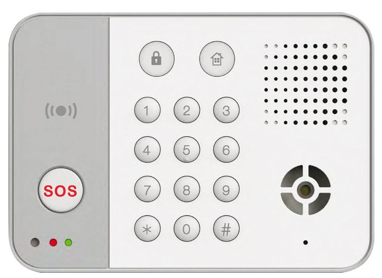

# VESTA-424

**KPT-41N-SFV**


Note:

This Keypad has a bidirectional audio SFV protocol to use with the panel VESTA-447


## **TWO-WAY VOICE REMOTE KEYPAD with NFC Tag**

<figure><figcaption></figcaption></figure>

## _**Identifying the Parts**_

<figure><figcaption></figcaption></figure>

1. **Siren**
2. **Speaker**
3. **Orange LED: Home Arm Key** .jpeg>)
4. **Red LED 1: Away Arm Key** .jpeg>)
5. **Panic Alarm (if enabled)**
   * Press both 1 and 3 to trigger panic alarm
6. **NFC Tag Sensor Zone**
7. **SOS button**
   * Press the SOS button to transmit Emergency Signal.
   * Press the SOS Button when the Remote Keypad is ringing to pick up an incoming call.
8. **Red LED 2**
9. **Green LED**
   * Lights up during a two-way communication or in Loopback Mode
10. **Fire Alarm (if enabled)**
    * Press both 4 and 6 to trigger fire alarm
11. **Medical Alarm (if enabled)**
    * Press both 7 and 9 to trigger Medical alarm
12. **\* Key**
    * In Stand-by mode, press \* Key to enter Test and Programming Mode.
    * Enter Keypad PIN Code + \* Key to adjust the volume (Low/Medium/High). The volume is Low by default.
13. **# Key**
    * In Stand-by mode, press **#** Key to check current system mode, the corresponding LED will light up.
14. **Service Call**
    * Press both 7 and 8 for Service Report
    * During the service call communicaiton, press and hold both 7 and 8 keys for 5 seconds to end the call. Then the Two-Way Voice Remote Keypad will emit one beep to indicate.
15. **Battery Compartment**
16. **Tamper Switch**
17. **Mounting Holes**
18. **NFC Tag**


Note:

* A short beep will sound along with key pressing to indicate that the button pressed is valid.
* A long beep will sound along with key pressing to indicate successful command.
* 4 continuous beeps will sound indicating mistake and the user should repeat the process again.
* Backlight will be ON for any key pressed, or command sent from the Keypad. When the system is in Disarm Mode, the backlight will also light up by pressing the \* key.


### _**LED Indicator**_

**Red LED (Away Arm Key)**

* **Red LED on:** the system is in **Test & Programming Mode**.
* **Red LED on for 5 seconds:** to show the system is in the **Away Arm Mode** by pressing #  key.
* **Red LED flashes, and Backlight on**: the system is in the **Away Arm Mode.**
* **Red LED flashes without beep:** request for **Force arm**.
* **Red LED flash with 4 beeps**: failure due to the following reasons:
  * No response from the control panel.
  * Request for **Home mode** during **Arm mode**.

**Orange LED (Home Arm Key)**

* **Orange LED:** Orange flashes and backlight on in the **Home Mode**.
* **Orange LED on for 5 seconds:** to show the system is in the **Home Mode** by pressing #  key.
* **Orange LED flashes for 5 seconds:** low battery in Normal Operation Mode, and Tamper open.
* **Orange LED flashes without beep:** request for **Force arm**.
* **Orange LED flashes with 4 beeps:** failure due to the following reasons:
  * No response from the control panel.
  * Request for **Home mode** during **Arm mode**.


Note:

* When Arm/Home, Red/Orange LED will turn off after successful completion of a valid keystroke sequence, or when the pause in between Control panel User code/PIN code keystrokes exceeds 2 seconds along with 4 beeps.
* If Arm/Home button is pressed but no Control Panel User Code/PIN code is entered, in 5 seconds the keypad will enter sleep mode.


### _**Built-in Siren**_

1. Exit Delay — the Two-Way Voice Remote Keypad continuously beeps. If enter Arm mode or Home Mode, the Two-Way Voice Remote Keypad will emit long beep.
2. Entry Delay —The Two-Way Voice Remote Keypad continuously beeps. When entering Disarm Mode, the Two-Way Voice Remote Keypad will emit 2 beeps.
3. Alarm siren — Siren will sound continuously when an alarm is triggered. Alarm sound will increase progressively from 85dB to 105dB in 15 seconds. Fire Alarm will sound 2 seconds and 1 second off.

### _**Power**_

* The Two-Way Voice Remote Keypad uses four CR123 3V Lithium batteries as its power source.
* The Two-Way Voice Remote Keypad can also detect the battery status. If the battery voltage is low, the Orange LED will flash for 5 seconds. The Low battery signal will be sent along with regular signal transmissions to the Control Panel for displaying the status accordingly.
* When the battery is exhausted, the Two-Way Voice Remote Keypad will stop all function, all LED will flash every 4 seconds.

### _**Power Saving Feature**_

* When idle, the Two-Way Voice Remote Keypad is in **Stand-by** mode and uses no power. It will activate and **wake-up** for 5 second when any key is pressed or keypad sensor is detected.
* After 5 seconds of key inactivity, the power goes off and it returns t**o Stand-by** mode.
* Upon completion of a command input, the power goes off and the Two-Way Voice Remote Keypad returns to **Stand-by** mode.


Note:

You can also press and hold **＊**&#x61;nd **#** key for 2 seconds to send learning code when Idle


### _**Supervisory Signal**_

* The Two-Way Voice Remote Keypad will automatically transmit Supervisory Signals periodically to the Control Panel at random intervals of 15-18 minutes.

### Tamper Protection

* The Remote Keypad is protected against any attempt to open the lid or to detach the Keypad from its mounting surface.
* Tamper protection is disabled when the keypad is in Test and Programming Mode

### _**Test and Programming Mode**_

* The Two-Way Voice Remote Keypad can be put into this mode by entering the Keypad PIN code (default: **0000**) followed by “**＊**” key along with a long beep sounding, the Red LED and backlight will turn on.
* To exit Test mode, press **#** key **twice** (long beep). Otherwise, the Two-Way Voice Remote Keypad will automatically exit Test mode after 5 minutes and return to Stand-by mode.

_**Under the Test and Programming Mode, the following functions can be enabled:**_

* Press **＊** key and then **2** key — to enable Dual-key Panic Alarm function.
* Press **＊** key and then **3** key — to enable Dual-key Fire Alarm function.
* Press **＊** key and then **4** key — to enable Dual-key Medical Alarm function
* Press **＊** key and then **5** key — to disable all Dual Key function (long beep). (**Default**)
* Press **＊** key and then **6** key — to change the Keypad PIN Code.
  1. Enter **Old** Keypad Pin Code and then press **\*** key along with a long beep. If incorrect PIN Code is entered, they Keypad will emit 4 beeps and exit PIN Code change function. (Pressing **#** key will also exit PIN Code change function)
  2. Enter **New** 4-digit Keypad PIN Code and then press **#** key. The Keypad will emit a long beep and will exit change Keypad PIN Code function automaticall&#x79;**.**
* Press **＊** key and then **7** key — to transmit the Two-Way Voice Remote Keypad learn signal with a long beep.
* Press **＊** key and then **8** key — to enable Arm/ Home without Control Panel User Code function with a long beep. (the code is checked by panel.)
* Press **＊** key and then **9** key — to enable Arm/ Home with Control Panel User Code function with a long beep. (the code is checked by panel.) (**Default**)
* Press **＊** key and then **0** key — to select sound setting mode of “**Beep**”, “**Voice prompt**” or “**Mute**”.

&#x20;                      a. When the “Beep” function is enabled, a long beep will emit.

&#x20;                      b. When the “Voice prompt” function is enabled, the voice prompt of Volume Low / Volume  Medium / Volume High will be played.

&#x20;                      c. When the “Mute” function is enabled, the Orange LED (Home Arm Key) will flash twice.

* Press **#** key **twice** — to exit Test Mod&#x65;**.**

### _**Audio Setting**_

* Under Test Mode, user can press **＊** key and then **0** key to select sound setting mode of “**Beep**”, “**Voice prompt**” or “**Mute**”.
* Under the normal operation mode, user can also adjust audio volume to low (default), medium or high by pressing **＊** key.
* When “Voice prompt” function is enabled, the voice prompt will be played on the conditions below.


Note: The voice prompts will only be played once each time when activated.


<table data-header-hidden><thead><tr><th width="98">No.</th><th width="119">Condition</th><th width="164">Audio</th><th>Indication</th></tr></thead><tbody><tr><td>1</td><td>Arm</td><td>Voice Prompt</td><td>System is Armed - Exit Now                                   System is in Arm mode</td></tr><tr><td>2</td><td>Home Mode</td><td>Voice Prompt</td><td>System is Armed - Exit Now                                   System is in Home mode</td></tr><tr><td>3</td><td>Disarm</td><td>Voice Prompt</td><td>System is Disarmed - Welcome Home</td></tr><tr><td>4</td><td>System fault</td><td>Voice Prompt</td><td>System Fault - Please check</td></tr><tr><td>5</td><td>Alarm in memory</td><td>Voice Prompt</td><td>Alarm in memory</td></tr><tr><td>6</td><td>Adjusting audio</td><td>Voice Prompt</td><td>Volume Low / Volume Medium / Volume High</td></tr></tbody></table>

### _**Installation Procedures**_

**Step 1** Put the Control Panel into **Learning Mode**. Please refer to the Control Panel manual.

**Step 2** **Keypad Normal Mode**

Under Keypad Normal Mode, press and hold **＊** key and **#** key for 2 seconds to transmit learn code to Control Panel.

**Keypad Programming Mode**

Alternatively, you can enable Remote keypad to enter Test and Programming Mode first. Enter Keypad PIN Code (Default: **0000**) and then press **＊** key. The **Red** LED will turn on and sound a long beep. Press **＊** key and then **7** key to transmit learn code to Control Panel. Remote keypad will sound a long beep.

**Step 3** During the learning process, the Green LED will light on to indicate. Refer to Control Panel manual to complete the learning process.


Note: When learnt into the Panel, the keypad will be recognized as 2 separate devices and will occupy 2 zones in the Panel. Add both devices into the Panel.


<figure><figcaption></figcaption></figure>

**Step 4** If learning is successful, the Keypad will emit 3 high-tone beeps upon receiving acknowledgement signal from Control Panel and meanwhile the Green LED will turn off.

If learning fails, the Two-Way Voice Remote Keypad will emit 5 low-tone beeps. Please restart learning procedure from Step 1.

**Step 5** After the Two-Way Voice Remote Keypad is learnt-in, put the Control Panel into **Walk Test** mode. Hold the Two-Way Voice Remote Keypad in the desired location, and press <mark style="color:$danger;">**SOS**</mark> button to confirm this location is within the signal range of the Control Panel.

**Step 6** When you are satisfied that the Two-Way Voice Remote Keypad works in the chosen location, you can proceed with mounting the Two-Way Voice Remote Keypad following the steps described below (see _**Mounting Remote Keypad**)_.

### _**SFV Walk Test**_

After learning the Remote Keypad into the Control Panel, perform SFV Walk Test to verify effective voice communication
&#x20;between the Keypad and the Panel.
\
**1.**  Click “Edit” on the 809 entry to open the Device Edit page.
\
**2.**  Under SFV Setting at the bottom of the page, select “Loopback Start” from the Function dropdown menu.
&#x20;The Remote Keypad will enter the Loopback Mode for 5 minutes, and its Green LED will light up.
\
**3.**  Speak short testing words (e.g., “one, two, three”) into the Remote Keypad.

a) In range: The testing words will be played back through the Keypad’s speaker after 2 seconds, confirming
\
effective communication with the Panel.
\
b) Out of range: The testing words will not be played back. Move the device closer to the Panel and repeat the
&#x20;testing words.
\
**4.**  Once effective communication is confirmed, proceed with installation.


Note: The SFV Walk Test should take precedence over the regular RF Walk Test.


<figure><figcaption></figcaption></figure>

**Exiting Loopback Mode:** Loopback Mode can be exited in three ways:
\
a) Click **“Loopback Stop”** from the Function dropdown menu.
\
b) Press and hold the **8 & 9 keys** on the Keypad for 5 seconds.
\
c) Wait for the 5-minute Loopback Mode to expire automatically

### _**Tag Learning/Clearing Procedures**_

The Keypad is capable of transmitting NFC (Near Field Communication) signals to the Control Panel, and you can assign a PIN Code and user name to each NFC label on the Panel webpage. The NFC labels can then be used to control alarm system mode through the Keypad. The number of NFC labels and PIN Codes are managed on the Control Panel webpage.

1. _**Add Label:**_

When adding a new label, the keypad must be in normal operation mode.

**Step 1** Go to the PIN Code page on the Control Panel webpage, input a 4-digit or 6-digit user pin code and user name for the tag, and assign the user pin code to an Area.

<figure><figcaption></figcaption></figure>

**Step 2** After Keypad is successfully learnt into the panel, apply a new label to the Keypad Tag sensor zone. The Keypad will emit 4 beeps to indicate this label is new (not added to the system yet).

**Step 3** Click the Load button on the PIN Code page as below. The corresponding label number will be loaded. Click Submit to save the user code setting.

<figure><figcaption></figcaption></figure>

**Step 4** The label has been added. You can use the label to arm/home arm/disarm the system.

2. _**Clear label:**_

**Step 1** Go to the PIN Code page on the Control Panel webpage.

**Step 2** Manually delete the label number and click Submit.

<figure><figcaption></figcaption></figure>

**Step 3** The label is cleared.

### _**Two-way Voice Communication**_

Two-way voice communication will be established when the Remote Keypad:

*
  Triggers an emergency alarm
*
  Makes a non-emergency call
* Receives an incoming call

#### **Alarm Activation**

* Press the <mark style="color:$danger;">SOS</mark> Button to transmit an Emergency alarm signal to the Control Panel. The Panel will activate an alarm,
  &#x20;dial the programmed alarm call recipient and establish two-way communication between the Keypad and the call
  &#x20;recipient.
* The telephone number to be called when the Remote Keypad is activated can be programmed via the Control Panel’s
  &#x20;local webpage (route: System Setting > Voice Report > **Telephone**)

<figure><figcaption></figcaption></figure>

#### **Service Report (Non-Emergency Call)**

**A)**  Dual-Key  Button Press

Press dual keys **7** and **8** simultaneously to transmit a service report signal to the Control Panel. The Control Panel will dial to programmed service call recipient (different from alarm call recipient) and establish two-way communication between the Remote Keypad and call recipient.

The telephone number to be called when the dual keys are pressed can be programmed via the Control Panel’s local
&#x20;webpage (route: System Setting > Voice Report > **Service Telephone**).

During the service call, pressing and holding both **7** and **8** keys for 5 seconds will end the call. The Two-Way Voice Remote Keypad will emit one beep to indicate.


Note:

* If the Control Panel encounters power failure during two-way communication period, the Remote Keypad will automatically be disconnected and emit one beep to notify the user. The Remote Keypad has a 3-minute communication time and cannot be extended.
* If the Two-Way Voice Remote Keypad fails to establish two-way communication, it will emit 1 low-tone beep.


**B)** **Rule / Scene Activation**

Users can program a phone number into the Home Portal Server to initiate a call to programmed number. when a configured rule or scene is triggered, the action of making a call will be performed.&#x20;

To set the phone number:

1 Navigate to the Remote Keypad’s **Action** Page via Rule or Scene settings.

* Route: Main Page > Rule > Action or Main Page > Scene > Action

<figure><figcaption></figcaption></figure>

2 Select the following option for each setting and enter the phone number to be called.

* **Action Type**: Select “Device Action”
* **Area**: Select the Area number of the Remote Keypad
* **Device**: Select the Zone number and the device (Keypad)
* **Action**: Select “Make a Call” (this option will only appear when “Keypad” is selected under “Device”)
* **Phone Number:** Enter the phone number (only the first 20 digits will be shown)

3 Click “v” to confirm and save the settings.

### **Incoming Calls**

Users can program authorized callers via the Panel’s webpage. To do this, go to the “**GSM**” tab and access “**Two-Way Setting**” function, and enter the numerals from the authorized phone number. The Panel will only answer incoming calls that contain the programmed numerals.

To answer incoming calls:

1. Program the caller’s phone number (up to 60 digits, including spaces and commas) in the “Two-way Setting” section of the Panel’s webpage. For example, users can enter “**123456,654321**” in the Caller column, indicating that two sets of phone numbers are programmed. The Panel will answer calls containing these numerals, such as 0987**123456**, because it includes “**123456**”.
2. If the phone number of an incoming call contains the programmed numerals, the Panel will pick up the call and assign the Remote Keypad to handle the two-way communication for 3 minutes (non-extendable).
3. The call will automatically end after 3 minutes or when the caller terminates it.

<figure><figcaption></figcaption></figure>


Note: A Repeater does not extend the range for two-way communication.


### Remote Sound & Volume Setting

* Detailed sound settings can be configured through
  &#x20;**Device Edit** page on the Control Panel’s webpage.
* Users can enable or disable voice prompt for **Mode
  &#x20;Change** events. If the checkboxes for mode change
  &#x20;prompt is unchecked, the voice prompt for mode
  &#x20;changes will be disabled, and the Remote Keypad will
  &#x20;beep for these events instead.
* The alarm volume and the confirmation beep volume
  &#x20;for mode changes can be adjusted independently
* Additional customization options include selecting the
  &#x20;language for voice prompts and setting volume levels
  &#x20;for alarms and other status notifications.

<figure><figcaption></figcaption></figure>

### _**How to Set System Mode**_

You may choose to arm/home arm with or without a Control Panel User Code

**Arm/Home without Control Panel User Code**

In the Test mode, pressing **＊** key and then **8** key to enable Arm/ Home without Control Panel User Code function, then exit Test mode by pressing the **#** key twice.

* **Enter Arm Mode**: Press  .png>)  key. If panel has no fault and arming is successful, the Red LED will turn ON with a short beep. When successful Arm, Red LED flashes, Backlight turns on with a long beep.
* **Enter Home Mode**: Press .png>) key. If panel has no fault and arming is successful, the Orange LED will turn ON with a short beep. When successful Home Arm, Orange LED flashes, Backlight turns on with a long beep.
* **Return to Disarm Mode**: Enter Control Panel User Code or put Tag on the Keypad Sensor will emit a short beep. If disarm is successful, Backlight flashes along with 2 beeps.

**Arm/Home with Control Panel User Code or NFC Tag**

In the Test mode, Pressing **＊** key and then **9** key can enable Arm/ Home with User Code function, then exit Test mode by pressing the **#** key twice. **(Default)**

**This function must be enabled for NFC tag to be used.**

* **Enter Arm Mode**: Press  .png>)  key then enter Control Panel User Code (or scan the tag); the Red LED will turn ON with a short beep. When successful Arm, Red LED flashes, Backlight turns on with a long beep.
* **Enter Home Mode**: Press .png>) key then enter Control Panel User Code (or scan the tag); the Orange LED will turn ON with a short beep. When successful Home Arm, Orange LED flashes, Backlight turns on with a long beep.
* **Return to Disarm Mode**: Enter Control Panel User Code or put Tag on the Keypad Sensor will emit a short beep. If disarm is successful, Backlight flashes along with 2 beeps.

If disarm is successful, Backlight flashes along with 2 beeps.

### _**Dual-key Alarm function**_

The Dual Key function allows you to activate alarm from Keypad by pressing 2 keys at the same time. Press and hold both keys for 1 second to transmit signal, the Keypad will emit a long beep to confirm. The dual-key function is **disabled** by default. To enable it, please refer to the Test Mode section.

* **Panic Alarm**: **1** key + **3** key.
* **Fire Alarm**: **4** key + **6** key.
* **Medical Alarm**: **7** key + **9**.

### _**Fault Conditions**_

When the Two-Way Voice Remote Keypad is under **NORMAL OPERATION MODE,**

1. When fault event exists in Control Panel, the arming command from Keypad will be ignored by Control Panel. The Keypad Red and Orange LED will flash without beep to indicate error. You can override the fault event and force arm the Control Panel by performing the arm action again.
2. If the **Control Panel** is under Arm Mode, you **CANNOT** activate Home mode with the Two-Way Voice Remote Keypad. The Keypad Red LED flashes + Orange LED flashes for 3 seconds along with 4 beeps to indicate transmission error.
3. If sent Arm/Home/Disarm signal but have no response from the Control Panel, the Red LED flashes + Orange LED flashes for 3 seconds along with 4 beeps.
4. When incorrect Keypad PIN code is entered to enter Test mode, the Keypad will emit 4 beeps. If incorrect Keypad PIN codes are entered for 4 times, the Keypad will disable key input function for 1 minute and indicate error by flashing all LEDs for 6 times and emitting 6 beeps. All key press during the next 1-minute period will be ignored.

After 1 minute, the Keypad will return to normal operation and emit a long beep to indicate.

### _**Mounting the Remote Keypad**_

To mount the Remote Keypad:

1. Undo the two bottom fixing screws and detach the back case.&#x20;
2. Using the 4 mounting holes of the back base as a template, mark off the positions in the most appropriate place.
3. Insert the wall plugs.
4. Screw the back case onto the wall plugs.
5. Replace the Remote Keypad and tighten the two bottom fixing screws.

### _**Change of Battery**_

1. Put the Control Panel to programming menu to bypass the Keypad tamper alarm.
2. Dismount the Two-Way Voice Remote Keypad.
3. Undo the two bottom fixing screws and detach the back case.
4. Take out the old batteries and press any key to fully discharge the residual power before inserting new batteries in the battery compartment.
5. Insert new batteries, attach the back case to the Keypad and tighten the bottom fixing screws.
6. Screw back the Two-Way Voice Remote Keypad to the surface with mounting screws.
7. Put the Control Panel back to normal operation mode.

### _**Factory Reset**_

If you have forgotten the Keypad PIN Code or anything wrong happened in the Two-Way Voice Remote Keypad, you can reset the Two-Way Voice Remote Keypad to factory default and reinitialize it.

Step 1 Remove the batteries and release the tamper.

Step 2 Press & hold **3** key while inserting the batteries back.

Step 3 Continue pressing **3** until three short beeps to indicate successful reset.

Step 4 Release **3** key, the reset process is complete.


Note:

After reset, Keypad PIN code reverts to factory default value, **0000** and clears all user code and tag data. The Two-Way Voice Remote Keypad will need a new learn-in process to start functioning.


