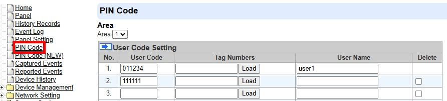

# VESTA-448

**KPT-35N-BUS**

## **WIRED KEYPAD**

KPT-35N-BUS is a hardwired keypad with an NFC key fob designed to have quick access control of the system control panel via PIN Code or NFC tags. The keypad can send wired signals to and receive signals from the Control Panel within wire distance, depending on the wire gauge and the total power consumption of all wired devices. The LCD screen will display information the system control panel sends back.

The wired keypad can be mounted on either a flat surface or a wall with screws, or placed on the desktop with the enclosed bracket. It also has a tamper protection switch which will be activated upon any unauthorized attempt to open the back cover.

## Parts Identification

<figure><figcaption></figcaption></figure>

<figure><figcaption></figcaption></figure>

1. **Backlit LCD Display**
2. **Green LED**
   * The Green LED is off in stand-by mode.
   * The Green LED will light up when any key is pressed.
3. **Yellow LED**
   * The Yellow LED will flash once every 3 seconds when any fault situation is detected, and turn to OFF when all fault conditions are restored. The LED’s behavior is controlled by the Control Panel.
4. **Backlit Numeric Keys**
5. **Backlit Star (**＊**) Key**
6. **Backlit Pound (**＃**) Key**
7. **Backlit OK Key**
   * For confirming the keyed-in data or confirming the selection
8. **Backlit Restore (**) **Key**
   * This key is used for deleting a digit, canceling the selection, aborting the current screen, and returning to the previous screen, etc.
9. **Backlit Arm/**   **Key**
   * Use this key to move the cursor and scroll the display upwards.
   * The key is also used for entering “Away Armed” mode.
10. **Backlit Home Arm/**  .png>) **Key**
    * Use this key to move the cursor and scroll the display downwards.
    * The key is also used for entering “Home Armed” mode.
11. **Backlit NFC Sensor Zone**
12. **Buzzer**
13. **BUS Terminal**
    * Hardwire the four terminals (V, G, A, B) to the BUS Terminal on the Control Panel. Up to four KPT-35N-BUS can be connected in series. For keypad wiring details, refer to _**Keypad Wiring**_ section on the next page.
14. **Terminal Resistor Jumper Switch**
    * On each BUS network, enable the terminal resistor jumpers at both endpoints (the two farthest nodes) to prevent signal reflection and ensure stable communication.
    * If the keypad is one of the endpoints, set its terminal resistor jumper switch to ON.

**Jumper On Jumper Off**

If the jumper is ON, the communication ability is enhanced.

&#x20;If the jumper is OFF (the jumper link is removed or “parked” on one pin), the communication ability is in normal level.

15. **Wire Management Hole**

* Pre-punched hole is used to enhance wiring management flexibility.

16. **Bottom Fixing Screw x 1**
17. **Tamper Switch**
18. **Bracket Holes x 3**
19. **Breakaway Area for Wiring**
20. **NFC tag**
21. **Bracket for Desktop Deployment** (optional item, sold separately)

## Features

### Power Supply Input

When KPT-35N-BUS is hardwired to Control Panel, 13.5V (typical) power supply can be provided by the Control Panel to KPT-35N-BUS.

### Power Saving Feature

* When idle, the wired keypad is in **stand-by** mode and consumes no power. It wakes up when any key is pressed.
* After accessing the User Menu, if neither the **Arm** key nor the **Home Arm** key is pressed, the wired keypad will return to **stand-by** mode automatically.
* If no key is pressed after “Enter PIN Code” message appears on the LCD screen, the wired keypad will return to **stand-by** mode.
* Upon completion of a command input, the wired keypad will return to **stand-by** mode.

### Tamper Protection

* The wired keypad is protected against any unauthorized attempts to open the back cover with a tamper switch. When the back cover is opened, the tamper switch will be triggered, and the wired keypad will transmit a tamper open signal to the system control panel.
* After re-placing the back cover, the wired keypad will transmit a tamper restore signal to the Control Panel.
* When the wired keypad is properly mounted with the back cover screwed onto the wall, removing the keypad forcefully will break off the back cover from the hollowed section around the screw location and activate the tamper switch.

### Supervision Signal

* The wired keypad will automatically transmit Supervision Signals to the Control Panel at intervals of 75 seconds.
* If the Control Panel has not received the signal from the wired keypad for a preset period, the Control Panel will consider the wired keypad out of order and react according to the panel settings.

### Caution&#x20;

* Wiring of the wired keypad should only be performed by certified technicians with proper knowledge and training in electric equipment.
* Before installation or any maintenance work, make sure the power supply has been disconnected.

### Keypad Wiring

* Before connecting the keypad to the system bus, please switch the power off.
* To connect KPT-35N-BUS to the Control Panel, open the front cover by using a Phillips screwdriver to loosen the cover fixing screw.
* Loosen KPT-35N-BUS’s “V” terminal and the Control Panel’s “VDD” terminal. Connect the “V” terminal to the “VDD” terminal and tighten both terminal screws.
* Loosen KPT-35N-BUS’s “G” terminal and the Control Panel’s “GND” terminal. Connect the “G” terminal to the “GND” terminal and tighten both terminal screws.
* Loosen KPT-35N-BUS’s “A” terminal and the Control Panel’s “485A” terminal. Connect the “A” terminal to the “485A” terminal and tighten both terminal screws.
* Loosen KPT-35N-BUS’s “B” terminal and the Control Panel’s “485B” terminal. Connect the “B” terminal to the “485B” terminal and tighten both terminal screws.
* Power on the Control Panel and wait for the “KPT-35N-BUS” to be shown on the wired keypad’s LCD screen.

<figure><figcaption></figcaption></figure>

* The keypad terminal can be hardwired to the Control Panel. Up to four KPT-35N-BUS can be connected in series. The maximum wire cable length depends on the wire gauge and the total power consumption of all wired devices, for example: a maximum of 3000ft with 22-AWG cable for one KPT-35N-BUS; a maximum of 1500ft with 22-AWG cable for 2 KPT-35N-BUSs; or a maximum of 1000ft with 22-AWG cable for 3 KPT-35N-BUS.
* In the picture below, KPT-35N-BUS-**A** and KPT-35N-BUS-**B** are wired correctly in series, as the total wire distance of the two keypads from the Control Panel is within 1500ft. For KPT-35N-BUS-**C** in the picture below, it is **NOT** wired correctly, as it is farther than 1000ft from the Control Panel.
* For optimal communication on the BUS network, enable the Terminal Resistor Jumpers only at both endpoints (the two farthest nodes) to prevent signal reflection and improve communication stability. Do not enable jumpers on any intermediate BUS devices—only the two endpoints should have them enabled.
* In the example below, the Control Panel and the KPT-35N-BUS-**B** are the two farthest endpoints. Please enable the J53 Jumper Switch on the Control Panel and the terminal resistor jumper on the KPT-35N-BUS-**B**.

<figure><figcaption></figcaption></figure>

### Learning

Please follow the steps below to learn the keypad into the Hybrid Panel.

**Step 1.** After connecting the keypad to the Hybrid Panel, power the Panel on, and the keypad will also be powered on.

**Step 2.** On the keypad’s LCD, choose a located area and a free zone to add to the Panel.

<figure><figcaption></figcaption></figure>

**Step 3.** Enter the User PIN Code of the located are&#x61;**.**

<figure><figcaption></figcaption></figure>

**Step 4.** Enter Installer Code. (Factory Default: **7982**)

<figure><figcaption></figcaption></figure>

**Step 5.** The keypad is added to the located area and the zone you chose.

<figure><figcaption></figcaption></figure>

### User PIN Code Management

To configure the KPT-35N-BUS for multi-area mode change with the system, please go to the Panel’s **PIN Code (NEW)** page to manage user PIN codes. This page allows you to set up and manage PIN codes across multiple areas.

A user PIN code must be unique, even across areas. Therefore, when a PIN code is assigned for multiple areas, the system will automatically add the area number as the first 2 digits. Please manage user PIN codes on **PIN Code (NEW)** page, and the system will update the **PIN Code** page accordingly.

For example, if you assign <mark style="color:red;">**1234**</mark> to both Area 1 and Area 2 on **PIN Code (NEW)** page, the system will update the PIN to <mark style="color:blue;">**01**</mark><mark style="color:red;">**1234**</mark> for Area 1 and <mark style="color:blue;">**02**</mark><mark style="color:red;">**1234**</mark> for Area 2 on the **PIN Code** page.

<figure><figcaption></figcaption></figure>

A PIN Code assigned to <mark style="color:blue;">multiple areas</mark> must be limited to <mark style="color:blue;">4 digits</mark> in **PIN Code (NEW)** page, as the system will automatically add the area number as the first two digits in **PIN (Code)** page.

On the other hand, a PIN Code for a <mark style="color:blue;">single area</mark> can be <mark style="color:blue;">set up to 6 digits.</mark>

<figure><figcaption></figcaption></figure>

### Add Tag/Clear Tag Procedures

The keypad can transmit NFC (Near Field Communication) tags to the Control Panel. You can assign a PIN code and user name to each NFC tag via the Panel's webpage. These tags can then be used to control the alarm system mode through the keypad. The number of NFC tags and PIN codes is also managed on the Control Panel webpage.

**Since each tag can only be assigned to a unique User ID for a specific area, it does not support mode changes across multiple areas.**&#x20;

_**A. Add Tag:**_

When adding a new tag, the keypad must be in normal operation mode.

Step 1. After setting up User PIN codes on the **PIN CODE (NEW)** page, go to the **PIN Code** page to manage NFC tags.

<figure><figcaption></figcaption></figure>

Step 2. Once KPT-35N-BUS is successfully learnt into the Panel, press the OK key on the keypad. Then, place a new tag to the Keypad Tag sensor zone. “Incorrect PIN Code” will be displayed to indicate this tag is new (not added to the system yet).

Step 3. Click the **Load** button on the PIN Code page as below. The corresponding tag number will be loaded. You can input a user name, and then click **Submit** to save the tag.

<figure><figcaption></figcaption></figure>

Step 4. The tag has been added. You can use the tag to arm/home arm/disarm the system.&#x20;

_**B. Clear Tag:**_

Step 1. Go to the **PIN Code** page on the Control Panel webpage.

Step 2. Manually delete the tag number and click **Submit**.

<figure><figcaption></figcaption></figure>

Step 3. The tag is cleared.

### System Status Check

* The wired keypad allows the user to check the status mode of each area. When the Panel is under stand-by mode, press the OK key and the current status of each area will be displayed on the LCD screen.
* There are three different statuses: **A** = Away Armed / **H** = Home Armed / **D** = System Disarmed.
* A question mark “**?**” will be displayed if the area status cannot be identified.
* Example:

<figure><figcaption></figcaption></figure>

### System Mode Change

The user can change the system mode for a single area using a unique PIN code for the area or NFC tag on the keypad. To change the system mode across multiple areas, the user can use a shared PIN code assigned to those areas.

**Single Area Mode Change:**

1. Press the “＊” key, and then enter the specific area PIN code (4-6 digits) or apply an NFC tag.

<figure><figcaption></figcaption></figure>

2. Press the **Arm/Home Arm/OK** key to enter **Away Armed/Home Armed/System Disarmed** mode for the area.

**Multiple Area Mode Change:**

There are 2 ways to change mode of multiple areas with a shared user code.

#### Method 1

1. Input **00** followed by a 4 digit User Code that is shared among multiple areas. (The shared user code does not include the area number).

<figure><figcaption></figcaption></figure>

2. Press the **Arm/Home Arm/OK** key to enter **Away Armed/Home Armed/System Disarmed** mode for all the areas that the user code applies to.

#### Method 2

1. Input a 4 digit User Code that is shared among multiple areas, and then press the **OK** button. (The shared user code does not include the area number.)

<figure><figcaption></figcaption></figure>

2. Choose the desired mode by pressing the **Arm/Home Arm/OK** key.

<figure><figcaption></figcaption></figure>

3. Use   and  .png>)  keys to scroll the display.&#x20;

Use the “＊” key to select the area(s) and then press the **OK** key to confirm your selection.

<figure><figcaption></figcaption></figure>

4. The selected areas will change to the desired mode accordingly.

* **Quick Arm Function:** Users can enter Setting Menu to activate the Quick Arm Function (Choose **Setting > Quick Arm > Enable**, and then press OK), which will allow users to change the mode by pressing the Arm key or the Home Arm key without entering the PIN code. To disarm the system, users still need to enter the PIN code.
* After entering the **User Menu** when the system is disarmed, users can select **Away Arm** or **Home Arm**, and press OK to change the system mode.

### Mode Change Result

* **Away Armed:** When the system changes to “Away Armed” mode, “Area No. Away Armed” will be displayed on the LCD screen along with a long beep indicating successful operation.
* **Home Armed:** When the system changes to “Home Armed” mode, “Area No. Home Armed” will be displayed on the LCD screen along with 3 beeps indicating successful operation.
* **System Disarmed:** When the system changes to “System Disarmed” mode, “Area No. System Disarmed” will be displayed on the LCD screen along with 2 beeps indicating successful operation.
* When the system mode is changed to disarmed mode, the LCD will show “Area No. Alarm Memory” and Yellow LED will flash once every 3 seconds with 5 beeps if there is/are alarm(s) triggered before. Users can manually enter User Menu to view the alarm memory (please refer to User Menu section below for details).
* **Exit/Entry Delay:** When the Entry/Exit delay timer is enabled in the Control Panel, and the Entry/Exit Beep function is enabled on the wired keypad, the wired keypad will count down with the system when Entry/Exit delay timer begins. "Counting Down Area No.” will be displayed on the LCD screen for 10 seconds. The green LED will also light up for 10 seconds along with 1 beep every second. After 10 seconds, the LCD screen and the green LED will turn off, but the warning beeps will continue with the system count down.
* **Operation Error:** “Operation Error” will be displayed on the LCD screen along with 2 beeps indicating unsuccessful operation; for instance, when you submit the mode change request from **Away Arm** to **Home Arm** mode.
* **Fault Display:** When the system arms with fault, “Fault Display” will be displayed on the LCD screen along with 3 beeps indicating arming fault. To view fault events, select “Fault Display” and press OK to confirm the selection.
* **Incorrect PIN Code:** When incorrect password is submitted, “Incorrect PIN Code” will be displayed on the LCD screen along with 4 beeps indicating wrong password entered.


Note:

* After the mode change request is submitted, if no signal is received from the Control Panel, the keypad will return to stand-by mode.
* If there are 5 incorrect PIN Code attempts within 10 minutes, the wired keypad will be automatically locked up for 5 minutes. During this period, any operation will be invalid. When the lockup time expires, the wired keypad will emit. 1 long beep.


### User Menu

* When the system of the area where KPT-35N-BUS is located is already in **Disarmed mode,** press any key to wake up the keypad, and then press and hold “＊” for 2 seconds to access the User Menu.
* The keypad will communicate with the system to retrieve information before entering User Menu. The following options will be displayed on LCD screen for selection.
* Use  and  keys to select and press the **OK** key to confirm your selection. If left inactive for 20 seconds, the keypad will exit User Menu automatically.

<figure><figcaption></figcaption></figure>

* **Away Arm:** Select “Away Arm” and press the OK key to change the system mode to “Away Armed”.
* **Home Arm:** Select “Home Arm” and press the OK key to change the system mode to “Home Armed”.
* **Alarm Memory:** This option will become available after an alarm is triggered. Entering User Menu will be directed to the Alarm Memory option automatically. Press **OK** to confirm the selection, and then use  and  keys to view the alarm memory.
* **Fault Display:** This option will become available when fault event exists in the system. To view fault events, select “Fault Display” and press OK to confirm the selection. Use  and  keys to view the fault events and press  key to return to User Menu.


Note:

* The Yellow LED will flash once every 3 seconds when any fault situation is detected, and turn OFF when all fault situations are cleared.
* If you try to arm the system when fault event exists, the arming will be prohibited and the LCD screen will jump to Fault Display. If you want to forcibly arm the system, perform the arm action again within 30 seconds. The system will ignore the fault event and enter your selected arm mode.


* **Log**: Select “Log” and press OK to view the system log. Use  and  keys to view the events and press  key to return to User Menu.
* **Bypass:** This function is available for devices in the same area as the keypad. "Enter M. Code" will appear on the LCD screen (default M. Code: **1111**). Once bypassed, the panel will ignore all signals from the selected device(s) and will not respond when they are triggered.
* **Setting:** Input the default I. code “**7982**” to enter the setting menu. Use  and  keys to select setting options and press  key to return to User Menu.

<figure><figcaption></figcaption></figure>

* **Beep Control:** This function is for you to set the keypad beep functions. **Entry/Exit Beep**, **Alarm Beep,** and **Door Chime** are disabled by default. You can enable them by choosing “Enable” and pressing “OK” to confirm the setting.
* **Dual Key Alarm Functions:** The dual-key functions are disabled by default. To enable each of the functions, you can choose “Enable”, and then press “OK”.

Panic Alarm: Press “1 + 3” to trigger a Panic Alarm.

Fire Alarm: Press “4 + 6” to trigger a Fire Alarm.

Medical Alarm: Press “7 + 9” to trigger a Medical Alarm.

When an alarm is triggered, “Alarm! Alarm!” will be displayed on the LCD screen.

* **Quick Arm:** Quick Arm Function can be enabled by choosing “Enable” and pressing “OK”. This will allow users to change the mode by pressing the Arm key or the Home Arm key without entering the PIN code.
* **Language:** Select “Language” and press OK to enter language menu. Use  and  keys to select the language for display, and press  key to return to User Menu.

<figure><figcaption></figcaption></figure>

### Fault Conditions

_When the wired keypad is under **NORMAL OPERATION MODE,**_

* If the Control Panel is in Away Armed mode, you CANNOT activate Home Armed mode by the wired keypad. If you do so, the wired keypad will emit 2 beeps indicating the Control Panel is in Away Armed mode.
* When any fault situation is detected, the Yellow LED will flash once every 3 seconds. The Yellow LED behavior is decided by the Control Panel.
* If there are 5 incorrect PIN Code attempts within 10 minutes, the wired keypad will be automatically locked up for 5 minutes. During this period, any operation will be invalid. When the lockup time expires, the wired keypad will emit 1 long beep.

### Identification

The “**Identify**” function is used to localize a specific wired device in the whole wired system. This function is helpful in distinguishing which device is which, especially in a large installation where numerous wired devices are included.

To locate KPT-35N-BUS in the wired system:

**Step 1.** On the Panel’s webpage, click “Identify” under the device list after the Keypad’s device column entry.

**Step 2.** If KPT-35N-BUS receives the signal from the Panel, the webpage will display a success message, and the white backlight of the wired keypad will flash 10 times to indicate where it is to the user.


Note:

* If a timeout message is displayed on the webpage, it means the wired keypad does not receive the signal from the Panel.
* Please check whether KPT-35N-BUS is properly connected to the Panel within proper wiring distance


### Mounting the Wired Keypad

**To mount the Keypad:**

1. Remove the front cover by unscrewing the bottom fixing screw.
2. Using the 4 mounting holes of the back cover as a template, mark off the positions in the most appropriate place.
3. Insert the wall plugs.
4. Screw the back cover onto the wall.

<figure><figcaption></figcaption></figure>

5. Reattach the front cover to the back cover by first aligning the top edges of the front and back covers, then align the bottom edges.

<figure><figcaption></figcaption></figure>

6. Tighten the bottom fixing screw. The installation is now complete.
