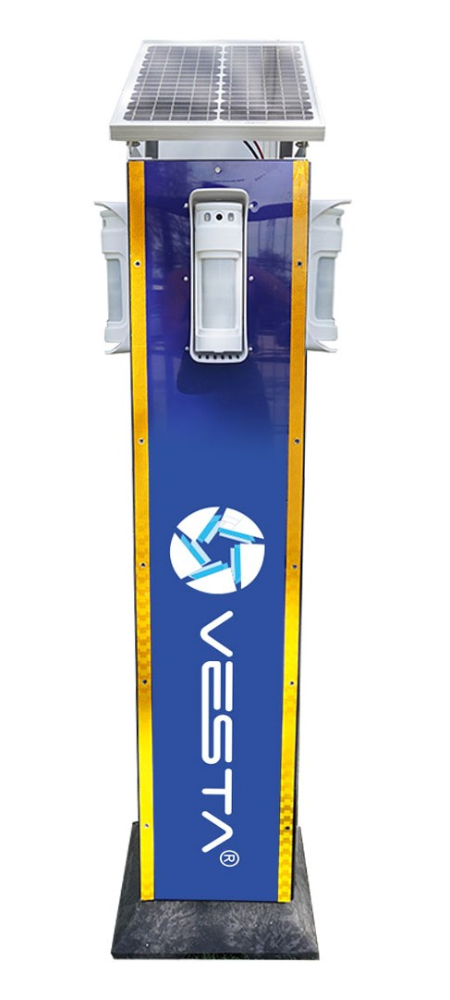

# VESTA 458

## Perimeter protection tower for VESTA Pircams

INTRODUCTION

Ideal for perimeter protection of sensitive areas, construction sites, or events requiring a stand-alone security solution.

<figure><figcaption></figcaption></figure>

### Key benefit

* Easy installation and operation, designed for quick installation by a single technician with no additional tools needed
* Even in the worst weather scenarios, you'll have more than 9 days of continuous operation without solar charging
* You can check charge levels and system status quickly from your cell phone to ensure optimal solar charging location at the time of installation
* Protected against vandalism or sabotage attempts with sensors that detect bumps, tilts and unauthorized openings
* Solar panel set at the perfect angle: its tilt is calculated to capture as much solar energy as possible, maximizing charging efficiency

### VESTA Tower

* Supports up to 4 Pircam **VESTA-370** detectors **(not included).**
* Supports **VESTA-381** vibration and tilt sensor **(not included)** for system self-protection
* Self-powered with 30 W solar panel
* Supports 45 Ah lead-acid battery with AGM technology **DEM-957 (not included)**
* Autonomy up to 9.4 days without solar charging
* Optimized weight of 15 kg for easy installation by a single technician
* Stable radio frequency coverage (RF+GPRS/LTE)

### **Solar panel**

* Type: Monocrystalline
* Maximum power: 30 W
* Closed-circuit voltage (VMP): 18.3V
* Current at maximum power: 1.64 A

### **MPPT solar charge controller**

* Optimization of performance in low-light conditions
* Increased energy harvesting by up to 30% over PWM controllers
* Real-time monitoring via Bluetooth connection

**DEM-957 battery (not included)**

* ype: Lead-acid with regulator valve.
* Voltage: 12V
* Amperage: 45 Ah
* Maintenance free with AGM technology
* Withstands extreme temperatures and fast recharge

### **Pircam VESTA-370 detector (not included)**

* Product developed in collaboration of Optex with Vesta
* Two independent IR lenses
* Adjustable range from 2.5 to 12 meters (8 to 40 feet)
* Anti-masking
* Anti-pets up to 25 kg
* Walk test
* High-speed HD file and image transfer (SF1)
* Up to 90° swivel angle
* 0.8 \~ 1.2 meters installation height
* IP55 protection
* EN50131 Grade 2

**VESTA-381 sensor (not included) for system self-protection**

* Vibration detector: If someone tries to hit the tower, an immediate alert will be triggered
* Tilt detection: Any attempt to knock it over or move it will be quickly detected by the tower.
* Opening sensor: The tower case includes a sensor that alerts you if someone tries to open the tower without permission.
