# VESTA-477

EIR-35

## Outdoor PIR Motion Detector

<figure><figcaption></figcaption></figure>

The EIR-35 is an advanced outdoor passive infrared (PIR) motion detector. Built to withstand outdoor conditions, the EIR-35 features UV-resistant housing and IPX5 waterproofing, making it suitable for areas like backyards, gates, and outdoor corridors.

With a typical detection range of **10 meters** when mounted at **2.3 meters** above ground, the outdoor motion detector incorporates anti-masking detectors with an advanced anti-masking feature, capable of detecting attempts to obscure the lens using objects or coatings within 20 cm. Infrared technology further enhances anti-masking through over-the-lens detection.

## Identifying the Parts

<figure>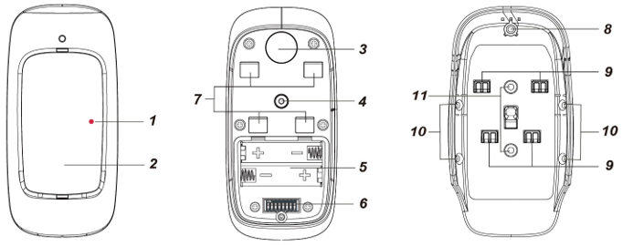<figcaption></figcaption></figure>

1. **LED Indicator (Red)**\
   The LED indicator is used to indicate the system status.
2. **IR Sensor**
3. **Test\&Learn Button**
   * Press the button once to send a learn code.
   * Press the button once to enter test mode for 10 minutes.
4. **Tamper Switch**
5. **Battery Compartment**
6. **DIP Switch Block**
7. **Hook Holes**
8. **Stabilizing Screw Hole**
9. **Hooks**
10. **Corner Mounting Holes**
11. **Surface Mounting Holes**

## LED Indicator

The LED Indicator will light up in the following conditions:

* When the Tamper Switch is triggered, the LED will flash to indicate it is transmitting a “**Tamper**” signal.
* When the motion detector is in fault conditions (tamper open or low battery condition persists), each time it transmits a detected movement, the LED will flash.
* In Test mode, the LED will turn on briefly whenever a movement is detected.

The LED will not flash if the tamper and battery are normal and the device is not under test mode. The LED will flash twice rapidly upon receiving acknowledgement from the Panel.

## Warm Up Period

The motion detector will warm up for 60 seconds after powering on. During the 60-second warm-up period, the LED indicator will flash, and the motion detector will not be activated.

## Test Mode

* The motion detector can be put into Test mode for 10 minutes by pressing the Test button once.
* In Test mode, the sleep timer function is disabled. The LED indicator will light up briefly whenever a movement is detected.
* Ensure the LED indicator (DIP Switch 2) is ON and the Double Knock function (DIP Switch 7) is OFF before conducting detection range tests in Test Mode.

## Double Knock Function

The motion detector features a double knock function. If the function is enabled, the motion detector will trigger an alarm only if two movements are detected within 10 seconds. When disabled, it will trigger an alarm when a movement is detected.

## DIP Switch Position Table

The table below outlines the function of each DIP switch. Each switch has two positions: **ON** (upper) and **OFF** (lower).

| DIP Switch | Position | Function                           |
| ---------- | -------- | ---------------------------------- |
| Switch 1   | ON       | Test Mode                          |
| Switch 1   | OFF      | Normal Mode (default)              |
| Switch 2   | ON       | Reserved                           |
| Switch 2   | OFF      | Reserved                           |
| Switch 3   | ON       | Reserved                           |
| Switch 3   | OFF      | Reserved                           |
| Switch 4   | ON       | EIR facing a lawn (default)        |
| Switch 4   | OFF      | EIR facing a concrete/stone ground |
| Switch 5   | ON       | Reserved                           |
| Switch 5   | OFF      | Reserved                           |
| Switch 6   | ON       | Reserved                           |
| Switch 6   | OFF      | Reserved                           |
| Switch 7   | ON       | Double Knock Detection             |
| Switch 7   | OFF      | Normal Detection (default)         |
| Switch 8   | ON       | Reserved                           |
| Switch 8   | OFF      | Reserved                           |

* After changing DIP Switch settings, please re-power on the PIR Camera for the new setting to take effect.
* Adjust the DIP Switches according to the installation location for optimal performance. Incorrect settings may hinder performance and cause false alarms or failure to detect movement.

## Remote Configuration

* The outdoor PIR Motion Detector supports remote setting of double knock function.
* When the device powers on, its double knock function is determined by DIP SW7 setting. Users can either adjust DIP Switch setting or remotely program the function from the Control Panel webpage or Home Portal Server. Remote setting will overwrite DIP Switch setting.

### Control Panel Webpage



#### Configure the IR setting

On the Panel local webpage, go to the **Edit Device** page; input the IR configuration value in the Sensor Setting section. Click **OK** to confirm.

| **IR Configuration** | **Double Knock** |
| -------------------- | ---------------- |
| 00                   | No               |
| 80                   | Yes              |

For example, to enable double knock function, enter 80.



#### Apply the new setting

Press the Test button on the PIR Motion Detector to send a signal to the panel; the new setting will be applied immediately. If the button is not pressed, new settings will be applied upon next signal transmission, e.g., supervision signal or IR trigger signal.



### Home Portal Server



#### Open remote configuration

On Home Portal Server, go to the Device setting page, click the EIR-35 device row and select “Remote Configuration.”



#### Set Double Knock

Select to enable or disable the Double Knock function from the drop-down menu, then click **Submit**.



#### Apply the new setting

Press the Test button on the device to send a signal to the panel; the new setting will be applied immediately. If the button is not pressed, new setting will be applied upon next signal transmission, e.g., supervision signal or IR trigger signal.



## Supervision Signal

* The motion detector automatically transmits supervision signals to the Panel at random intervals of 15 to 18 minutes.
* If the Control Panel does not receive the signal from the device during the preset period, it will indicate that the particular device is experiencing an out-of-signal problem.

## Sleep Timer

The motion detector features an automatic “sleep time” of approximately one minute for power conservation. After transmitting a detected movement, the motion detector will not transmit again for one minute.

Continuous movement in front of motion detector will therefore not unduly exhaust the battery.

## Tamper Protection

* The motion detector is protected by a tamper switch which is depressed when the motion detector is hooked onto the mounting bracket.
* When the motion detector is removed from the mounting bracket, the tamper switch will be activated and the motion detector will send a tamper open signal to the Control Panel to report this condition.

## Anti-Masking

* The motion detector is equipped with masking sensors that can detect any masking (blocking) attempt by an intruder.
* When a masking condition is detected and lasts for 3 minutes, the device will send a masking alarm signal to the Control Panel to report the condition.
* After masking/blocking has been removed for 3 minutes, the device will send a restore signal to the Panel.

## Battery

* The motion detector uses two AA L91 lithium batteries as its power source.
* The motion detector features low battery voltage detection. When low battery is detected, a low battery signal will be sent to the Control Panel along with regular signal transmissions.

### Change the Batteries



#### Remove the motion detector

Remove the motion detector from mounting bracket.



#### Open the battery cover

Loosen the battery cover fixing screw and open the battery cover.



#### Remove the old batteries

Remove the old batteries and press the test button twice to fully discharge the residual power.



#### Insert new batteries

Insert two new AA L91 lithium batteries.



#### Send a battery normal signal

Press the test button once. A battery normal signal will be sent to the Control Panel.



#### Reinstall the device

Screw back the battery cover, then hook the device back to the mounting bracket.



## Getting Started – Learning the Motion Detector into the Control Panel



#### Insert the batteries

Insert two AA L91 lithium batteries into the battery holder taking care to connect the polarity correctly.



#### Wait for warm-up

The Motion detector will warm up for 60 seconds, during which the LED flashes and the sensor is inactive. After warm-up, the LED turns off and the sensor is ready for operation.



#### Put the Control Panel into learning mode

Put the Control Panel into learning mode; refer to Control Panel manual for details.



#### Send a learn signal

Press the Test button once. The LED indicator turns on briefly.



#### Complete the learn-in process

If the Control Panel receives the signal, it will display the information accordingly. Refer to the Control Panel manual to complete the learn-in process.



## Walk Test



#### Test communication

After the Motion detector is learnt-in, put the Control Panel into Walk Test mode. Hold the Motion detector in the desired location, and press the Test button to test communication with the Control Panel.



#### Confirm the installation location

Proceed to installation once proper communication with the Panel is confirmed at the chosen location.



## Mounting & Installation Method

* The Motion detector can be mounted on a flat surface or in a corner with the fixing screws, wall plugs, and the mounting bracket provided.
* The provided mounting bracket features two surface-mounting holes and four corner-mounting holes, accommodating various mounting needs.

### Mounting with the Mounting Bracket



#### Drill mounting holes

Use the mounting bracket as a template and drill 2 holes for mounting on a flat surface, or 4 holes for mounting in a corner.



#### Secure the mounting bracket

Push in the plugs and screw the mounting bracket onto the wall.



#### Hook on the Motion Detector

Hook the Motion detector onto the mounting bracket and then **push it downward**.


Ensure the tamper switch is fully depressed when hooking the device onto the bracket.


Surface Mounting

<figure>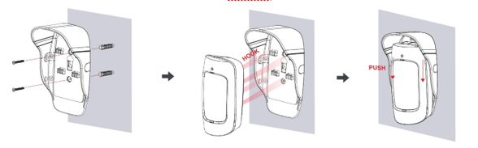<figcaption></figcaption></figure>

Corner Mounting

<figure>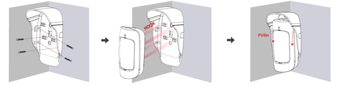<figcaption></figcaption></figure>




#### Apply the stabilizing screw

Apply the Stabilizing Screw to the top of the Motion detector. The Stabilizing Screw has a foolproof mechanism for correct installation.

<figure>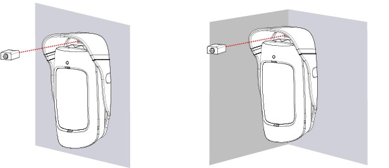<figcaption></figcaption></figure>



### Mounting with the Rotating Holder

A rotating holder is provided as a user friendly mounting option.


The rotating holder is optional and sold separately.




#### Drill mounting holes

Use the rotating holder as a template and drill 2 holes for mounting on a flat surface.



#### Secure the holder

Push in the plugs and screw the holder onto the wall.



#### Attach the mounting bracket

Peel off the mylar tape to expose the screw hole. Screw the mounting bracket onto the holder.

<figure>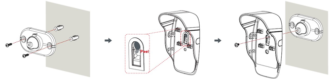<figcaption></figcaption></figure>



#### Hook on the Motion Detector

Hook the Motion Detector onto the mounting bracket and then **push it downward**.


Ensure the tamper switch is fully depressed when hooking the device onto the bracket.




#### Apply the stabilizing screw

Apply the Stabilizing Screw to the top of the Motion detector. The Stabilizing Screw has a foolproof mechanism for correct installation.

<figure>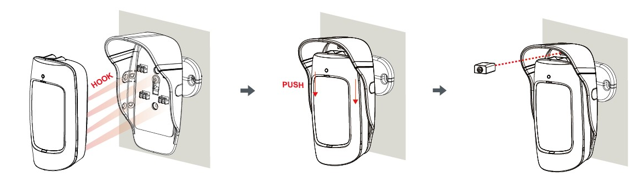<figcaption></figcaption></figure>



## Installation Recommendations

**It is recommended to install the outdoor motion detector in the following locations:**

* At a height of 2.3 meters above the ground level for best performance.
* In a corner for the widest view.
* At a position where an intruder would normally move across the Motion detector’s field of view.
* On a surface or in a corner where animals are inaccessible.
* The Motion detector has a detection range of 10 meters when mounted at the height of 2.3 meters above the ground.


- Adjust the mounting height based on the tallest pet. Taller dogs require higher installation.
- When mounted at 2.3 m, the PIR Camera has a 1 m blind spot directly beneath it. Mounting higher increases the blind spot; mounting lower reduces it.
- Always conduct a detection range test when changing the mounting height.


### EIR-35 Detection Range

<figure>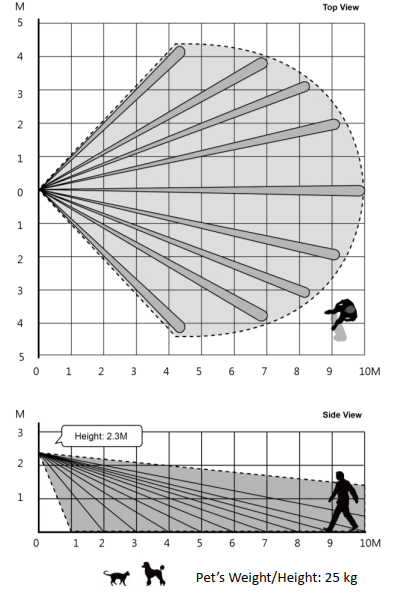<figcaption></figcaption></figure>

Pet’s Weight/Height: 25 kg

### Limitations

* Do not expose the outdoor motion detector completely to direct sunlight.
* Avoid large obstacles in the detection area.
* Do not face heat sources such as fires and boilers, or install above radiators.
* Never attempt to disassemble or modify the unit.
* The Motion Detector detects differences between moving object and the background. It does not detect idle objects.
* Please install the outdoor motion detector straight up. Do not tilt it.

<figure>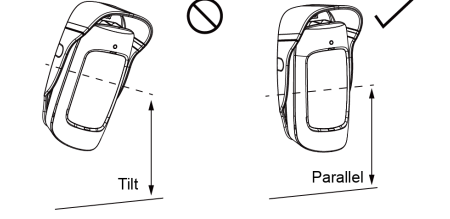<figcaption></figcaption></figure>

* Do not install the motion detector where objects moved by wind such as trees and laundry may block the motion detector’s field of view.

<figure>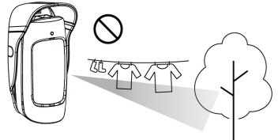<figcaption></figcaption></figure>

* Clear all light-reflecting surfaces from the detection area, as well as water puddles.

<figure>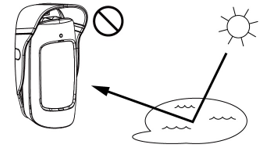<figcaption></figcaption></figure>

* Avoid aiming at the path of outdoor unit’s intake or exhaust airflow.

<figure>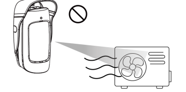<figcaption></figcaption></figure>
