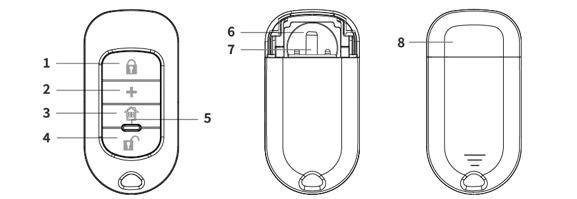
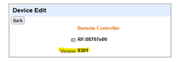
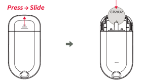

# VESTA 512

The Remote Controller is used to arm the system in Home or Away Mode, disarm the system, and send a panic signal. The Control Panel returns an acknowledgement signal to the device upon receiving its signal.

## Identifying the Parts

<figure><figcaption></figcaption></figure>

### 1 Arm Button

Press once: Arm the system in Away Mode

### 2 Panic Button

* Press once: Inquire the system mode
* Press and hold for 3 seconds: Send a panic signal regardless of system mode


- Panic alarms cannot be stopped after activation by pressing Disarm Button on RC-32.


### 3 Home Arm Button

Press once: Arm the system in Home Mode

### 4 Disarm Button

* Press once: Disarm the system
* Press once during an alarm: Stop the alarm
* Press and hold for 3 seconds: Complete learn-in process and enable system mode indication (refer to _**Getting Started**_ & _**System Mode Indication**_ for details)

### 5 LED Indicator (Red & Green)

**RED**

* Flash: Signal transmission
* ON for 5 seconds: Mode changed to ARM
* Flash for 5 seconds: Mode changed to HOME ARM
* Flash 6 times: Panel no response

**GREEN**

* ON for 5 seconds: Mode changed to DISARM
* Flash once: Receive panel acknowledgement

**ORANGE (RED + GREEN)**

* ON for 5 seconds: Mode change failed due to system fault or invalid operation

### 6 Battery

### 7 Battery Retaining Clip

### 8 Battery Cover

## Power Source

* The Remote Controller is powered by one **CR2032** 3 V lithium battery.
* The device reports its battery level to the Control Panel upon battery insertion and in 10% increments from 100% down to 10% (low battery).
* When low battery is detected, the device transmits a low-battery signal every 20 minutes for 6 transmissions, then once every 24 hours.


- _When changing battery, press any button twice after removing the old battery to fully drain the residual energy before inserting a new one._


## Getting Started



## Remove the battery cover.



## Insert the battery with the positive terminal facing up.



## Replace the cover.



## Put the Control Panel into Learn Mode; refer to Control Panel manual for detail.



## Press any button on the Remote Controller.

If the Control Panel receives the signal from the Remote Controller successfully, it will display the device information accordingly.



## Click **Add** on the Panel webpage to add the device to the system.



## Press and hold the **Disarm Button** for 3 seconds to complete the learning process and enable System Mode Indication.

The process is completed when the **Version** information appears on **Device Edit** page.

<figure><figcaption></figcaption></figure>



## System Mode Indication

When enabled, pressing the Panic Button causes the LED indicator to show the current system mode.

* Steady Green (3 seconds): System disarmed
* 2 Red flashes: System home-armed
* Steady Red (3 seconds): System armed
* Alternating Green / Red (2 cycles): Panel no response

## Battery Replacement

### Battery Insertion

1. Press and slide the battery cover outward to open.
2. Insert the battery under the battery retaining clip with the positive (+) side facing up, ensuring it is fully seated in the compartment.
3. Align the battery cover with the slot, then press it inward until it clicks.

<figure><figcaption></figcaption></figure>

### Battery Removal

1. Press and slide the battery cover outward to open.
2. Hold the battery by the edge and remove it carefully.


**WARNING**

* **INGESTION HAZARD:** This product contains a button cell or coin battery.
* **Death or serious injury can occur if swallowed.**

Swallowing the cell can cause severe internal burns within 2 hours and may be fatal.

* **Keep** new and used batteries **OUT OF REACH OF CHILDREN.**
* **Seek immediate medical attention** if a battery is suspected to be swallowed or inserted into any part of the body.


