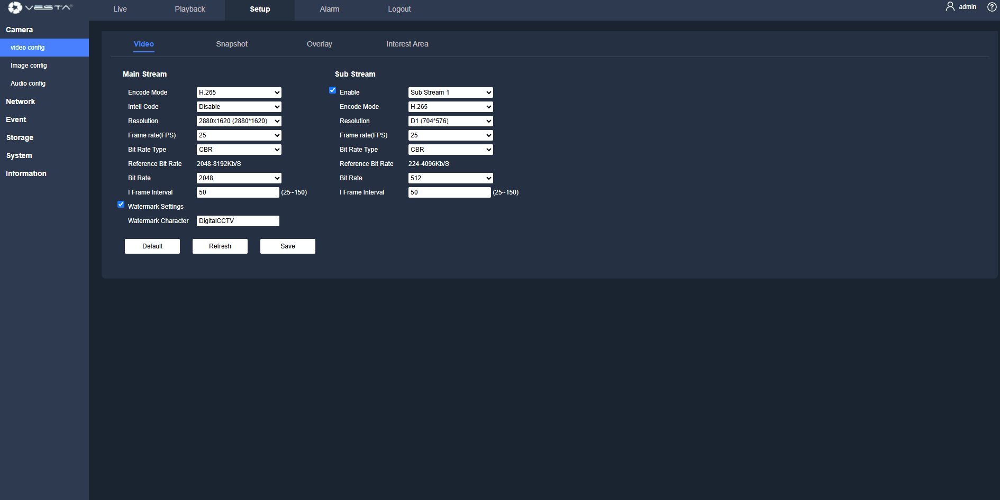

# VESTA ADVANCED IP CAMERA SERIES (Stand Alone)

## Are you ready to discover the new VESTA ADVANCED SERIES cameras?



## How to Integrate ADVANCED VIDEO Cameras or NVRs in Stand-Alone CCTV Mode

To set up your ADVANCED VIDEO cameras or NVRs in **stand-alone CCTV mode**, follow these simple steps:

### **Step 1: Download the VESTA ADVANCED App**

<figure><figcaption></figcaption></figure>

The system is managed through the **VESTA ADVANCED** mobile app, available for both Android and iOS devices.

* **Android**: [Download from Google Play](https://play.google.com/store/apps/details?id=com.vesta.vestaadvanced\&hl=es_419)
* **iOS**: [Download from the App Store](https://apps.apple.com/es/app/vesta-advanced/id6748019032)

### **Step 2: Install the App**

Install the app on your smartphone or tablet as you would with any other application.

### **Step 3: Register the Device**

Open the app and **register your camera or NVR using its serial number**.\
You can usually find the serial number printed on the device label or packaging.

That’s it! Once registered, you’ll be able to view and manage your CCTV system directly from the app.

<figure><figcaption></figcaption></figure>

## Quick videos

### How to update a VESTA ADV camera or NVR – Step by step



### How to program IVS rules in VESTA ADV&#x20;

**Intelligent Video Surveillance (IVS) Rules** are advanced video analysis algorithms used to enhance the functionality of your VESTA ADV camera or NVR. These rules allow the system to automatically detect and respond to specific events, improving security and reducing false alarms. Common IVS rules include:

1. **Intrusion Detection:** Alerts when an object/human enters a predefined zone.
2. **Tripwire:** Triggers when an object/human crosses a defined line.
3. **Cross region:** Triggers when an object/human crosses or appears in a defined area.

To program IVS rules in your VESTA ADV system follow this steps:&#x20;



### How to set up continuous recording on MicroSD of IP CAM:

**Enable Continuous Recording on MicroSD**

1. **Storage Configuration:**
   * Navigate to the **Storage** section.
   * Select **Destination** and ensure **Scheduled** is enabled.
   * In **Scheduled** make sure to enable 24h all days or needed days

<figure><figcaption></figcaption></figure>

### **Quick login to local portal:**&#x20;


**Quick login to local portal:**&#x20;

**Step 1:** Open a browser, enter the device’s IP address in the address bar (the **default IP address is 192.168.1.86**), and press Enter.

**Step 2:** Enter the username and passwor&#x64;**; the default user name of the device is “admin”**.

.png>)

**Step 3:** When logging in to the device for the first time, the system will pop up a “Change Password” prompt. Please change the administrator password on time and safe-keep it.

.png>)

**Reset Password:** If the user forgets the password, click Reset Password to get a key. After the customer sends this key to our technician, our technician will generate a new decoding key for the user, and the password will be reset to **the default password “123456”.**


### VESTA advanced series complete manual guide&#x20;



### Quick Guide




_**More information will be added soon**_


