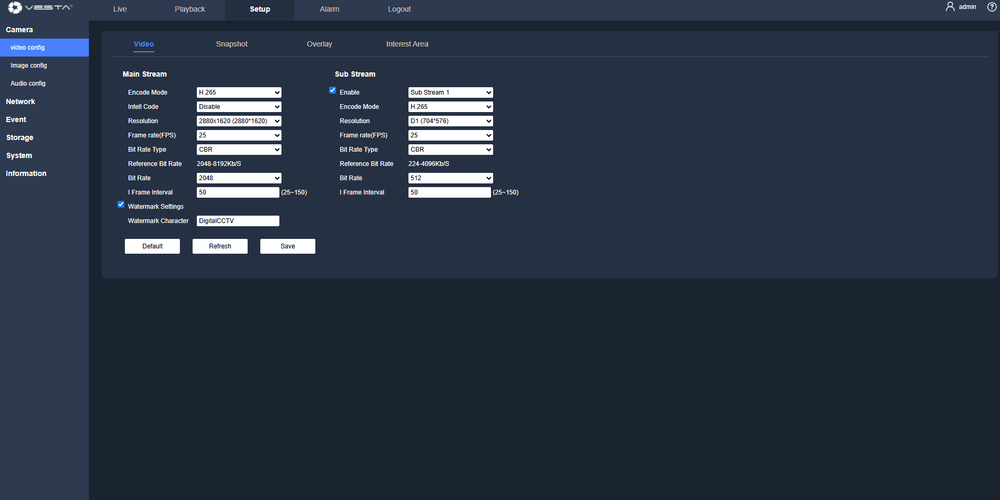

# VESTA ADVANCED IP CAMERA SERIES with VESTA Intrusion (SmartHomeSec)

## ✨ Are you ready to discover the new VESTA ADVANCED SERIES cameras?



### What does this VESTA integration allow?

<figure><figcaption></figcaption></figure>

### **Start-up with VESTA panels in 3 steps**



### Upgrade the IP cam ([Clic here for the QUICK VIDEO](vesta-advanced-ip-camera-series-with-vesta-intrusion-smarthomesec.md#how-to-update-a-vesta-adv-camera-or-nvr-step-by-step))

To update the camera, follow these steps:

1. **Download the Firmware**: Ensure you download the firmware that matches your camera model from the following list according to your model.

&#x20;                                                               &#x20;

 <a href="../adv-firmware-updates/firmware-updates-vesta-advanced-video.md"><strong>DOWNLOAD</strong></a>  

1. [**Access Local Interface**](vesta-advanced-ip-camera-series-with-vesta-intrusion-smarthomesec.md#quick-login-to-local-portal): Navigate to the camera's local interface (Default IP: _192.168.1.86_).
2. **Navigate to Setup**: Go to 'Setup' in the menu.
3. **Select System**: Choose 'System' from the options.
4. **Choose Upgrade**: Proceed to 'Upgrade' to begin the firmware update process.

<figure><figcaption></figcaption></figure>



### Panel and SmartHomeSec APP upgrade


It is important to ensure that the **panel is at version 34F or higher** and that the **application is updated to version 3.6.0 or higher**. These updates include this integration. Check and update regularly to maintain compatibility and optimal performance of your devices.




### Adding the camera to the panel

1. **Network Verification:** Ensure that both the VESTA panel and the camera are connected to the same network.
2. **SmartHomeSec APP Setup:**
   * Open the app and log in using your **Master account** credentials.
   * Navigate to the "**Cameras**" section and select "**VESTA ADVANCED**."
3. **Camera Scanning:**
   * The system will begin **scanning for new cameras on the network automatically**.
4. **Camera Selection:**
   * Choose the camera from the list, and input the **username and password**. Use the same credentials you use for accessing the camera's web server locally.



<figure><figcaption></figcaption></figure>

## Quick videos

### How to update a VESTA ADV camera or NVR – Step by step



### How to program IVS rules in VESTA ADV&#x20;

**Intelligent Video Surveillance (IVS) Rules** are advanced video analysis algorithms used to enhance the functionality of your VESTA ADV camera or NVR. These rules allow the system to automatically detect and respond to specific events, improving security and reducing false alarms. Common IVS rules include:

1. **Intrusion Detection:** Alerts when an object/human enters a predefined zone.
2. **Tripwire:** Triggers when an object/human crosses a defined line.
3. **Cross region:** Triggers when an object/human crosses or appears in a defined area.

To program IVS rules in your VESTA ADV system follow this steps:&#x20;



### How to set up continuous recording on MicroSD of IP CAM:

**Enable Continuous Recording on MicroSD**

1. **Storage Configuration:**
   * Navigate to the **Storage** section.
   * Select **Destination** and ensure **Scheduled** is enabled.
   * In **Scheduled** make sure to enable 24h all days or needed days

<figure><figcaption></figcaption></figure>

### **Quick login to local portal:**&#x20;


**Quick login to local portal:**&#x20;

**Step 1:** Open a browser, enter the device’s IP address in the address bar (the **default IP address is 192.168.1.86**), and press Enter.

**Step 2:** Enter the username and passwor&#x64;**; the default user name of the device is “admin”**.

.png>)

**Step 3:** When logging in to the device for the first time, the system will pop up a “Change Password” prompt. Please change the administrator password on time and safe-keep it.

.png>)

**Reset Password:** If the user forgets the password, click Reset Password to get a key. After the customer sends this key to our technician, our technician will generate a new decoding key for the user, and the password will be reset to **the default password “123456”.**


### VESTA advanced series complete manual guide&#x20;



### Quick Guide



***

## **Camera Troubleshooting and Configuration Issues**

### **CGI Activation Issues**

.png>)\
\
If the panel prompts you to enable CGI on the camera (And CGI already activated), this may be due to changes in user settings. This can happen if:

* A client manually modified user settings on the camera (Changed admin rights).
* The camera was added to a third-party recorder, which initialized it in a way that altered user data.

**Solution:**\
Reset the camera to factory settings. After the reset, the camera will function correctly.\
&#xNAN;_(Note: This issue is typically related to modifications in the Users settings.)_

***

## Event Playback Troubleshooting Guide

### Issue

The recording icon appears on the alarm event from a camera, but when you access it, the video does not play.&#x20;

<figure><figcaption></figcaption></figure>

<figure><figcaption></figcaption></figure>

### Root Cause Analysis

Two parameters are usually responsible for this behavior:

***

#### 1. Multimedia Configuration in SHS

When configuring the camera or NVR in SHS: 

* **Set multimedia to "Images" only** — uncheck video.
* Video delivery is excluded because it depends on multiple variable factors (network bandwidth, codec compatibility, connectivity, etc.) and produces inconsistent results.

#### 2. What Happens on Alarm Trigger

When an alarm fires, the camera or NVR automatically reports two things: 

* **Event snapshots** (still images captured at the moment of alarm)
* **Quick playback** (if a MicroSD or NVR HDD is present) — 10 seconds before the event and 20 seconds after

\
The recording icon appears when there is an alarm event, but playback fails when the actual recording cannot be located.

***

### Critical Parameters to Verify

#### A) Time Synchronization (Most Common Cause)

* The camera/NVR time **must match** the Vesta panel time.
* The panel sets the time automatically when we add it first time, but **DST (Daylight Saving Time) must be correctly configured** on the camera or NVR itself.
* **Why it fails:** If the camera's DST is wrong, the time offset prevents the system from locating the recorded video fragment around the event timestamp. The icon shows (because storage exists), but the search window misses the actual recording.

#### B) Continuous Recording

* The camera or NVR **must have continuous recording enabled**.
* **Why it fails:** If the camera only records on motion/event triggers, when the system searches for the 10-second window _before_ the alarm… there is nothing there. Hence: icon visible, no playback.

***

### Troubleshooting Checklist

Compare the failing camera against the working one:

| Parameter                | Check                                                                         |
| ------------------------ | ----------------------------------------------------------------------------- |
| **DST / Time zone**      | Is DST correctly set on the camera? Is the time identical to the Vesta panel? |
| **Continuous recording** | Is 24/7 continuous recording enabled on the camera/NVR?                       |
| **Storage media**        | Is MicroSD/HDD present, functional, and with sufficient space?                |

 
