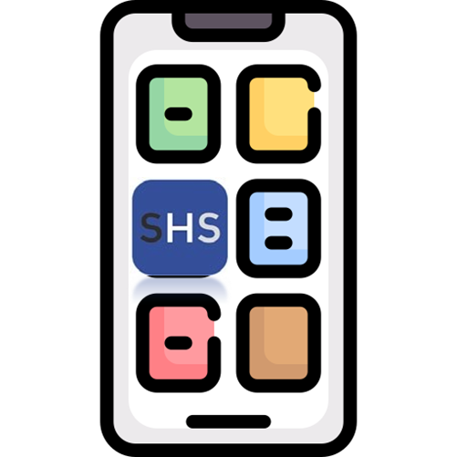
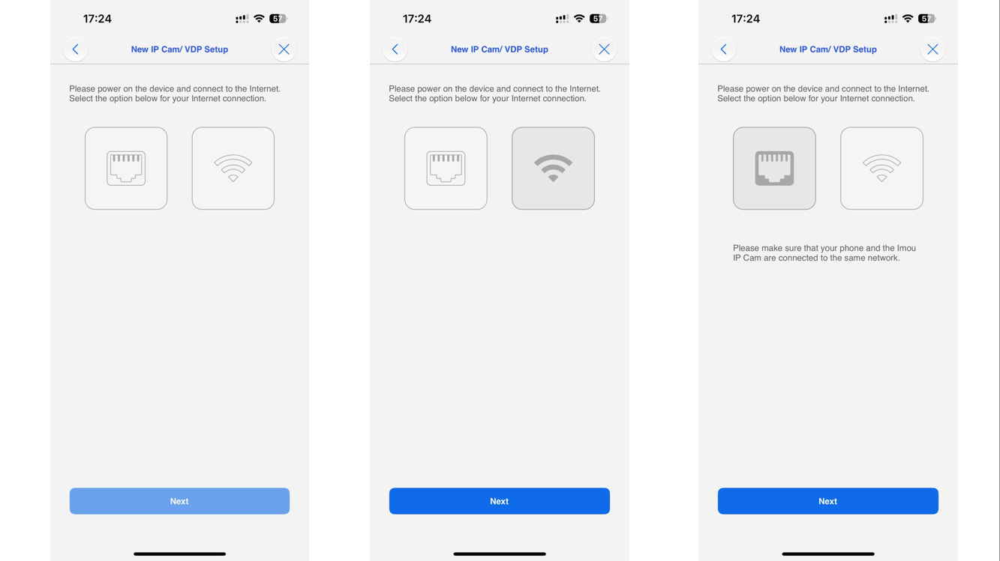
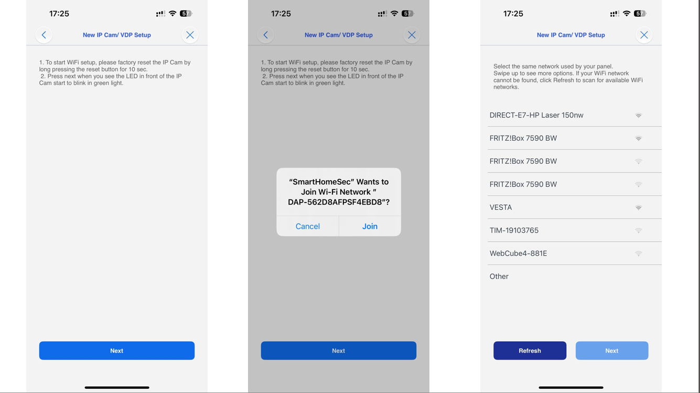
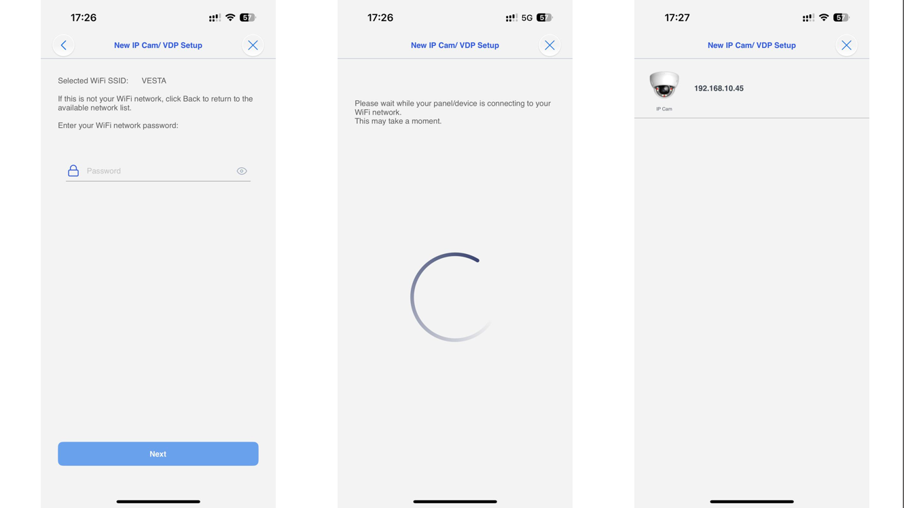
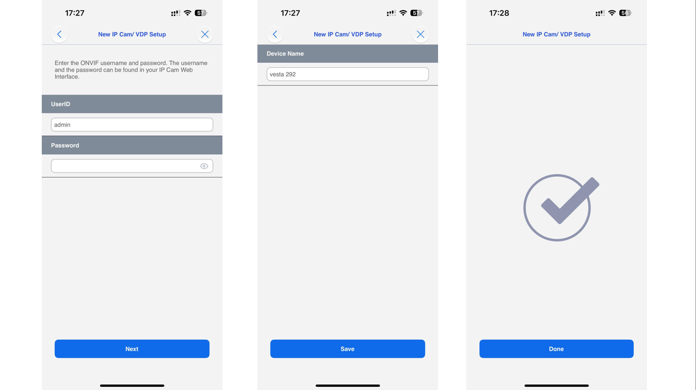
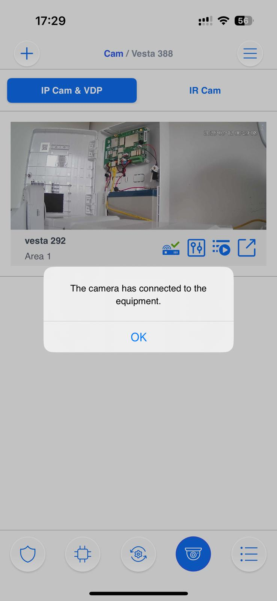
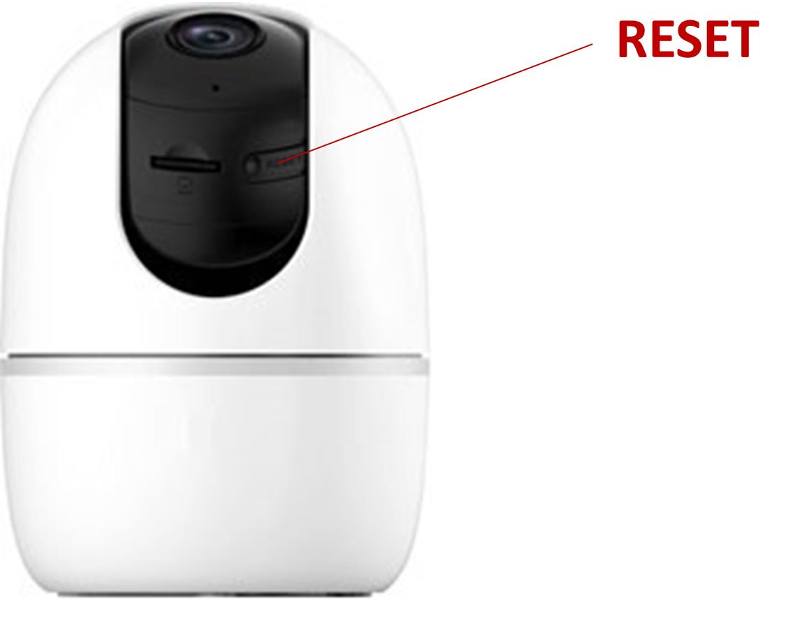

# SETUP VESTA CAMERAS 291-292-293

<figure><figcaption></figcaption></figure>


We will show how to add the camera Vesta-292, but the steps to add the camera Vesta-291 or Vesta-293 are similar


## Camera 292

<figure><figcaption></figcaption></figure>

#### STEP 1:  Plug the power cable&#x20;

#### STEP 2: Wait for the LED to remain in solid <mark style="color:green;">GREEN</mark> colour for Ethernet connection or flashing  <mark style="color:green;">GREEN</mark> in case of Wi-Fi Setup

Use the SmartHomeSec app to initialise the camera and **add** it to the system

<figure><figcaption>
STEP 1                                                                STEP 2                                                           STEP 3
</figcaption></figure>

### STEP 1: Login as User in the SmarthomeSec App

### STEP 2: Press Camera logo

### STEP 3: Press + Icon to add a camera

<figure><figcaption>
STEP 4                                                                                                             STEP 5 
</figcaption></figure>

### STEP 4: Press the VESTA/Imou icon

### STEP 5: Scan the Camera QR code and press NEXT&#x20;

### STEP 6: Select how to add the camera:

* &#x20;Add to the equipment: The camera must be installed on the same panel LAN network. In this way, the camera will be fully supported in the panel and the user app.&#x20;


Vantages to add to the equipment:

* The camera will be an intrusion zone in the panel, and it can generate alarms.
* SD-CARD video recording access
* Movement detection.
* PTZ control for the VESTA-292


<figure><figcaption>
STEP 6
</figcaption></figure>

* Add to the cloud: The camera will be installed using the cloud. The user will see the live video only from the user's app account.


Vantages to add to the cloud:

* The camera can be installed on a different network (or at a different site).
* Users with panels connected with 4G communication only, can have cameras connected to their accounts.


### STEP 7: Choose the communication path of the camera (Ethernet or Wi-Fi)


The camera and the panel must be on the same network, please check before proceeding&#x20;


<figure><figcaption>
STEP 7
</figcaption></figure>


In case of Ethernet communication, jump directly to STEP 12


### STEP 8: Wi-Fi connection


The mobile must be connected to the Wi-Fi network that you want to connect the camera


<figure><figcaption>
STEP 8                                                                STEP 9                                                                 STEP 10
</figcaption></figure>


**If you're connecting your camera via Wi-Fi but it doesn't proceed to the IP search step, don't worry. This can happen if your mobile device temporarily lost internet connection while switching networks and didn’t reconnect properly.**

To continue:

* Check if the camera's <mark style="color:green;">**GREEN LED**</mark> is **solid ON** (not blinking).
* If it is, go back to the previous step and **select ETHERNET instead of Wi-Fi** — the setup should then work correctly.

.png>)


### STEP 9: Connect your mobile to the camera network by pressing join

### STEP 10: Select the network and press Next

<figure><figcaption>
 STEP 11                                                                STEP 12                                                                    STEP 13
</figcaption></figure>

### STEP 11: Write the Wi-Fi password

### STEP 12: The app will show you the camera userID and password

<figure><figcaption>
STEP 12                                                                                                                                                  
</figcaption></figure>


Note:

If the password field is not automatically filled:&#x20;

UserID: admin

Password: (Safety code of the camera, label below)


<figure><figcaption>
Password
</figcaption></figure>

SETUP COMPLETED

<figure><figcaption></figcaption></figure>

***

### **How to Enable Camera Notifications When the System is Disarmed**

The **VESTA HOME / ADV cameras** allow you to receive notifications even while the system is disarmed. This can be useful if you want to stay aware of movement in certain areas without arming the entire system.

#### Steps to Configure:

1. Go to the Settings --> Device -->  **Camera settings** in the app SmartHomeSec.
   1.

       <figure><figcaption></figcaption></figure>
2. Locate the option **Chime as Attribute during Disarm**:&#x20;
   1.

       <figure><figcaption></figcaption></figure>
3. Enable this option on the camera.

#### What Happens Next:

* The system will stay in **alert mode** even when disarmed.
* If the camera detects activity, you will receive a **push notification**:
  * _Human Detected / Motion Detected_

⚠️ **Important:** In this mode, the camera **will not capture images**. You will only get the push notification. You can then open the live stream manually if you want to check what’s happening.

#### Coming Soon:

The platform will soon support a new attribute: **Notifications with Image**. Once available, you will not only get the notification but also a snapshot from the camera directly in the alert.

***

## TROUBLESHOOTING&#x20;

### **I cannot find the IP of the camera on the setup steps:**

1\.   Ensure that the VESTA central controller is connected to the same network as the camera.

2\.   Restart the switch or router where the VESTA panel and Camera are connected.

***

### **I cannot complete the setup via WIFI**

1\.   Check that you have the latest firmware in the VESTA control unit.

2\.   Make sure to enable the location for the SmartHomeSec APP.

3\.   Make sure you give the APP permissions to connect to a WIFI network, and if it asks for connection permissions allow them.

***

### **The camera is not ready:**

1. Reset the camera to factory settings

To reset the VESTA camera:  Press the button RESET located on the back and hold for 10 seconds (The camera will make a BEEP and the LED will turn red) NOTES: In the VESTA-292 model, the button is located under the optics

<figure><figcaption></figcaption></figure>
