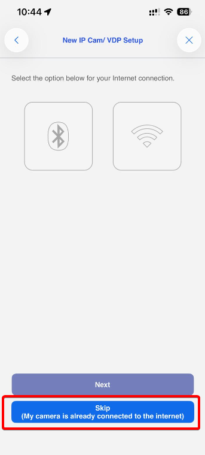

# SETUP VESTA HOME CAMERAS VESTA-462 and VESTA-463

The **Vesta-462** and **Vesta-463** series are a range of **Vesta Home** wireless battery-powered cameras designed for outdoor use. They provide reliable, high-quality video surveillance while ensuring quick and easy installation without the need for complex wiring.

Designed to integrate seamlessly with the Vesta Home ecosystem, these cameras offer flexible placement and dependable performance for residential security applications. Their long-lasting rechargeable batteries can be conveniently recharged using the **included solar panel**, helping to extend operating time, reduce maintenance, and provide continuous protection with minimal user intervention.

<figure><figcaption></figcaption></figure>

## Follow this guide to add the cameras to the SmartHomeSec App


Note:&#x20;

* Cameras can only be added using the SmartHomeSec app.
* This guide is only valid for the VESTA-462 and VESTA-463 camera models.
* Only the Master user can add or remove cameras.




### Login as User in the SmartHomeSec app

<figure><figcaption>
STEP 1                                                       STEP 2                                                     STEP 3
</figcaption></figure>



### Press the Camera logo




### Press the + Icon to add a camera




### Press the VESTA Home icon

<figure><figcaption></figcaption></figure>



### Scan the Camera QR code&#x20;

<figure><figcaption></figcaption></figure>



### Select Add to Cloud and press Next&#x20;

<figure><figcaption></figcaption></figure>




### Reset the camera to its factory settings by pressing the reset button.

<figure><figcaption></figcaption></figure>


Wait for the LED to flash <mark style="color:green;">GREEN</mark> before proceeding and pressing the Next button.


<figure><figcaption></figcaption></figure>



### Select the Bluetooth method to send the Wi-Fi credentials to the camera, then press 'Next'.

<figure><figcaption></figcaption></figure>



### Write the Wi-Fi Password and press Submit


Note: Your smartphone must be connected to the same Wi-Fi network


<figure><figcaption></figcaption></figure>



### The camera has been added successfully.

<figure><figcaption></figcaption></figure>



***

## TROUBLESHOOTING&#x20;

### **If you're connecting your camera via Bluetooth or Wi-Fi but it doesn't proceed to the next step**


**Don't worry. This can happen if your mobile device temporarily loses its internet connection while switching networks and doesn’t reconnect properly.**

To continue:

* Check if the camera's <mark style="color:green;">**GREEN LED**</mark> is **solid ON** (not blinking).
* If it is, go back to the previous step and **select Skip (My camera is already connected to the internet)** — the setup should then work correctly.



***

### **I cannot complete the setup via WIFI**

1\.   Check that you have the latest firmware in the VESTA control unit.

2\.   Make sure to enable the location for the SmartHomeSec APP.

3\.   Make sure you give the APP permissions to connect to a WIFI network, and if it asks for connection permissions, allow them.

***

