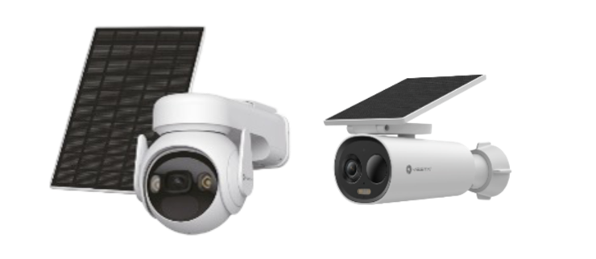
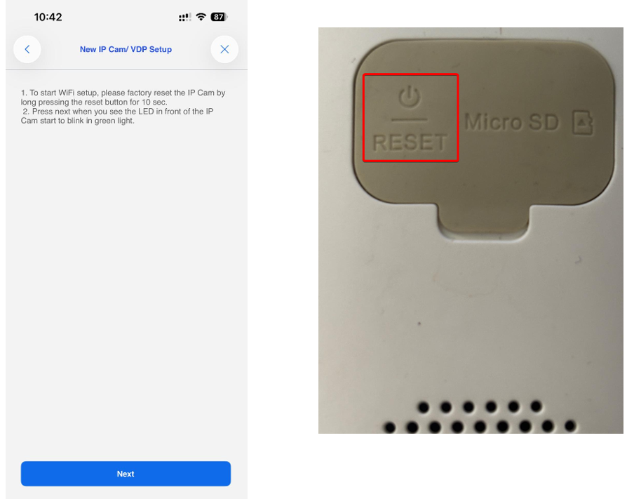
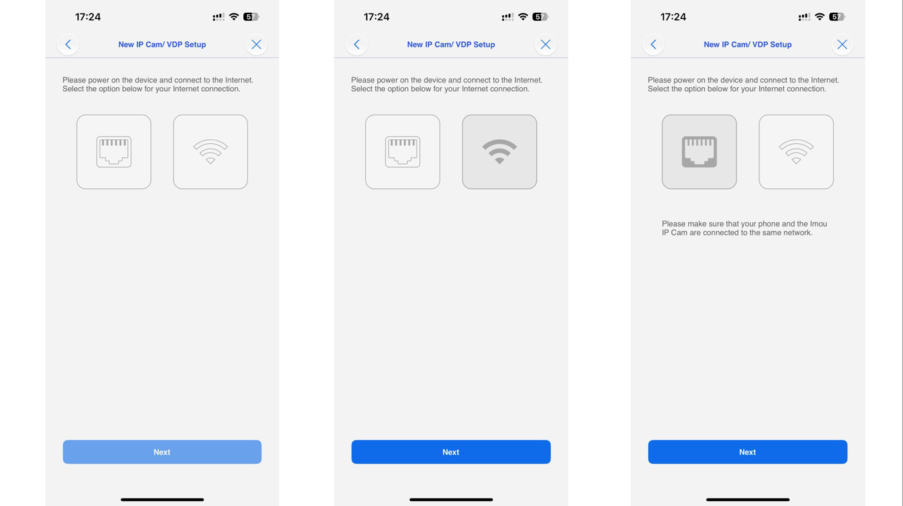
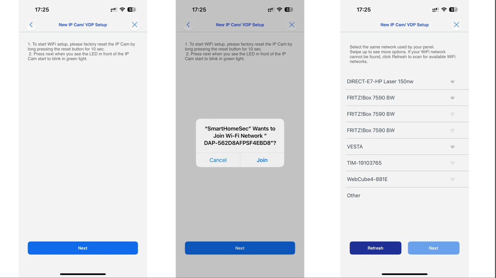
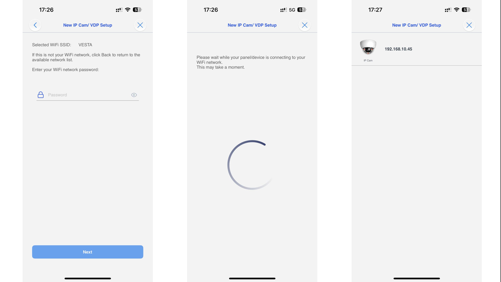
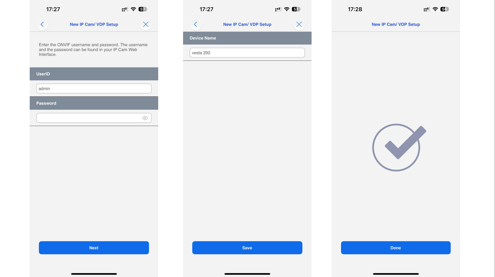
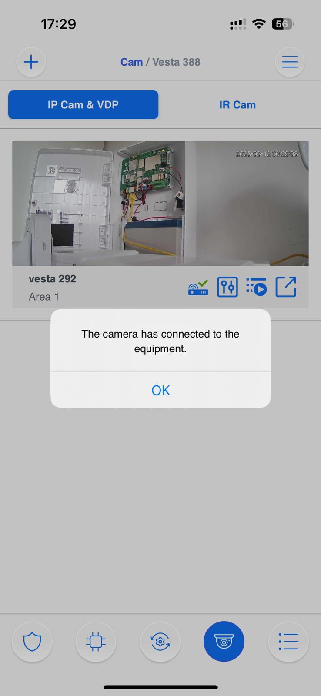
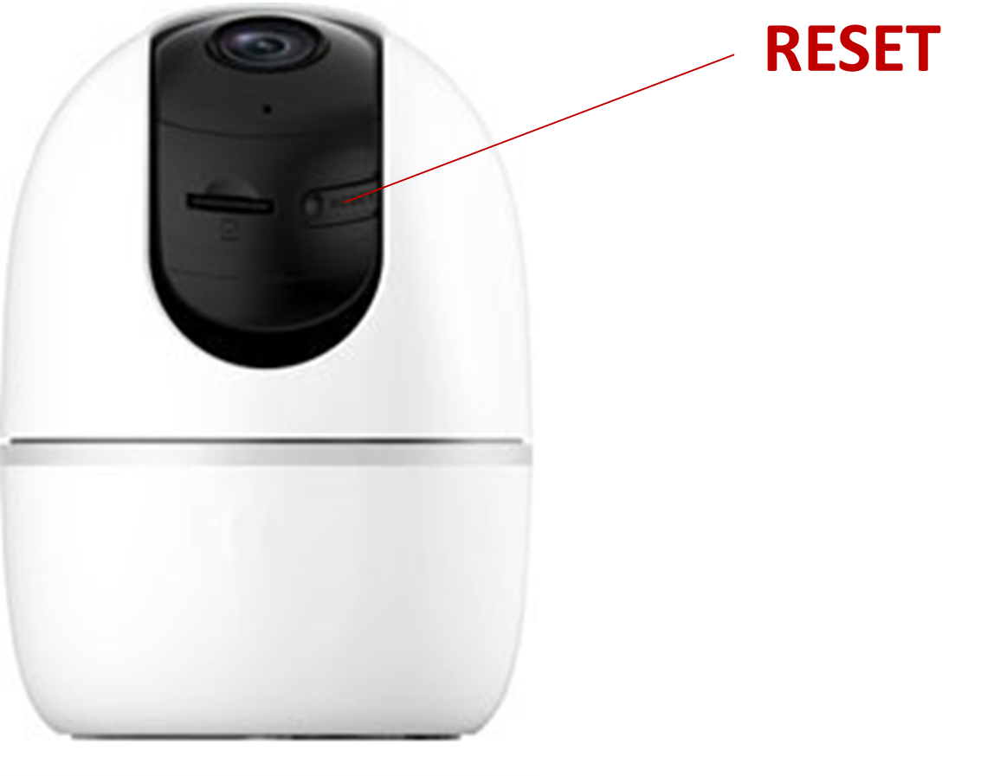

# SETUP VESTA HOME CAMERAS VESTA-462 and VESTA-463

The **Vesta-462** and **Vesta-463** series are a range of **Vesta Home** wireless battery-powered cameras designed for outdoor use. They provide reliable, high-quality video surveillance while ensuring quick and easy installation without the need for complex wiring.

Designed to integrate seamlessly with the Vesta Home ecosystem, these cameras offer flexible placement and dependable performance for residential security applications. Their long-lasting rechargeable batteries can be conveniently recharged using the **included solar panel**, helping to extend operating time, reduce maintenance, and provide continuous protection with minimal user intervention.

<figure><figcaption></figcaption></figure>

## Follow this guide to add the cameras to the SmartHomeSec App


Note:&#x20;

* Cameras can only be added using the SmartHomeSec app.
* This guide is only valid for the VESTA-462 and VESTA-463 camera models.
* Only the Master user can add or remove cameras.




### Login as User in the SmartHomeSec app

<figure><figcaption>
STEP 1                                                       STEP 2                                                     STEP 3
</figcaption></figure>



### Press the Camera logo




### Press the + Icon to add a camera




### Press the VESTA Home icon

<figure><figcaption></figcaption></figure>



### Scan the Camera QR code&#x20;

<figure><figcaption></figcaption></figure>



### Select Add to Cloud and press Next&#x20;

<figure><figcaption></figcaption></figure>




### Reset the camera to its factory settings by pressing the reset button.

Wait for the LED to flash <mark style="color:green;">GREEN</mark> before proceeding

<figure><figcaption></figcaption></figure>



### Choose Bluetooth to send the Wi-Fi credentials to the camera and press Next&#x20;

<figure><figcaption></figcaption></figure>



### Write the Wi-Fi Password and press Submit


Note: your smartphone must be connected to the same Wi-Fi network


<figure><figcaption></figcaption></figure>



### The camera has been added successfully.

<figure><figcaption></figcaption></figure>



### STEP 7: Choose the communication path of the camera (Ethernet or Wi-Fi)


The camera and the panel must be on the same network, please check before proceeding&#x20;


<figure><figcaption>
STEP 7
</figcaption></figure>


In case of Ethernet communication, jump directly to STEP 12


### STEP 8: Wi-Fi connection


The mobile must be connected to the Wi-Fi network that you want to connect the camera


<figure><figcaption>
STEP 8                                                                STEP 9                                                                 STEP 10
</figcaption></figure>


**If you're connecting your camera via Wi-Fi but it doesn't proceed to the IP search step, don't worry. This can happen if your mobile device temporarily lost internet connection while switching networks and didn’t reconnect properly.**

To continue:

* Check if the camera's <mark style="color:green;">**GREEN LED**</mark> is **solid ON** (not blinking).
* If it is, go back to the previous step and **select ETHERNET instead of Wi-Fi** — the setup should then work correctly.

.png>)


### STEP 9: Connect your mobile to the camera network by pressing join

### STEP 10: Select the network and press Next

<figure><figcaption>
 STEP 11                                                                STEP 12                                                                    STEP 13
</figcaption></figure>

### STEP 11: Write the Wi-Fi password

### STEP 12: The app will show you the camera userID and password

<figure><figcaption>
STEP 12                                                                                                                                                  
</figcaption></figure>


Note:

If the password field is not automatically filled:&#x20;

UserID: admin

Password: (Safety code of the camera, label below)


<figure><figcaption>
Password
</figcaption></figure>

SETUP COMPLETED

<figure><figcaption></figcaption></figure>

***

### **How to Enable Camera Notifications When the System is Disarmed**

The **VESTA HOME / ADV cameras** allow you to receive notifications even while the system is disarmed. This can be useful if you want to stay aware of movement in certain areas without arming the entire system.

#### Steps to Configure:

1. Go to the Settings --> Device -->  **Camera settings** in the app SmartHomeSec.
   1.

       <figure><figcaption></figcaption></figure>
2. Locate the option **Chime as Attribute during Disarm**:&#x20;
   1.

       <figure><figcaption></figcaption></figure>
3. Enable this option on the camera.

#### What Happens Next:

* The system will stay in **alert mode** even when disarmed.
* If the camera detects activity, you will receive a **push notification**:
  * _Human Detected / Motion Detected_

⚠️ **Important:** In this mode, the camera **will not capture images**. You will only get the push notification. You can then open the live stream manually if you want to check what’s happening.

#### Coming Soon:

The platform will soon support a new attribute: **Notifications with Image**. Once available, you will not only get the notification but also a snapshot from the camera directly in the alert.

***

## TROUBLESHOOTING&#x20;

### **I cannot find the IP of the camera on the setup steps:**

1\.   Ensure that the VESTA central controller is connected to the same network as the camera.

2\.   Restart the switch or router where the VESTA panel and Camera are connected.

***

### **I cannot complete the setup via WIFI**

1\.   Check that you have the latest firmware in the VESTA control unit.

2\.   Make sure to enable the location for the SmartHomeSec APP.

3\.   Make sure you give the APP permissions to connect to a WIFI network, and if it asks for connection permissions allow them.

***

### **The camera is not ready:**

1. Reset the camera to factory settings

To reset the VESTA camera:  Press the button RESET located on the back and hold for 10 seconds (The camera will make a BEEP and the LED will turn red) NOTES: In the VESTA-292 model, the button is located under the optics

<figure><figcaption></figcaption></figure>
