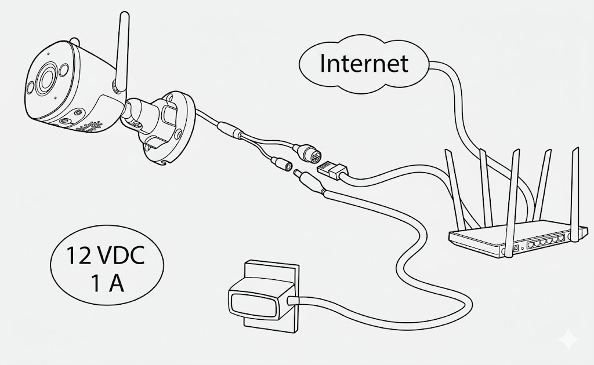

# VESTA HOME - UPDATE TOOL

ES EN FR

VESTA HOME - UPDATE TOOL

## Elige tu modelo

Selecciona la cámara que deseas actualizar

Volver

1

Modelo

2

Estado

3

Conexión

4

Fin

Continuar

#### ¿El LED está en verde fijo?

Asegúrate de que la luz de la cámara está encendida en color verde y sin parpadear.

Sí, está verde fijo No, está apagado o parpadea

**Instrucciones:** Por favor, conecta la cámara a la corriente y a tu router mediante un cable de red (Ethernet) o asegúrate de que esté correctamente conectada por Wi-Fi, hasta que el LED se quede en verde fijo.

Cancelar escáner

Activar Cámara para Escanear

Apunta al código QR pegado en la cámara

O ingresa los datos manual

Número de Serie (SN)

Código de Verificación (SC)

Obtener Datos

Actualizar Firmware

0%

#### Actualizando...

Proceso automático, por favor no apagues ni desconectes la cámara.

Actualizar otra cámara
