# VESTA-TXI-R

## OPTEX TXI PIR curtain detector for outdoor use with VESTA F1 wireless transmitter

<figure><figcaption></figcaption></figure>

The TXI-R offers overhead curtain-type volumetric detection, providing stable and consistent detection thanks to OPTEX’s advanced Triple AND logic (patent pending). Designed to create a narrow detection field along the façade of a building, it enables the detection of potential intruders before they reach the premises. The TXI-R is ideal for perimeter protection in detached houses, balconies, warehouses, office buildings and retail premises, as well as for any application where it is necessary to protect the boundaries of a property.

The TXI features a unique configuration with Quad + Dual volumetric detection and is powered by OPTEX’s SMDA digital logic, designed to ignore the movement of animals within the detection zone, reducing the risk of false alarms in environments where pets or wildlife may be present, without compromising intruder detection performance.

With a compact, palm-sized design, the TXI-R can be installed at a height of up to 4 m and offers a detection range of 12 m, which is adjustable to prevent over-reach, and an optional zero-angle setting, allowing coverage to be tailored to the requirements of each installation whilst maintaining a discreet setup.

## KIT specification

* x1 **OPTEX-255** **(TXI-R)**: Battery-powered outdoor PIR curtain detector, range 12 m x 2.4 m, via radio with RF transmitter, IP55. Contents:
* 2 mounting screws
* 2 connecting screws
* 1 side bracket
* 1 rear bracket
* 1 area adjustment plate 1
* 1 area adjustment plate 2
* 1 connector
* x1 **VESTA-271** (TX-OPT-BXS-F1-868): F1 868MHz radio transmitter for installation inside the detector and sending RF signals to the panel.

## Specification

* OPTEX TXI battery-powered PIR curtain detector for outdoor use
* 12 m x 2.4 m (40 ft x 8 ft) range
* Installation from 2.2 to 4 m
* Radio-ready via compatible RF transmitter
* Detection method: passive infrared PIR
* Triple AND logic with area optimized design
* SMDA digital temperature compensation
* Detection distance adjustable in 3 levels by means of included plates
* Bottom zone selectable ON/OFF via bottom lever
* Horizontal adjustment: left, front or right
* Red LED selectable ON/OFF
* Alarm output via solid-state switch, 10 V DC 0.01 A max.
* Fault output with tamper open when cover or main unit removed
* 3.0 V DC power supply
* 14 µA consumption at standby
* 5 mA max. consumption at 3.0 VDC
* IP55 protection
* Operating temperature range from -30°C to +60°C
* Maximum ambient humidity 95%.
* Dimensions: 119.5 x 54.4 x 70.2 mm
* Weight approx. 135 g

## Identifying the Parts

1\) TXI-R

<figure>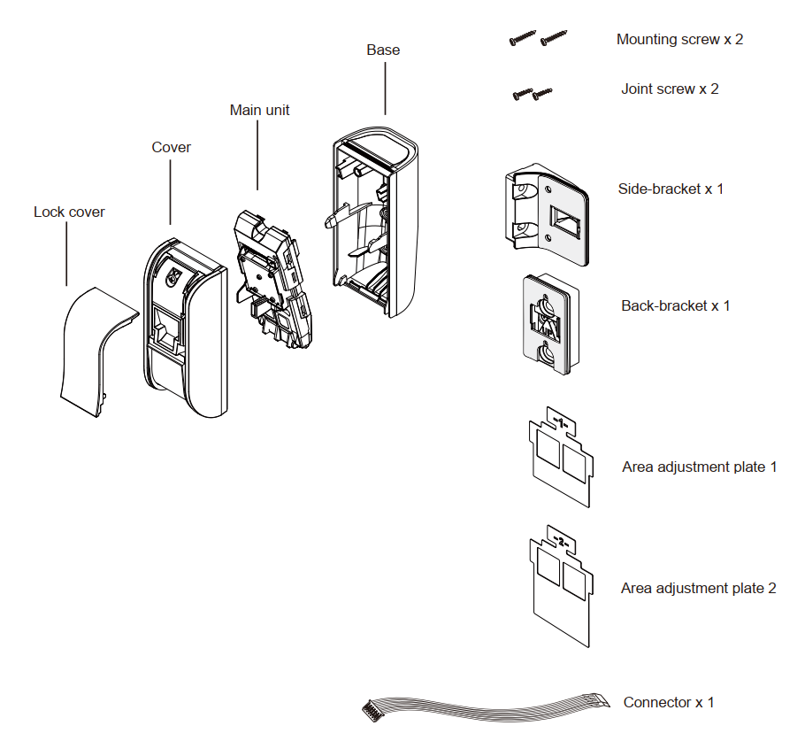<figcaption></figcaption></figure>

2\) VESTA-271


[vesta-271.md](vesta-271.md)


## Functions Overview

#### Pet Tolerance

This product is equipped with a triple AND logic to reduce false alarms. The triple AND function activates the alarm only when infrared changes are simultaneously detected in three separate detection zones. This mechanism significantly reduces false detections caused by small pets.

#### Accelerometer tamper

This product is equipped with an accelerometer that accurately detects movement and vibration. An accelerometer measures changes in velocity (acceleration) when the device is moved, tilted, or subjected to impact. This enables the system to detect tampering, abnormal motion, or unauthorised handling, enhancing overall security performance.

## Installation

Disassemble the unit

1\) Remove the lock cover

<figure>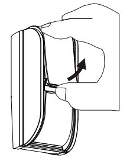<figcaption></figcaption></figure>

2\) Loosen the fixing screw

<figure>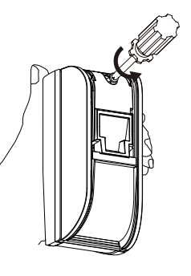<figcaption></figcaption></figure>

3\) Open the cover

<figure>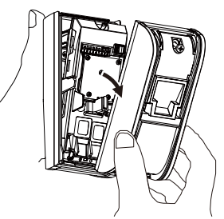<figcaption></figcaption></figure>

4\) Remove the main unit

<figure>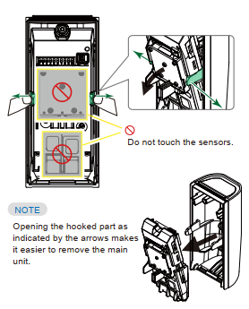<figcaption></figcaption></figure>

## Installation Recommendations

### Detection Range

<figure>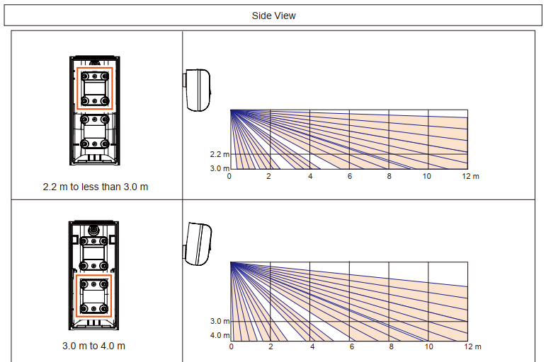<figcaption></figcaption></figure>

### Area Ajustment

<figure>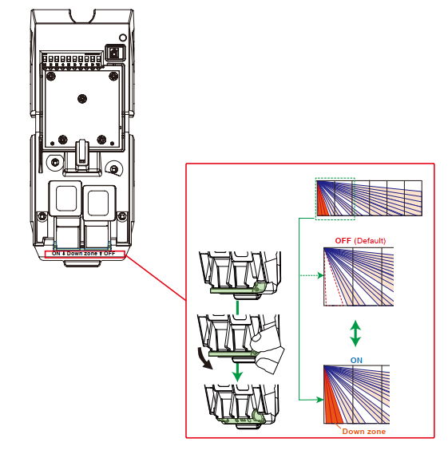<figcaption></figcaption></figure>

### Detection Ajustment

To limit the distance, use the appropriate area adjustment plate

<figure>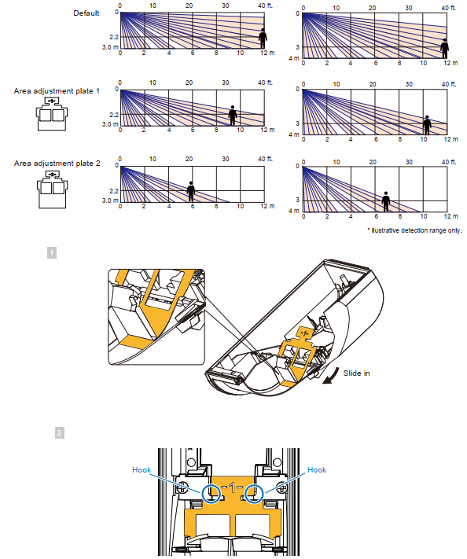<figcaption></figcaption></figure>

## Installation

### Mounting bracket

#### Standard bracket installation for wall mounting

<figure>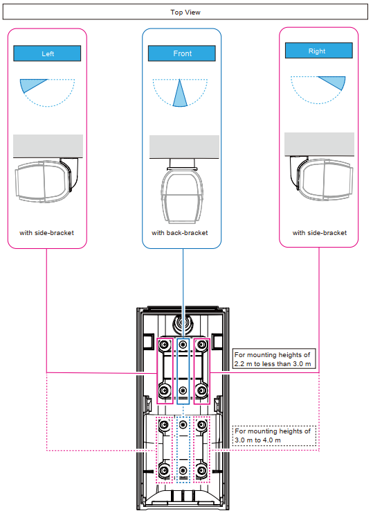<figcaption></figcaption></figure>

#### Standard bracket installation for wall mount (Side-Bracket)

<figure>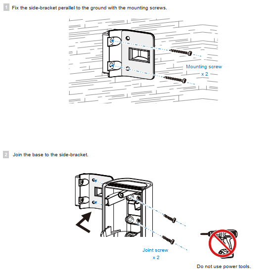<figcaption></figcaption></figure>

#### Standard bracket installation for wall mount (Back-Bracket)

<figure>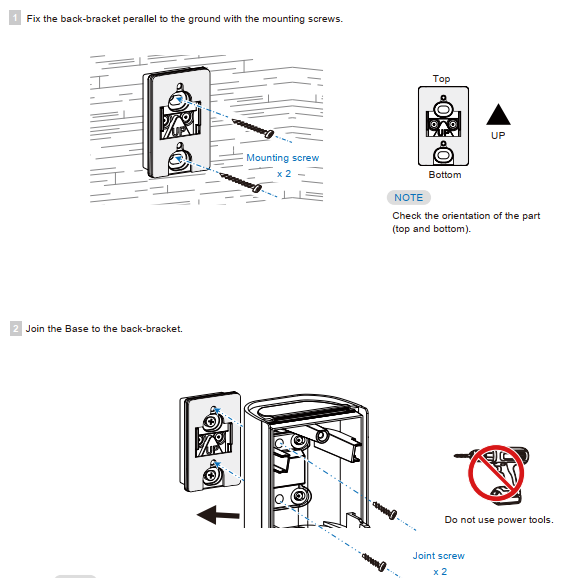<figcaption></figcaption></figure>

## Installation Recommendations

<figure>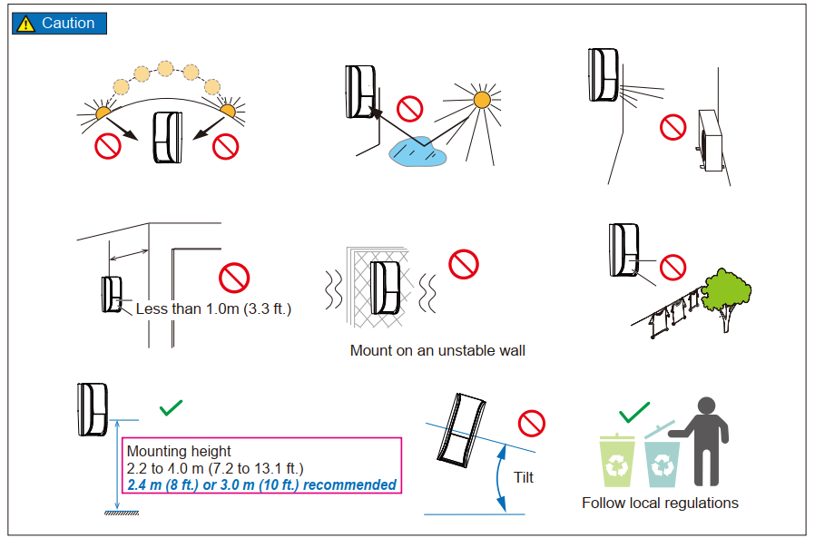<figcaption></figcaption></figure>

